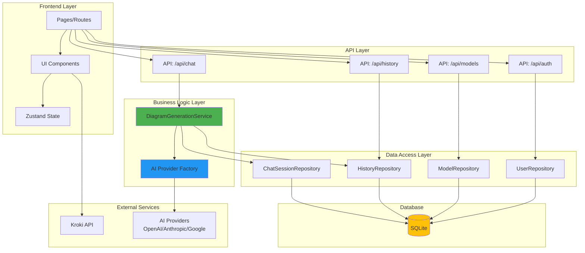
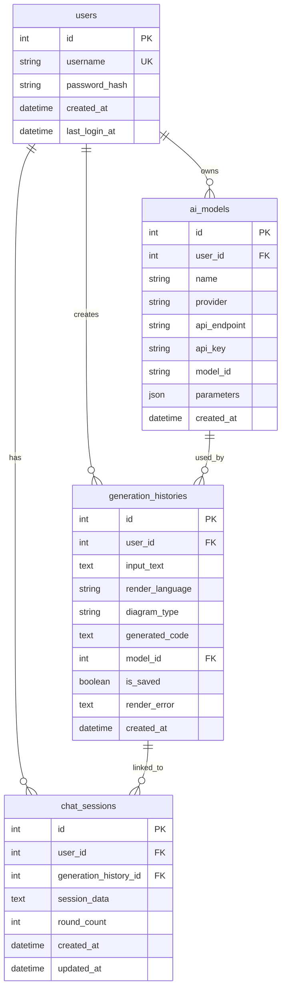
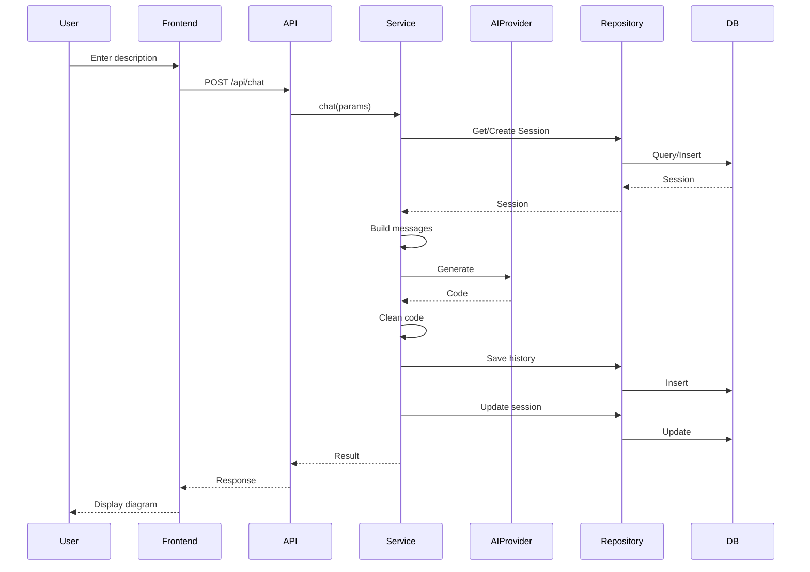

# DiagramAI Architecture Guide

> Architecture reference for AI assistants and developers

---

## 📋 Project Overview

- **Tech Stack**: Next.js 15 + React 19 + TypeScript 5.x
- **Architecture**: Repository + Service + Factory Pattern
- **Database**: SQLite with better-sqlite3
- **Auth**: JWT + bcrypt
- **AI**: Multi-provider support (OpenAI, Anthropic, Google, DeepSeek)

---

## 🏗️ System Architecture



---

## 📂 Directory Structure

```
src/
├── app/                          # Next.js App Router
│   ├── (app)/                    # Protected routes (需要认证)
│   │   ├── page.tsx              # Main diagram editor
│   │   ├── history/              # Generation history
│   │   └── models/               # Model configuration
│   ├── (auth)/                   # Auth routes
│   │   ├── login/                # Login page
│   │   └── register/             # Register page
│   └── api/                      # API endpoints
│       ├── auth/                 # Authentication
│       ├── chat/                 # Diagram generation
│       ├── models/               # Model CRUD
│       └── history/              # History CRUD
│
├── components/                   # React components
│   ├── editor/                   # Editor components
│   ├── history/                  # History components
│   ├── modals/                   # Modal dialogs
│   └── selectors/                # Dropdown selectors
│
├── lib/                          # Core libraries
│   ├── ai/                       # AI integration
│   │   └── provider-factory.ts  # Multi-provider factory
│   ├── auth/                     # Authentication
│   │   ├── jwt.ts                # JWT tokens
│   │   └── password.ts           # Password hashing
│   ├── constants/                # Constants
│   │   ├── env.ts                # Environment variables
│   │   └── prompts/              # AI prompts (10+ files)
│   ├── db/                       # Database
│   │   ├── client.ts             # SQLite client
│   │   └── schema.sql            # Database schema
│   ├── repositories/             # Data access layer
│   │   ├── UserRepository.ts
│   │   ├── ModelRepository.ts
│   │   ├── HistoryRepository.ts
│   │   └── ChatSessionRepository.ts
│   ├── services/                 # Business logic
│   │   └── DiagramGenerationService.ts
│   ├── stores/                   # Zustand stores
│   ├── utils/                    # Utilities
│   └── validations/              # Zod schemas
│
└── types/                        # TypeScript types
    ├── diagram.ts                # Diagram types
    ├── ai.ts                     # AI types
    └── env.d.ts                  # Environment types
```

---

## 🔑 Core Modules

### 1. AI Provider Factory

**File**: `src/lib/ai/provider-factory.ts`

Unified interface for multiple AI providers:

```typescript
const model = getAIProvider({
  provider: "openai" | "anthropic" | "google" | "openai-compatible",
  model_id: "gpt-4o",
  api_key: "sk-...",
  api_endpoint: "https://api.deepseek.com/v1", // Optional
});
```

**Supported Providers**:

- OpenAI (GPT-3.5, GPT-4, GPT-4o)
- Anthropic (Claude 3)
- Google (Gemini Pro)
- OpenAI Compatible (DeepSeek, etc.)

### 2. Diagram Generation Service

**File**: `src/lib/services/DiagramGenerationService.ts`

Core business logic for diagram generation:

```typescript
async chat(params: ChatParams): Promise<ChatResult>
```

**Flow**:

1. Validate parameters
2. Load/create chat session
3. Build messages with system prompt
4. Call AI provider
5. Clean generated code
6. Save to history
7. Update session

### 3. Repository Layer

**Pattern**: All database operations go through repositories

```typescript
// UserRepository - User authentication
class UserRepository {
  create(data: CreateUserData): User;
  findByUsername(username: string): User | null;
}

// ModelRepository - AI model configuration
class ModelRepository {
  create(data: CreateModelData): AIModel;
  findByUserId(userId: number): AIModel[];
}

// HistoryRepository - Generation history
class HistoryRepository {
  create(data: CreateHistoryData): GenerationHistory;
  findByUserId(userId: number): GenerationHistory[];
}

// ChatSessionRepository - Chat sessions
class ChatSessionRepository {
  create(data: CreateSessionData): ChatSession;
  update(id: number, data: UpdateSessionData): void;
}
```

### 4. Authentication System

**Files**: `src/lib/auth/`

- **JWT**: 7-day expiration, signed tokens
- **bcrypt**: 10-round password hashing
- **Middleware**: `withAuth` protects API routes

---

## 💾 Database Schema



**Tables**:

- `users` - User accounts
- `ai_models` - AI provider configurations
- `generation_histories` - Generated diagrams
- `chat_sessions` - Multi-turn conversations

---

## 🔄 Request Flow

### Diagram Generation Flow



---

## 🎯 Development Guidelines

### Code Standards

- ✅ TypeScript strict mode
- ✅ ESLint + Prettier
- ✅ Chinese comments required
- ✅ Conventional Commits

### Architecture Rules

- ✅ Database access ONLY through repositories
- ✅ Business logic in service layer
- ✅ API routes protected with `withAuth`
- ✅ Input validation with Zod
- ✅ Error handling with try-catch

### Testing

```bash
npm test              # Run all tests
npm run test:coverage # Coverage report
npm run type-check    # TypeScript check
npm run lint          # ESLint check
```

**Test Coverage**: 246+ tests across components, services, and utilities

---

## 🚀 Adding New Features

### Add New Diagram Language

1. Add to `src/types/diagram.ts`:

```typescript
export type RenderLanguage = "mermaid" | "plantuml" | "your-language";
```

2. Create prompt in `src/lib/constants/prompts/`:

```typescript
export const YOUR_LANGUAGE_PROMPT = `...`;
```

3. Register in `src/lib/constants/prompts/index.ts`

4. Update database schema enum

5. Add frontend selector option

### Add New AI Provider

1. Check Vercel AI SDK compatibility

2. Add to `src/lib/ai/provider-factory.ts`:

```typescript
case 'your-provider':
  return createYourProvider({ ... })
```

3. Update database schema enum

4. Add frontend configuration UI

---

## 📚 Key Files Reference

| File                                           | Purpose                    |
| ---------------------------------------------- | -------------------------- |
| `src/lib/ai/provider-factory.ts`               | AI provider abstraction    |
| `src/lib/services/DiagramGenerationService.ts` | Core generation logic      |
| `src/lib/auth/jwt.ts`                          | JWT authentication         |
| `src/lib/db/schema.sql`                        | Database schema (v4.1.0)   |
| `src/lib/constants/prompts/`                   | AI prompts (10+ languages) |
| `src/app/api/chat/route.ts`                    | Generation API endpoint    |

---

## 🔧 Environment Variables

See `env.example` for complete list. Key variables:

```bash
# Required
JWT_SECRET=<64+ chars>

# Optional
AI_TEMPERATURE=0.7
BCRYPT_SALT_ROUNDS=10
NEXT_PUBLIC_KROKI_URL=https://kroki.io
```

---

## 📖 Additional Documentation

- **README.md** - User guide and setup
- **env.example** - Environment configuration

---

**Version**: 1.0.0  
**Last Updated**: 2025-01-08
