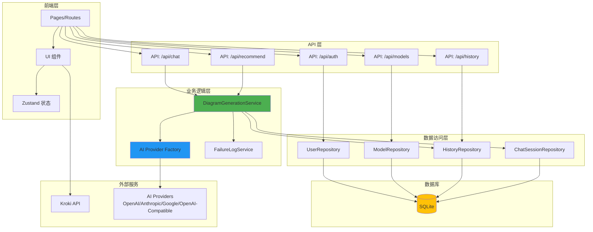
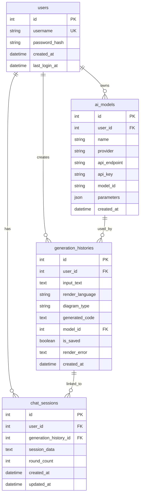
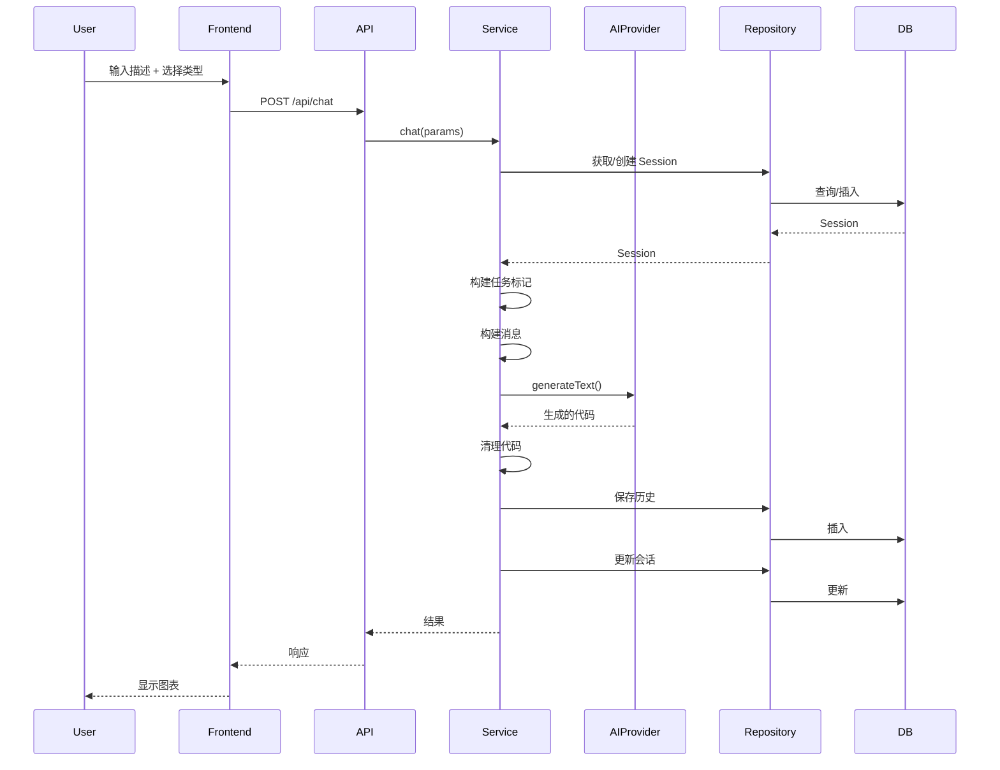
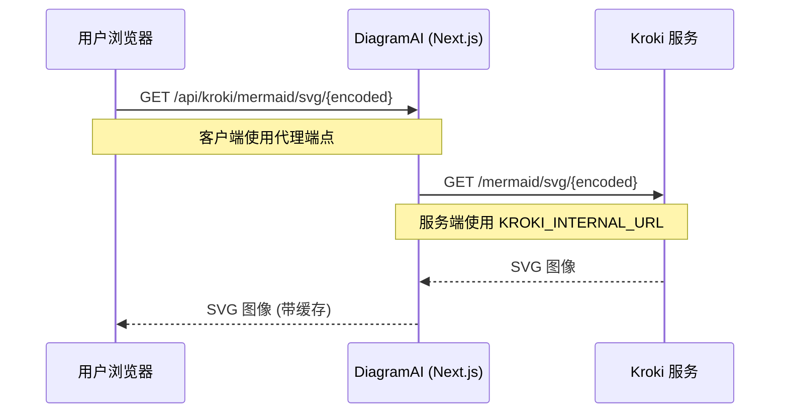

# DiagramAI 架构指南

> AI 助手和开发者的架构参考文档

---

## 📋 项目概览

- **技术栈**: Next.js + React + TypeScript
- **架构模式**: Repository + Service + Factory Pattern
- **数据库**: SQLite (better-sqlite3)
- **认证**: JWT + bcrypt
- **AI 集成**: Vercel AI SDK (多提供商支持)
- **图表渲染**: Kroki (支持 23 种渲染语言)

---

## 🏗️ 系统架构



---

## 📂 目录结构

```
src/
├── app/                          # Next.js App Router
│   ├── (app)/                    # 保护路由 (需要认证)
│   │   ├── page.tsx              # 主图表编辑器
│   │   ├── history/              # 生成历史页面
│   │   └── models/               # 模型配置页面
│   ├── (auth)/                   # 认证路由
│   │   ├── login/                # 登录页面
│   │   └── register/             # 注册页面
│   └── api/                      # API 端点
│       ├── auth/                 # 认证 API
│       ├── chat/                 # 图表生成 API
│       ├── models/               # 模型 CRUD API
│       ├── history/              # 历史记录 API
│       ├── recommend/            # 推荐 API
│       └── kroki/                # Kroki 代理 API
│
├── components/                   # React 组件
│   ├── auth/                     # 认证组件
│   ├── editor/                   # 编辑器组件
│   ├── history/                  # 历史记录组件
│   ├── icons/                    # 图标组件
│   ├── layout/                   # 布局组件
│   ├── modals/                   # 模态对话框
│   ├── models/                   # 模型配置组件
│   ├── selectors/                # 选择器组件
│   ├── shared/                   # 共享组件
│   ├── theme/                    # 主题组件
│   └── ui/                       # UI 基础组件
│
├── lib/                          # 核心库
│   ├── ai/                       # AI 集成
│   │   └── provider-factory.ts  # 多提供商工厂
│   ├── auth/                     # 认证
│   │   ├── jwt.ts                # JWT 令牌
│   │   ├── password.ts           # 密码哈希
│   │   └── middleware.ts         # 认证中间件
│   ├── constants/                # 常量
│   │   ├── env.ts                # 环境变量
│   │   ├── diagram-types.ts      # 图表类型定义
│   │   ├── diagram-validation.ts # 图表验证规则
│   │   ├── placeholders.ts       # 占位符文本
│   │   └── prompts/              # AI 提示词 (23+ 语言)
│   ├── db/                       # 数据库
│   │   ├── client.ts             # SQLite 客户端
│   │   ├── schema.sql            # 数据库 Schema (v5.0.0)
│   │   └── migrate.ts            # 数据库迁移
│   ├── repositories/             # 数据访问层
│   │   ├── UserRepository.ts
│   │   ├── ModelRepository.ts
│   │   ├── HistoryRepository.ts
│   │   └── ChatSessionRepository.ts
│   ├── services/                 # 业务逻辑
│   │   ├── DiagramGenerationService.ts
│   │   └── FailureLogService.ts
│   ├── stores/                   # Zustand 状态管理
│   │   └── diagram-store.ts
│   ├── themes/                   # 主题配置
│   │   └── codemirror-theme.ts
│   ├── utils/                    # 工具函数
│   │   ├── api-client.ts         # API 客户端
│   │   ├── api-response.ts       # API 响应工具
│   │   ├── clipboard.ts          # 剪贴板工具
│   │   ├── code-cleaner.ts       # 代码清理
│   │   ├── download.ts           # 下载工具
│   │   ├── kroki.ts              # Kroki URL 生成
│   │   ├── logger.ts             # 日志工具
│   │   └── svg-to-image.ts       # SVG 转图片
│   └── validations/              # Zod 验证模式
│       ├── auth.ts
│       ├── chat.ts
│       ├── models.ts
│       └── history.ts
│
├── types/                        # TypeScript 类型
│   ├── ai.ts                     # AI 类型
│   ├── common.ts                 # 通用类型
│   ├── database.ts               # 数据库类型
│   ├── diagram.ts                # 图表类型
│   ├── recommendation.ts         # 推荐类型
│   └── env.d.ts                  # 环境变量类型
│
├── contexts/                     # React Context
│   ├── AuthContext.tsx
│   └── ThemeContext.tsx
│
└── hooks/                        # 自定义 Hooks
    ├── useAuthRedirect.ts
    ├── useEditorActions.ts
    └── useRecommendation.ts
```

---

## 🔑 核心模块

### 1. AI Provider Factory

**文件**: `src/lib/ai/provider-factory.ts`

多 AI 提供商统一接口:

```typescript
const model = getAIProvider({
  provider: "openai" | "anthropic" | "gemini" | "openai-compatible",
  model_id: "gpt-4o",
  api_key: "sk-...",
  api_endpoint: "https://api.deepseek.com/v1", // 可选
});
```

**支持的提供商**:

- **OpenAI**: 支持所有 GPT 系列模型
- **Anthropic**: 支持所有 Claude 系列模型
- **Google**: 支持所有 Gemini 系列模型
- **OpenAI Compatible**: DeepSeek, SiliconFlow, Together AI, Groq 等兼容 OpenAI API 的服务

### 2. Diagram Generation Service

**文件**: `src/lib/services/DiagramGenerationService.ts`

核心图表生成业务逻辑:

```typescript
async chat(params: ChatParams): Promise<ChatResult>
```

**功能流程**:

1. **任务类型决策** - 根据 `taskType` 或 `sessionId` 决定任务类型
   - `generate`: 首次生成新图表
   - `adjust`: 基于现有代码调整优化
   - `fix`: 修复语法错误 (保持逻辑不变)

2. **AI 调用** - 通过 Provider Factory 调用 AI 模型

3. **代码清理** - 使用 `cleanCode()` 清理 AI 生成的代码

4. **会话管理** - 存储/更新 ChatSession

5. **失败日志** - 当 `taskType === 'fix'` 时自动记录失败案例

**任务标记系统**:

```typescript
// 任务标记由前端按钮类型决定
const taskHint = _buildTaskHint(taskType);
// => "<<<SYSTEM_INSTRUCTION: GENERATE_NEW_DIAGRAM>>>"
// => "<<<SYSTEM_INSTRUCTION: ADJUST_EXISTING_DIAGRAM>>>"
// => "<<<SYSTEM_INSTRUCTION: FIX_SYNTAX_ERRORS_ONLY>>>"
```

### 3. Repository 层

**模式**: 所有数据库操作通过 Repository 进行

```typescript
// UserRepository - 用户认证
class UserRepository {
  create(data: CreateUserData): User;
  findByUsername(username: string): User | null;
  updateLastLogin(userId: number): void;
}

// ModelRepository - AI 模型配置
class ModelRepository {
  create(data: CreateModelData): AIModel;
  findByUserId(userId: number): AIModel[];
  findById(modelId: number): AIModel | null;
  update(modelId: number, data: UpdateModelData): void;
  delete(modelId: number): void;
}

// HistoryRepository - 生成历史
class HistoryRepository {
  create(data: CreateHistoryData): GenerationHistory;
  findByUserId(userId: number, filters?: HistoryFilters): GenerationHistory[];
  findById(historyId: number): GenerationHistory | null;
  update(historyId: number, data: UpdateHistoryData): void;
  delete(historyId: number): void;
}

// ChatSessionRepository - 聊天会话
class ChatSessionRepository {
  create(data: CreateSessionData): ChatSession;
  findById(sessionId: number): ChatSession | null;
  update(sessionId: number, sessionData: string, roundCount: number): void;
}
```

### 4. 认证系统

**文件**: `src/lib/auth/`

- **JWT**: 7 天过期时间, 签名令牌
- **bcrypt**: 10 轮密码哈希 (生产环境建议 12 轮)
- **Middleware**: `withAuth` 保护 API 路由

---

## 💾 数据库 Schema



**数据表**:

- `users` - 用户账户
- `ai_models` - AI 提供商配置
- `generation_histories` - 生成的图表
- `chat_sessions` - 多轮对话会话

**Schema 特性**:

- 支持 23 种图表渲染语言
- 完整的用户认证和会话管理
- 多 AI 提供商配置支持

---

## 🔄 请求流程

### 图表生成流程



---

## 🎯 开发指南

### 代码规范

- ✅ TypeScript strict 模式
- ✅ ESLint + Prettier
- ✅ 中文注释
- ✅ Conventional Commits (feat/fix/docs/refactor/test/chore)

### 架构原则

- ✅ 数据库访问仅通过 Repository
- ✅ 业务逻辑在 Service 层
- ✅ API 路由使用 `withAuth` 保护
- ✅ 输入验证使用 Zod
- ✅ 错误处理使用 try-catch

### 测试

```bash
npm test              # 运行所有测试
npm run test:coverage # 覆盖率报告
npm run type-check    # TypeScript 检查
npm run lint          # ESLint 检查
```

**测试覆盖**: 50+ 测试套件,覆盖组件、服务和工具函数

---

## 🚀 添加新功能

### 添加新的图表语言

1. 在 `src/lib/constants/diagram-types.ts` 中添加:

```typescript
export const RENDER_LANGUAGES: readonly RenderLanguageInfo[] = [
  // ...
  {
    value: "your-language",
    label: "YourLanguage",
    description: "描述",
    iconPath: "/icons/languages/your-language.svg",
  },
];

export const LANGUAGE_DIAGRAM_TYPES: Record<RenderLanguage, readonly DiagramTypeInfo[]> = {
  // ...
  "your-language": [{ value: "flowchart", label: "流程图", description: "展示流程" }],
};
```

2. 在 `src/lib/constants/prompts/` 创建提示词目录:

```
prompts/
└── your-language/
    ├── L1_CORE_RULES.md
    ├── L2_BEST_PRACTICES.md
    ├── L3_<diagram-type>.md
    └── README.md
```

3. 更新数据库 Schema 的 `render_language` 枚举:

```sql
CHECK (render_language IN ('mermaid', 'plantuml', ..., 'your-language'))
```

4. 运行数据库迁移

5. 添加前端图标 `/public/icons/languages/your-language.svg`

### 添加新的 AI Provider

1. 检查 Vercel AI SDK 兼容性

2. 在 `src/lib/ai/provider-factory.ts` 添加:

```typescript
case 'your-provider':
  const provider = createYourProvider({
    apiKey: config.api_key,
    baseURL: config.api_endpoint || undefined,
  });
  return provider(config.model_id);
```

3. 更新数据库 Schema 的 `provider` 枚举

4. 添加前端配置 UI

---

## 🔄 类型定义管理

### Prompt 层级结构

DiagramAI 使用三层 Prompt 系统:

```
L1: universal.txt (641 行)
    → 所有图表共享的通用规范

L2: {language}/common.txt
    → 每种语言的通用规范 (可选)
    → 21/23 种语言有此文件

L3: {language}/{type}.txt
    → 特定图表类型的规范 (必需)
    → 必须与前端类型定义对齐
```

**Prompt 构建逻辑** (`src/lib/utils/prompt-loader.ts`):
```typescript
最终 Prompt = L1 + L2 + L3 (用 --- 分隔)
```

### 类型定义对齐原则

**SSOT (Single Source of Truth)**: `src/lib/constants/diagram-types.ts`

**三方对齐关系**:
```
前端类型定义 (diagram-types.ts)
     ↓
必须完全匹配
     ↓
L3 Prompt 文件 (prompts/{language}/{type}.txt)
```

**维护规则**:
1. **添加新图表类型**:
   - ✅ 先创建 `prompts/{language}/{type}.txt` 文件
   - ✅ 然后在 `LANGUAGE_DIAGRAM_TYPES` 添加对应类型定义
   - ✅ 验证三方对齐: 运行 `npx tsx scripts/verify-types.ts`

2. **删除图表类型**:
   - ✅ 先从 `LANGUAGE_DIAGRAM_TYPES` 移除类型定义
   - ✅ 然后删除或重命名 `prompts/{language}/{type}.txt`
   - ⚠️  保留有价值的 prompt 内容,避免误删

3. **重命名图表类型**:
   - ✅ 同时修改前端定义和 prompt 文件名
   - ✅ 更新 `RENDER_LANGUAGES` 的图表数量描述

**常见错误**:
- ❌ 前端定义了类型但没有对应 prompt 文件
- ❌ 存在 prompt 文件但前端没有定义 (用户无法选择)
- ❌ 复制粘贴导致把其他语言的类型混进来

**历史教训 (2025-10-12)**:
- 发现所有 23 种语言的类型定义都存在严重混乱
- 原因: 复制粘贴错误,把其他语言的类型混在一起
- 修复: 完全基于实际 prompt 文件重建类型定义
- 结果: 类型数量从 600+ 个混乱定义减少到 80+ 个正确定义

---

## 📚 关键文件参考

| 文件                                           | 用途                 |
| ---------------------------------------------- | -------------------- |
| `src/lib/ai/provider-factory.ts`               | AI 提供商抽象        |
| `src/lib/services/DiagramGenerationService.ts` | 核心生成逻辑         |
| `src/lib/services/FailureLogService.ts`        | 失败日志记录         |
| `src/lib/auth/jwt.ts`                          | JWT 认证             |
| `src/lib/auth/middleware.ts`                   | API 路由保护         |
| `src/lib/db/schema.sql`                        | 数据库 Schema        |
| `src/lib/constants/prompts/`                   | AI 提示词 (23+ 语言) |
| `src/lib/constants/diagram-types.ts`           | 图表类型定义 (SSOT)  |
| `src/lib/utils/prompt-loader.ts`               | Prompt 三层加载器    |
| `src/app/api/chat/route.ts`                    | 生成 API 端点        |
| `src/app/api/kroki/[[...path]]/route.ts`       | Kroki 代理 API       |

---

## 🔧 环境变量

查看 `env.example` 获取完整配置列表。关键变量:

```bash
# 必需配置
JWT_SECRET=<64+ 字符强密钥>

# 可选配置
BCRYPT_SALT_ROUNDS=10          # 生产环境建议 12
AI_TEMPERATURE=0.7
AI_MAX_RETRIES=3
API_TEST_TIMEOUT=30000         # 模型测试超时 (毫秒)

# Kroki 配置
NEXT_PUBLIC_KROKI_URL=/api/kroki           # 客户端 (代理)
KROKI_INTERNAL_URL=https://kroki.io        # 服务端 (直连)
NEXT_PUBLIC_KROKI_TIMEOUT=5000
NEXT_PUBLIC_KROKI_MAX_RETRIES=3

# 输入限制
NEXT_PUBLIC_MAX_INPUT_CHARS=20000
NEXT_PUBLIC_MAX_CHAT_ROUNDS=10

# 失败日志
ENABLE_FAILURE_LOGGING=true
```

---

## 📊 Kroki 架构

### 概述

DiagramAI 使用 Kroki 作为图表渲染引擎,通过代理架构解决 CORS 问题。



### 部署选项

| 选项            | 使用场景   | 配置                                          |
| --------------- | ---------- | --------------------------------------------- |
| **公共服务**    | 开发、测试 | `KROKI_INTERNAL_URL=https://kroki.io`         |
| **Docker 本地** | 生产环境   | `KROKI_INTERNAL_URL=http://localhost:8000`    |
| **Docker 远程** | 分布式部署 | `KROKI_INTERNAL_URL=http://kroki-server:8000` |

### 为什么使用代理?

1. **解决 CORS**: 浏览器无法直接访问 Kroki 服务
2. **统一入口**: 所有请求通过 Next.js API
3. **缓存**: 实现 1 小时缓存,减少重复请求
4. **安全性**: Kroki 仅需暴露给 DiagramAI 服务器

### 代码实现

**文件**: `src/app/api/kroki/[[...path]]/route.ts`

```typescript
// 代理客户端请求到 Kroki
export async function GET(request: NextRequest) {
  const pathname = request.nextUrl.pathname.replace("/api/kroki", "");
  const krokiUrl = ENV.KROKI_INTERNAL_URL;
  const targetUrl = `${krokiUrl}${pathname}`;

  const response = await fetch(targetUrl);
  const content = await response.arrayBuffer();

  return new NextResponse(content, {
    headers: {
      "Content-Type": "image/svg+xml",
      "Cache-Control": "public, max-age=3600", // 1 小时缓存
    },
  });
}
```

**文件**: `src/lib/utils/kroki.ts`

```typescript
// 生成 Kroki URL (deflate + base64url 编码)
export function generateKrokiURL(
  code: string,
  diagramType: KrokiDiagramType,
  outputFormat: KrokiOutputFormat = "svg"
): string {
  const compressed = pako.deflate(code, { level: 9 });
  const encoded = base64UrlEncode(compressed);
  return `${KROKI_URL}/${diagramType}/${outputFormat}/${encoded}`;
  // 返回: /api/kroki/mermaid/svg/eNpL...
}
```

### 图表渲染流程

```mermaid
graph LR
    A[DiagramPreview 组件] --> B[generateKrokiURL]
    B --> C[/api/kroki/mermaid/svg/...]
    C --> D[Kroki API Route]
    D --> E{Kroki 服务}
    E -->|公共| F[https://kroki.io]
    E -->|Docker| G[http://localhost:8000]
    E -->|远程| H[http://kroki-server:8000]
    F --> I[返回 SVG]
    G --> I
    H --> I
    I --> J[缓存 & 显示]
```

### 性能优化

- **客户端缓存**: 1 小时缓存已渲染的图表
- **压缩**: 使用 pako.deflate (level 9) 优化 URL 大小
- **Base64 URL**: URL 安全编码所有图表代码

---

## 🎨 支持的图表语言

DiagramAI 支持 **23 种图表渲染语言**:

### 主流语言 (前 10)

1. **Mermaid** - 14 种图表类型 (流程图、时序图、类图、ER 图、甘特图等)
2. **PlantUML** - 8 种 UML 图表 (时序图、类图、用例图、活动图等)
3. **D2** - 6 种现代化图表 (流程图、时序图、ER 图、类图等)
4. **Graphviz** - 5 种图形可视化 (流程图、状态图、树形结构等)
5. **WaveDrom** - 3 种数字信号图 (时序波形、信号图、寄存器图)
6. **Nomnoml** - 3 种简化 UML 图 (类图、组件图、架构图)
7. **Excalidraw** - 3 种手绘风格图表 (草图、线框图、通用图表)
8. **C4-PlantUML** - 4 种 C4 架构图 (上下文图、容器图、组件图、时序图)
9. **Vega-Lite** - 6 种数据可视化 (柱状图、折线图、散点图、饼图等)
10. **DBML** - 4 种数据库图表 (完整 Schema、单表设计、ER 图、数据库迁移)

### 扩展语言 (新增 13 种)

11. **BPMN** - 业务流程建模标准
12. **Ditaa** - ASCII 艺术转图形
13. **NwDiag** - 网络拓扑图
14. **BlockDiag** - 块状流程图
15. **ActDiag** - 活动图 (泳道图)
16. **PacketDiag** - 网络数据包图
17. **RackDiag** - 机柜图
18. **SeqDiag** - 时序图 (BlockDiag 风格)
19. **Structurizr** - C4 架构建模 DSL
20. **Erd** - 简洁 ER 图语法
21. **Pikchr** - 图表脚本语言
22. **SvgBob** - ASCII 转 SVG 美化
23. **UMLet** - 轻量级 UML 工具

---

## 📖 附加文档

- **README.md** - 快速开始和基本使用
- **README.en.md** - 英文版本
- **KROKI_DEPLOYMENT.md** - Kroki 部署指南
- **env.example** - 环境变量配置

---

---

DiagramAI - AI 驱动的专业图表生成工具
