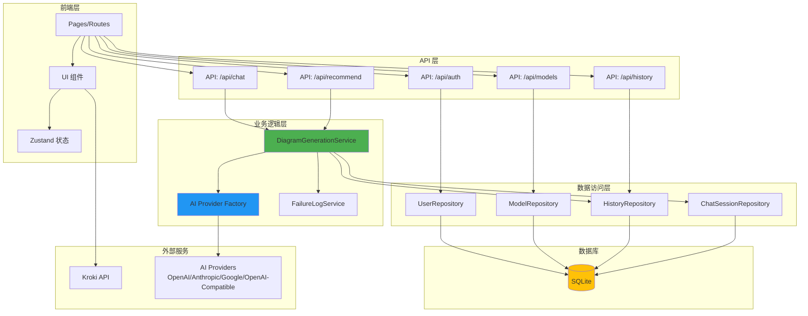
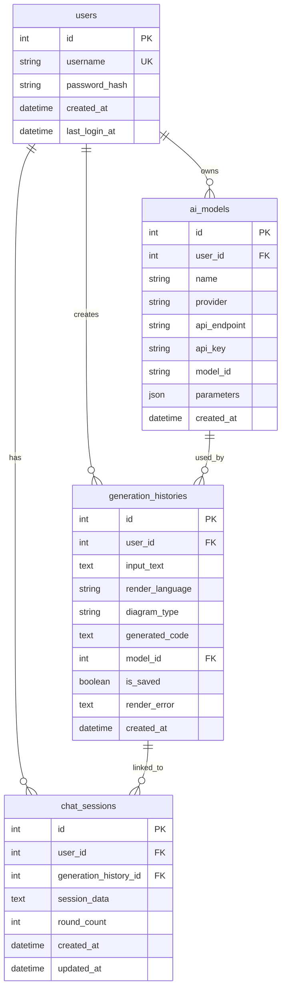
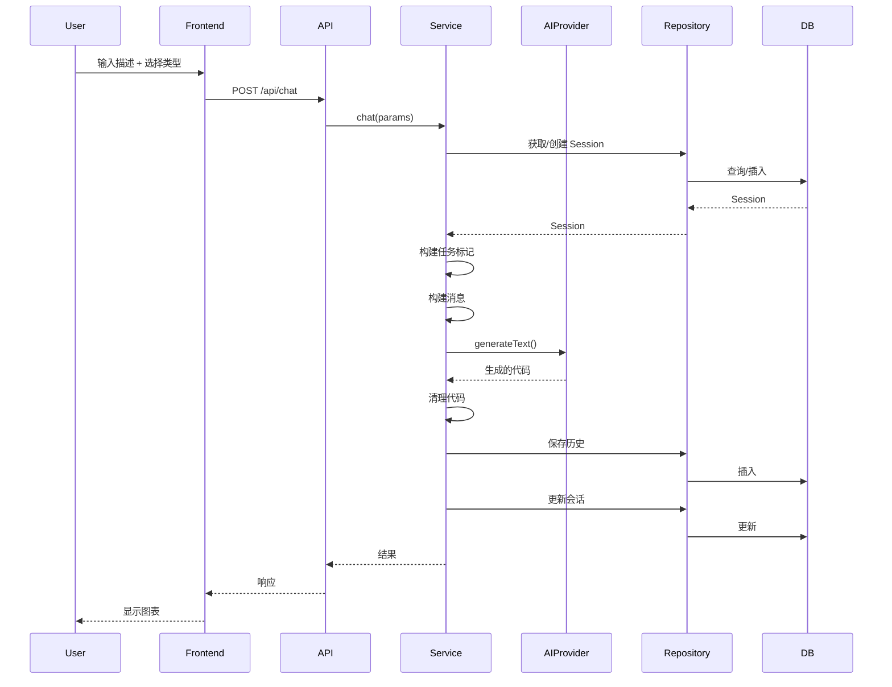
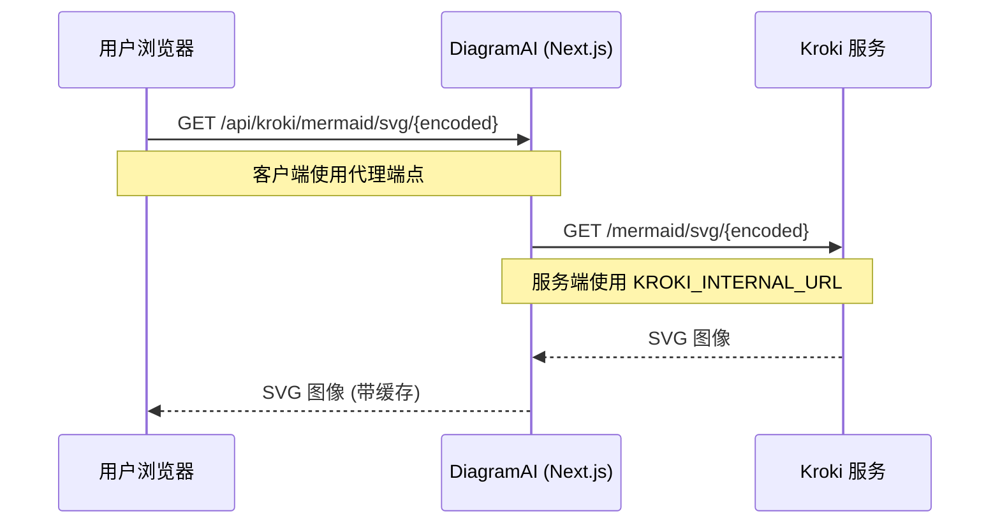

# DiagramAI 架构指南

> AI 助手和开发者的架构参考文档

---

## 📋 项目概览

- **技术栈**: Next.js 15 + React 19 + TypeScript 5
- **架构模式**: Repository + Service + Factory Pattern
- **数据库**: SQLite (better-sqlite3)
- **认证**: JWT + bcrypt
- **AI 集成**: Vercel AI SDK (多提供商支持)
- **图表渲染**: Kroki (支持 23 种渲染语言)
- **状态管理**: Zustand
- **样式**: Tailwind CSS 4 + shadcn/ui

---

## 🏗️ 系统架构



---

## 📦 模块结构图

```mermaid
graph TD
    Root["DiagramAI (根)"]

    Root --> App["src/app"]
    Root --> Components["src/components"]
    Root --> Lib["src/lib"]
    Root --> Types["src/types"]
    Root --> Contexts["src/contexts"]
    Root --> Hooks["src/hooks"]
    Root --> Public["public"]

    App --> AppAuth["(auth) - 认证路由"]
    App --> AppProtected["(app) - 保护路由"]
    App --> AppAPI["api - API 端点"]

    AppAuth --> Login["login - 登录页"]
    AppAuth --> Register["register - 注册页"]

    AppProtected --> MainEditor["page.tsx - 主编辑器"]
    AppProtected --> History["history - 历史记录"]
    AppProtected --> Models["models - 模型配置"]

    AppAPI --> AuthAPI["auth - 认证 API"]
    AppAPI --> ChatAPIRoute["chat - 图表生成"]
    AppAPI --> ModelsAPI["models - 模型管理"]
    AppAPI --> HistoryAPIRoute["history - 历史 API"]
    AppAPI --> KrokiAPI["kroki - Kroki 代理"]
    AppAPI --> RecommendAPI["recommend - 推荐"]

    Lib --> LibAI["ai - AI 集成"]
    Lib --> LibAuth["auth - 认证"]
    Lib --> LibConstants["constants - 常量"]
    Lib --> LibDB["db - 数据库"]
    Lib --> LibRepos["repositories - 数据访问"]
    Lib --> LibServices["services - 业务逻辑"]
    Lib --> LibStores["stores - 状态管理"]
    Lib --> LibUtils["utils - 工具函数"]
    Lib --> LibValidations["validations - 验证"]

    LibConstants --> Prompts["prompts - AI 提示词 (23 种语言)"]

    Components --> CompAuth["auth - 认证组件"]
    Components --> CompEditor["editor - 编辑器"]
    Components --> CompHistory["history - 历史记录"]
    Components --> CompIcons["icons - 图标"]
    Components --> CompLayout["layout - 布局"]
    Components --> CompModals["modals - 对话框"]
    Components --> CompModels["models - 模型配置"]
    Components --> CompSelectors["selectors - 选择器"]
    Components --> CompShared["shared - 共享组件"]
    Components --> CompTheme["theme - 主题"]
    Components --> CompUI["ui - 基础 UI"]

    Public --> Icons["icons - 图标资源"]

    click AppAuth "#认证路由" "点击查看认证路由文档"
    click AppProtected "#保护路由" "点击查看保护路由文档"
    click AppAPI "#api-层" "点击查看 API 层文档"
    click LibAI "#ai-provider-factory" "点击查看 AI Provider Factory"
    click LibServices "#diagram-generation-service" "点击查看核心服务"
    click LibRepos "#repository-层" "点击查看数据访问层"
    click Prompts "#prompt-层级结构" "点击查看 Prompt 系统"
```



---

## 📊 模块索引

| 模块路径                 | 职责                       | 关键文件                                             | 文档链接                                |
| ------------------------ | -------------------------- | ---------------------------------------------------- | --------------------------------------- |
| **src/app/(auth)**       | 认证路由：登录、注册       | login/page.tsx, register/page.tsx                    | -                                       |
| **src/app/(app)**        | 主应用：编辑器、历史、模型 | page.tsx, history/page.tsx, models/page.tsx          | -                                       |
| **src/app/api/auth**     | 认证 API：登录、注册、登出 | login/route.ts, register/route.ts                    | -                                       |
| **src/app/api/chat**     | 图表生成 API               | route.ts                                             | -                                       |
| **src/app/api/models**   | 模型管理 API               | route.ts, [id]/route.ts                              | -                                       |
| **src/app/api/history**  | 历史记录 API               | route.ts, [id]/route.ts                              | -                                       |
| **src/app/api/kroki**    | Kroki 代理 API             | [[...path]]/route.ts                                 | -                                       |
| **src/lib/ai**           | AI 提供商抽象              | provider-factory.ts                                  | [查看详情](#ai-provider-factory)        |
| **src/lib/auth**         | 认证系统：JWT + bcrypt     | jwt.ts, password.ts, middleware.ts                   | [查看详情](#认证系统)                   |
| **src/lib/constants**    | 常量配置                   | diagram-types.ts, env.ts, prompts/                   | [查看详情](#类型定义管理)               |
| **src/lib/db**           | 数据库层                   | client.ts, schema.sql                                | [查看详情](#数据库-schema)              |
| **src/lib/repositories** | 数据访问层                 | User/Model/History/ChatSession                       | [查看详情](#repository-层)              |
| **src/lib/services**     | 业务逻辑层                 | DiagramGenerationService.ts, DiagramEditorService.ts | [查看详情](#diagram-generation-service) |
| **src/lib/stores**       | 状态管理                   | diagram-store.ts                                     | -                                       |
| **src/lib/utils**        | 工具函数                   | kroki.ts, code-cleaner.ts, logger.ts                 | -                                       |
| **src/components**       | React 组件库               | 10+ 子模块                                           | -                                       |
| **src/types**            | TypeScript 类型            | database.ts, diagram.ts, ai.ts                       | -                                       |
| **src/contexts**         | React Context              | AuthContext.tsx, ThemeContext.tsx                    | -                                       |
| **src/hooks**            | 自定义 Hooks               | useAuthRedirect.ts, useEditorActions.ts              | -                                       |

---

## 📂 目录结构

```
src/
├── app/                          # Next.js App Router
│   ├── (app)/                    # 保护路由 (需要认证)
│   │   ├── page.tsx              # 主图表编辑器
│   │   ├── history/              # 生成历史页面
│   │   └── models/               # 模型配置页面
│   ├── (auth)/                   # 认证路由
│   │   ├── login/                # 登录页面
│   │   └── register/             # 注册页面
│   └── api/                      # API 端点
│       ├── auth/                 # 认证 API
│       ├── chat/                 # 图表生成 API
│       ├── models/               # 模型 CRUD API
│       ├── history/              # 历史记录 API
│       ├── recommend/            # 推荐 API
│       └── kroki/                # Kroki 代理 API
│
├── components/                   # React 组件
│   ├── auth/                     # 认证组件
│   ├── editor/                   # 编辑器组件
│   ├── history/                  # 历史记录组件
│   ├── icons/                    # 图标组件
│   ├── layout/                   # 布局组件
│   ├── modals/                   # 模态对话框
│   ├── models/                   # 模型配置组件
│   ├── selectors/                # 选择器组件
│   ├── shared/                   # 共享组件
│   ├── theme/                    # 主题组件
│   └── ui/                       # UI 基础组件
│
├── lib/                          # 核心库
│   ├── ai/                       # AI 集成
│   │   └── provider-factory.ts  # 多提供商工厂
│   ├── auth/                     # 认证
│   │   ├── jwt.ts                # JWT 令牌
│   │   ├── password.ts           # 密码哈希
│   │   └── middleware.ts         # 认证中间件
│   ├── constants/                # 常量
│   │   ├── env.ts                # 环境变量
│   │   ├── diagram-types.ts      # 图表类型定义
│   │   ├── diagram-validation.ts # 图表验证规则
│   │   ├── placeholders.ts       # 占位符文本
│   │   └── prompts/              # AI 提示词 (23+ 语言)
│   ├── db/                       # 数据库
│   │   ├── client.ts             # SQLite 客户端
│   │   └── schema.sql            # 数据库 Schema
│   ├── repositories/             # 数据访问层
│   │   ├── UserRepository.ts
│   │   ├── ModelRepository.ts
│   │   ├── HistoryRepository.ts
│   │   └── ChatSessionRepository.ts
│   ├── services/                 # 业务逻辑
│   │   ├── DiagramGenerationService.ts
│   │   └── FailureLogService.ts
│   ├── stores/                   # Zustand 状态管理
│   │   └── diagram-store.ts
│   ├── themes/                   # 主题配置
│   │   └── codemirror-theme.ts
│   ├── utils/                    # 工具函数
│   │   ├── api-client.ts         # API 客户端
│   │   ├── api-response.ts       # API 响应工具
│   │   ├── clipboard.ts          # 剪贴板工具
│   │   ├── code-cleaner.ts       # 代码清理
│   │   ├── download.ts           # 下载工具
│   │   ├── kroki.ts              # Kroki URL 生成
│   │   ├── logger.ts             # 日志工具
│   │   ├── prompt-loader.ts      # Prompt 三层加载器
│   │   └── svg-to-image.ts       # SVG 转图片
│   └── validations/              # Zod 验证模式
│       ├── auth.ts
│       ├── chat.ts
│       ├── models.ts
│       └── history.ts
│
├── types/                        # TypeScript 类型
│   ├── ai.ts                     # AI 类型
│   ├── common.ts                 # 通用类型
│   ├── database.ts               # 数据库类型
│   ├── diagram.ts                # 图表类型
│   ├── recommendation.ts         # 推荐类型
│   └── env.d.ts                  # 环境变量类型
│
├── contexts/                     # React Context
│   ├── AuthContext.tsx
│   └── ThemeContext.tsx
│
└── hooks/                        # 自定义 Hooks
    ├── useAuthRedirect.ts
    ├── useEditorActions.ts
    ├── useExportActions.ts
    └── useRecommendation.ts
```

---

## 🔑 核心模块

### 1. AI Provider Factory

**文件**: `src/lib/ai/provider-factory.ts`

多 AI 提供商统一接口:

```typescript
const model = getAIProvider({
  provider: "openai" | "anthropic" | "gemini" | "openai-compatible",
  model_id: "gpt-4o",
  api_key: "sk-...",
  api_endpoint: "https://api.deepseek.com/v1", // 可选
});
```

**支持的提供商**:

- **OpenAI**: 支持所有 GPT 系列模型
- **Anthropic**: 支持所有 Claude 系列模型
- **Google**: 支持所有 Gemini 系列模型
- **OpenAI Compatible**: DeepSeek, SiliconFlow, Together AI, Groq 等兼容 OpenAI API 的服务

### 2. Diagram Generation Service

**文件**: `src/lib/services/DiagramGenerationService.ts`

核心图表生成业务逻辑:

```typescript
async chat(params: ChatParams): Promise<ChatResult>
```

**功能流程**:

1. **任务类型决策** - 根据 `taskType` 或 `sessionId` 决定任务类型
   - `generate`: 首次生成新图表
   - `adjust`: 基于现有代码调整优化
   - `fix`: 修复语法错误 (保持逻辑不变)

2. **AI 调用** - 通过 Provider Factory 调用 AI 模型

3. **代码清理** - 使用 `cleanCode()` 清理 AI 生成的代码

4. **会话管理** - 存储/更新 ChatSession

5. **失败日志** - 当 `taskType === 'fix'` 时自动记录失败案例

**任务标记系统**:

```typescript
// 任务标记由前端按钮类型决定
const taskHint = _buildTaskHint(taskType);
// => "<<<SYSTEM_INSTRUCTION: GENERATE_NEW_DIAGRAM>>>"
// => "<<<SYSTEM_INSTRUCTION: ADJUST_EXISTING_DIAGRAM>>>"
// => "<<<SYSTEM_INSTRUCTION: FIX_SYNTAX_ERRORS_ONLY>>>"
```

### 3. Repository 层

**模式**: 所有数据库操作通过 Repository 进行

```typescript
// UserRepository - 用户认证
class UserRepository {
  create(data: CreateUserData): User;
  findByUsername(username: string): User | null;
  updateLastLogin(userId: number): void;
}

// ModelRepository - AI 模型配置
class ModelRepository {
  create(data: CreateModelData): AIModel;
  findByUserId(userId: number): AIModel[];
  findById(modelId: number): AIModel | null;
  update(modelId: number, data: UpdateModelData): void;
  delete(modelId: number): void;
}

// HistoryRepository - 生成历史
class HistoryRepository {
  create(data: CreateHistoryData): GenerationHistory;
  findByUserId(userId: number, filters?: HistoryFilters): GenerationHistory[];
  findById(historyId: number): GenerationHistory | null;
  update(historyId: number, data: UpdateHistoryData): void;
  delete(historyId: number): void;
}

// ChatSessionRepository - 聊天会话
class ChatSessionRepository {
  create(data: CreateSessionData): ChatSession;
  findById(sessionId: number): ChatSession | null;
  update(sessionId: number, sessionData: string, roundCount: number): void;
}
```

### 4. 认证系统

**文件**: `src/lib/auth/`

- **JWT**: 7 天过期时间, 签名令牌
- **bcrypt**: 10 轮密码哈希 (生产环境建议 12 轮)
- **Middleware**: `withAuth` 保护 API 路由

---

## 💾 数据库 Schema



**数据表**:

- `users` - 用户账户
- `ai_models` - AI 提供商配置
- `generation_histories` - 生成的图表
- `chat_sessions` - 多轮对话会话

**Schema 特性**:

- 支持 23 种图表渲染语言
- 完整的用户认证和会话管理
- 多 AI 提供商配置支持

---

## 🔄 请求流程

### 图表生成流程



---

## 🎯 开发指南

### 代码规范

- ✅ TypeScript strict 模式
- ✅ ESLint + Prettier
- ✅ 中文注释
- ✅ Conventional Commits (feat/fix/docs/refactor/test/chore)

### 架构原则

- ✅ 数据库访问仅通过 Repository
- ✅ 业务逻辑在 Service 层
- ✅ API 路由使用 `withAuth` 保护
- ✅ 输入验证使用 Zod
- ✅ 错误处理使用 try-catch

### 运行与开发

```bash
# 开发环境
npm run dev              # 启动开发服务器 (http://localhost:3000)

# 构建与生产
npm run build            # 构建生产版本
npm run start            # 启动生产服务器

# 代码质量
npm run lint             # ESLint 检查
npm run format           # Prettier 格式化
npm run format:check     # 检查格式
npm run type-check       # TypeScript 检查
npm run ci               # 完整 CI 检查 (format + lint + type-check)

# 数据库
npm run db:init          # 初始化数据库
npm run db:seed          # 种子数据

# 清理
npm run clean            # 清理缓存
npm run rebuild          # 重新构建
```

---

## 🚀 添加新功能

### ⚠️ 添加新的图表语言 - SSOT 维护流程

**重要**: RenderLanguage 枚举值必须在多个位置保持 100% 同步！

#### 步骤 1: 修改 TypeScript 类型定义 (SSOT 源头)

在 `src/lib/constants/diagram-types.ts` 中添加:

```typescript
// 1. 添加到 RenderLanguage 类型
export type RenderLanguage =
  | "mermaid"
  | "plantuml"
  // ...
  | "your-language"; // ✅ 新增

// 2. 添加到 RENDER_LANGUAGES 数组
export const RENDER_LANGUAGES: readonly RenderLanguageInfo[] = [
  // ...
  {
    value: "your-language",
    label: "YourLanguage",
    description: "描述",
    iconPath: "/icons/languages/your-language.svg",
  },
];

// 3. 添加到 LANGUAGE_DIAGRAM_TYPES
export const LANGUAGE_DIAGRAM_TYPES: Record<RenderLanguage, readonly DiagramTypeInfo[]> = {
  // ...
  "your-language": [{ value: "flowchart", label: "流程图", description: "展示流程" }],
};
```

#### 步骤 2: 同步数据库 Schema 枚举 ⚠️ 必须手动同步

在 `src/lib/db/schema.sql` 修改 **两处** CHECK 约束:

```sql
-- 位置 1: generation_histories 表 (约第 167 行)
CHECK (render_language IN (
  'mermaid', 'plantuml', ..., 'your-language'  -- ✅ 添加新语言
))

-- 位置 2: custom_prompts 表 (约第 322-330 行)
CHECK (
  render_language IS NULL OR
  render_language IN (
    'mermaid', 'plantuml', ..., 'your-language'  -- ✅ 添加新语言
  )
)
```

#### 步骤 3: 创建提示词文件

在 `data/prompts/` 创建提示词目录:

```
data/prompts/
└── your-language/
    ├── common.txt        # L2: 语言通用规范 (可选)
    └── flowchart.txt     # L3: 特定图表类型 (必需)
```

#### 步骤 4: 添加前端资源

添加图标文件: `/public/icons/languages/your-language.svg`

#### 步骤 5: 验证同步

```bash
# 1. TypeScript 类型检查
npm run type-check

# 2. 构建验证
npm run build

# 3. 手动验证数据库约束是否生效
# 尝试插入新语言的数据,确保不会报错
```

#### ⚠️ 维护警告

**必须同步的 4 个位置**:

1. ✅ `diagram-types.ts` - RenderLanguage type (SSOT, 自动传播)
2. ❌ `schema.sql:167` - generation_histories CHECK (手动同步)
3. ❌ `schema.sql:322-330` - custom_prompts CHECK (手动同步)
4. ✅ `code-cleaner.ts` - 已改为动态生成 (自动同步)

**未来优化计划**: 考虑使用代码生成工具自动同步 Schema 枚举值

### 添加新的 AI Provider

1. 检查 Vercel AI SDK 兼容性

2. 在 `src/lib/ai/provider-factory.ts` 添加:

```typescript
case 'your-provider':
  const provider = createYourProvider({
    apiKey: config.api_key,
    baseURL: config.api_endpoint || undefined,
  });
  return provider(config.model_id);
```

3. 更新数据库 Schema 的 `provider` 枚举

4. 添加前端配置 UI

---

## 🔄 类型定义管理

### Prompt 层级结构

DiagramAI 使用三层 Prompt 系统:

```
L1: universal.txt (641 行)
    → 所有图表共享的通用规范

L2: {language}/common.txt
    → 每种语言的通用规范 (可选)
    → 21/23 种语言有此文件

L3: {language}/{type}.txt
    → 特定图表类型的规范 (必需)
    → 必须与前端类型定义对齐
```

**Prompt 构建逻辑** (`src/lib/utils/prompt-loader.ts`):

```typescript
最终 Prompt = L1 + L2 + L3 (用 --- 分隔)
```

### 类型定义对齐原则

**SSOT (Single Source of Truth)**: `src/lib/constants/diagram-types.ts`

**三方对齐关系**:

```
前端类型定义 (diagram-types.ts)
     ↓
必须完全匹配
     ↓
L3 Prompt 文件 (prompts/{language}/{type}.txt)
```

**维护规则**:

1. **添加新图表类型**:
   - ✅ 先创建 `prompts/{language}/{type}.txt` 文件
   - ✅ 然后在 `LANGUAGE_DIAGRAM_TYPES` 添加对应类型定义
   - ✅ 验证三方对齐: 运行 `npx tsx scripts/verify-types.ts`

2. **删除图表类型**:
   - ✅ 先从 `LANGUAGE_DIAGRAM_TYPES` 移除类型定义
   - ✅ 然后删除或重命名 `prompts/{language}/{type}.txt`
   - ⚠️ 保留有价值的 prompt 内容,避免误删

3. **重命名图表类型**:
   - ✅ 同时修改前端定义和 prompt 文件名
   - ✅ 更新 `RENDER_LANGUAGES` 的图表数量描述

**常见错误**:

- ❌ 前端定义了类型但没有对应 prompt 文件
- ❌ 存在 prompt 文件但前端没有定义 (用户无法选择)
- ❌ 复制粘贴导致把其他语言的类型混进来

**历史教训 (2025-10-12)**:

- 发现所有 23 种语言的类型定义都存在严重混乱
- 原因: 复制粘贴错误,把其他语言的类型混在一起
- 修复: 完全基于实际 prompt 文件重建类型定义
- 结果: 类型数量从 600+ 个混乱定义减少到 80+ 个正确定义

---

## 📚 关键文件参考

| 文件                                           | 用途                 |
| ---------------------------------------------- | -------------------- |
| `src/lib/ai/provider-factory.ts`               | AI 提供商抽象        |
| `src/lib/services/DiagramGenerationService.ts` | 核心生成逻辑         |
| `src/lib/services/FailureLogService.ts`        | 失败日志记录         |
| `src/lib/auth/jwt.ts`                          | JWT 认证             |
| `src/lib/auth/middleware.ts`                   | API 路由保护         |
| `src/lib/db/schema.sql`                        | 数据库 Schema        |
| `src/lib/constants/prompts/`                   | AI 提示词 (23+ 语言) |
| `src/lib/constants/diagram-types.ts`           | 图表类型定义 (SSOT)  |
| `src/lib/utils/prompt-loader.ts`               | Prompt 三层加载器    |
| `src/app/api/chat/route.ts`                    | 生成 API 端点        |
| `src/app/api/kroki/[[...path]]/route.ts`       | Kroki 代理 API       |

---

## 🔧 环境变量

查看 `env.example` 获取完整配置列表。关键变量:

```bash
# 必需配置
JWT_SECRET=<64+ 字符强密钥>

# 可选配置
BCRYPT_SALT_ROUNDS=10          # 生产环境建议 12
AI_TEMPERATURE=0.7
AI_MAX_RETRIES=3
API_TEST_TIMEOUT=30000         # 模型测试超时 (毫秒)

# Kroki 配置
NEXT_PUBLIC_KROKI_URL=/api/kroki           # 客户端 (代理)
KROKI_INTERNAL_URL=https://kroki.io        # 服务端 (直连)
NEXT_PUBLIC_KROKI_TIMEOUT=5000
NEXT_PUBLIC_KROKI_MAX_RETRIES=3

# 输入限制
NEXT_PUBLIC_MAX_INPUT_CHARS=20000
NEXT_PUBLIC_MAX_CHAT_ROUNDS=10

# 失败日志
ENABLE_FAILURE_LOGGING=true
```

---

## 📊 Kroki 架构

### 概述

DiagramAI 使用 Kroki 作为图表渲染引擎,通过代理架构解决 CORS 问题。



### 部署选项

| 选项            | 使用场景   | 配置                                          |
| --------------- | ---------- | --------------------------------------------- |
| **公共服务**    | 开发、测试 | `KROKI_INTERNAL_URL=https://kroki.io`         |
| **Docker 本地** | 生产环境   | `KROKI_INTERNAL_URL=http://localhost:8000`    |
| **Docker 远程** | 分布式部署 | `KROKI_INTERNAL_URL=http://kroki-server:8000` |

### 为什么使用代理?

1. **解决 CORS**: 浏览器无法直接访问 Kroki 服务
2. **统一入口**: 所有请求通过 Next.js API
3. **缓存**: 实现 1 小时缓存,减少重复请求
4. **安全性**: Kroki 仅需暴露给 DiagramAI 服务器

### 代码实现

**文件**: `src/app/api/kroki/[[...path]]/route.ts`

```typescript
// 代理客户端请求到 Kroki
export async function GET(request: NextRequest) {
  const pathname = request.nextUrl.pathname.replace("/api/kroki", "");
  const krokiUrl = ENV.KROKI_INTERNAL_URL;
  const targetUrl = `${krokiUrl}${pathname}`;

  const response = await fetch(targetUrl);
  const content = await response.arrayBuffer();

  return new NextResponse(content, {
    headers: {
      "Content-Type": "image/svg+xml",
      "Cache-Control": "public, max-age=3600", // 1 小时缓存
    },
  });
}
```

**文件**: `src/lib/utils/kroki.ts`

```typescript
// ⚡ POST 方式渲染 - 无 URL 长度限制,无需编码
export async function renderKrokiDiagram(
  code: string,
  diagramType: KrokiDiagramType,
  outputFormat: KrokiOutputFormat = "svg"
): Promise<string> {
  const response = await fetch(`${KROKI_URL}/${diagramType}/${outputFormat}`, {
    method: "POST",
    headers: { "Content-Type": "application/json" },
    body: JSON.stringify({ code, language: diagramType, type: outputFormat }),
  });

  const blob = await response.blob();
  return URL.createObjectURL(blob); // 返回 blob URL
}
```

### 图表渲染流程

```mermaid
graph LR
    A[DiagramPreview 组件] --> B[renderKrokiDiagram]
    B -->|POST| C[/api/kroki/mermaid/svg]
    C --> D[Kroki API Route]
    D -->|POST| E{Kroki 服务}
    E -->|公共| F[https://kroki.io]
    E -->|Docker| G[http://localhost:8000]
    E -->|远程| H[http://kroki-server:8000]
    F --> I[返回 SVG]
    G --> I
    H --> I
    I --> J[Blob URL & 显示]
```

### 性能优化

- ⚡ **POST 方式**: 无 URL 长度限制,支持大型图表
- 🚀 **无需编码**: 直接发送代码,性能更好
- 📦 **Blob URL**: 高效的内存管理,自动清理
- 🗑️ **移除 pako**: 减少依赖,简化代码

---

## 🎨 支持的图表语言

DiagramAI 支持 **23 种图表渲染语言**:

### 主流语言 (前 10)

1. **Mermaid** - 14 种图表类型 (流程图、时序图、类图、ER 图、甘特图等)
2. **PlantUML** - 8 种 UML 图表 (时序图、类图、用例图、活动图等)
3. **D2** - 7 种现代化图表 (流程图、时序图、ER 图、类图、网格等)
4. **Graphviz** - 6 种图形可视化 (流程图、状态图、树形结构、ER 图等)
5. **WaveDrom** - 4 种数字信号图 (时序波形、信号图、寄存器图、位字段)
6. **Nomnoml** - 4 种简化 UML 图 (类图、组件图、架构图、流程图)
7. **Excalidraw** - 5 种手绘风格图表 (草图、线框图、通用图表、流程图、架构图)
8. **C4-PlantUML** - 4 种 C4 架构图 (上下文图、容器图、组件图、时序图)
9. **Vega-Lite** - 6 种数据可视化 (柱状图、折线图、散点图、饼图、面积图、热力图)
10. **DBML** - 4 种数据库图表 (完整 Schema、单表设计、ER 图、表关系图)

### 扩展语言 (新增 13 种)

11. **BPMN** - 1 种业务流程建模标准
12. **Ditaa** - 1 种 ASCII 艺术转图形
13. **NwDiag** - 1 种网络拓扑图
14. **BlockDiag** - 2 种块状流程图 (块状图、分组图)
15. **ActDiag** - 2 种活动图 (活动图、泳道图)
16. **PacketDiag** - 2 种网络数据包图 (数据包、协议栈)
17. **RackDiag** - 2 种机柜图 (机柜、数据中心)
18. **SeqDiag** - 1 种时序图 (BlockDiag 风格)
19. **Structurizr** - 7 种 C4 架构建模 DSL
20. **Erd** - 1 种简洁 ER 图语法
21. **Pikchr** - 1 种图表脚本语言
22. **SvgBob** - 1 种 ASCII 转 SVG 美化
23. **UMLet** - 1 种轻量级 UML 工具

**总计**: 80+ 种图表类型

---

## 🎨 提示词管理

DiagramAI 支持用户自定义 AI 提示词,实现个性化图表生成。

### 功能特性

- **三层提示词系统**: L1 (通用规范) + L2 (语言规范) + L3 (类型规范)
- **版本管理**: 语义化版本控制 (v1.0.0, v1.0.1, ...)
- **历史回溯**: 激活任意历史版本,安全地测试不同提示词
- **实时预览**: CodeMirror 编辑器,支持语法高亮和实时编辑
- **用户隔离**: 每个用户的自定义提示词相互独立
- **智能 Fallback**: 无自定义版本时自动使用系统默认

### 使用方法

1. 访问 `/prompts` 页面
2. 选择要自定义的层级和类型:
   - **L1**: 所有图表共享的通用规范
   - **L2**: 特定语言的通用规范 (如 Mermaid)
   - **L3**: 特定图表类型的规范 (如 Mermaid 流程图)
3. 在编辑器中修改提示词内容
4. 点击"保存"创建新版本 (自动递增版本号)
5. 使用版本选择器切换和激活不同版本
6. 返回主编辑器 (`/`) 测试效果

### 技术架构

**数据库层**:

- `custom_prompts` 表 (支持版本控制和激活版本管理)
- 5 个性能索引优化查询速度
- 自动更新 `updated_at` 触发器

**API 层** (6 个端点):

- `GET /api/prompts/:level` - 获取激活的提示词
- `GET /api/prompts/versions` - 获取版本历史
- `POST /api/prompts` - 创建新版本
- `PUT /api/prompts/:id/activate` - 激活指定版本
- `DELETE /api/prompts/:id` - 删除指定版本
- `GET /api/prompts` - 获取用户所有自定义位置

**前端层**:

- `usePrompt` Hook - API 集成和状态管理
- 7 个 React 组件 - 完整的提示词管理 UI
- CodeMirror 编辑器 - 专业的代码编辑体验

### 核心实现

**代码实现**:

- **数据库 Schema**: `src/lib/db/schema.sql` - 完整的数据库结构定义
- **Repository 层**: `src/lib/repositories/PromptRepository.ts` - 数据访问层实现
- **类型定义**: `src/types/prompt.ts` - TypeScript 类型定义

**核心优势**:

- ✅ 支持版本控制和历史回溯 (文件系统无法实现)
- ✅ 多用户隔离和权限管理
- ✅ 智能 Fallback (用户自定义 > 系统默认)
- ✅ ACID 事务保证数据安全
- ✅ 索引优化查询性能 (< 1ms)

---

## 📖 附加文档

- **README.md** - 快速开始和基本使用
- **README.en.md** - 英文版本
- **KROKI_DEPLOYMENT.md** - Kroki 部署指南
- **env.example** - 环境变量配置

---

## 🔍 AI 使用指引

### 对 AI 助手的建议

1. **架构理解**:
   - 本项目严格遵循 Repository + Service + Factory 模式
   - 数据库访问必须通过 Repository 层
   - 业务逻辑集中在 Service 层
   - 不要绕过这些层次结构

2. **代码修改**:
   - 修改功能时,先查看对应的 Service 或 Repository
   - 添加新功能时,遵循现有的文件组织结构
   - 类型定义在 `src/types/` 中集中管理

3. **Prompt 系统**:
   - 修改 AI 生成逻辑时,优先调整 prompt 文件
   - 不要修改 `prompt-loader.ts` 除非是架构级别的改进
   - 保持三层 Prompt 系统 (L1 + L2 + L3) 的完整性

4. **数据库操作**:
   - 所有 SQL 操作在 Repository 中
   - 使用参数化查询防止 SQL 注入
   - 外键关系已在 Schema 中定义,不要破坏

5. **错误处理**:
   - API 层使用 `apiSuccess()` 和 `apiError()` 统一响应格式
   - Service 层抛出有意义的错误信息
   - Repository 层返回 null 或布尔值

---

DiagramAI - AI 驱动的专业图表生成工具
