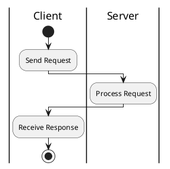
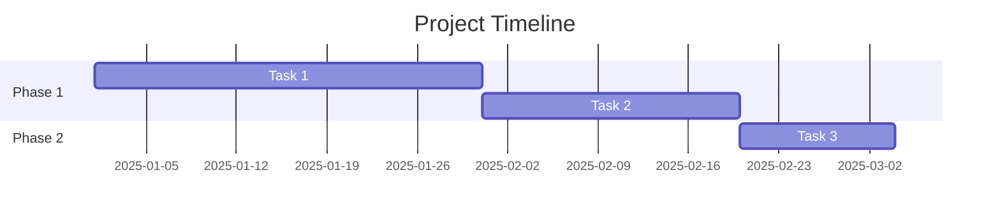

# ActDiag 社区问题和解决方案

> **文档目的**: 汇总社区讨论的 ActDiag 问题和解决方案
> **最后更新**: 2025-01-13

---

## 📚 概述

ActDiag 是 blockdiag 系列工具之一,主要用于生成活动图(Activity Diagram),特别适合绘制带泳道的业务流程图。本文档汇总了社区中常见的问题、讨论和解决方案。

---

## 🔧 通用问题

### 1. ActDiag vs UML Activity Diagram

**问题来源**: Stack Overflow 社区讨论

**问题描述**:
ActDiag 与标准 UML 活动图有什么区别?如何选择?

**对比分析**:

| 特性 | ActDiag | UML Activity Diagram |
|------|---------|---------------------|
| 语法复杂度 | 简单 | 中等 |
| 泳道支持 | ✅ 原生支持 | ✅ 支持 |
| 决策节点 | 手动定义 | 标准语法 |
| 并行流程 | 手动定义 | 标准语法 |
| 学习曲线 | 平缓 | 较陡 |
| 适用场景 | 简单业务流程 | 复杂系统建模 |

**ActDiag 示例**:

```actdiag
actdiag {
  request -> process -> respond;

  lane client {
    label = "Client"
    request; respond;
  }

  lane server {
    label = "Server"
    process;
  }
}
```

**UML Activity Diagram (PlantUML)**:



**建议**:
- **简单流程**: 使用 ActDiag,语法简洁
- **复杂建模**: 使用标准 UML 活动图
- **团队熟悉度**: 选择团队熟悉的工具

---

### 2. 跨泳道活动表示

**问题来源**: Stack Overflow [#62946470](https://stackoverflow.com/questions/62946470/how-to-represent-an-action-available-from-multiple-swimlanes-in-an-activity-diag)

**问题描述**:
如何表示一个活动可以从多个泳道访问?

**问题场景**:
```
用户角色 1: 可以执行活动 A
用户角色 2: 也可以执行活动 A
如何在活动图中表示?
```

**ActDiag 限制**:
- 每个活动只能属于一个泳道
- 不支持跨泳道的活动

**解决方案 1**: 使用抽象泳道

```actdiag
actdiag {
  request -> check_role;
  check_role -> execute_a;
  execute_a -> respond;

  lane user {
    label = "User (Any Role)"
    request;
    respond;
  }

  lane system {
    label = "System"
    check_role [label = "Check Role", shape = "diamond"];
    execute_a [label = "Execute A"];
  }
}
```

**解决方案 2**: 创建共享泳道

```actdiag
actdiag {
  role1_request -> shared_action -> role1_respond;
  role2_request -> shared_action -> role2_respond;

  lane role1 {
    label = "Role 1"
    role1_request [label = "Request"];
    role1_respond [label = "Respond"];
  }

  lane shared {
    label = "Shared Actions"
    shared_action [label = "Execute A"];
  }

  lane role2 {
    label = "Role 2"
    role2_request [label = "Request"];
    role2_respond [label = "Respond"];
  }
}
```

**解决方案 3**: 使用注释说明

```actdiag
actdiag {
  request -> execute -> respond;

  lane user {
    label = "User\n(Role 1 or Role 2)"
    request;
    respond;
  }

  lane system {
    label = "System"
    execute [label = "Execute A\n(Available to all roles)"];
  }
}
```

---

### 3. 泳道查询和过滤

**问题来源**: Atlassian Community (Kanban 泳道讨论)

**问题描述**:
如何在 ActDiag 中使用查询条件来显示特定活动?

**ActDiag 限制**:
- ActDiag 是静态图表工具
- 不支持动态查询或过滤
- 无法根据条件显示/隐藏泳道

**替代方案**: 生成多个版本的图表

```bash
# 生成完整流程图
actdiag full_process.diag -o full.png

# 生成特定角色流程图
actdiag role1_process.diag -o role1.png
actdiag role2_process.diag -o role2.png
```

**示例**: 角色特定视图

```actdiag
// role1_process.diag
actdiag {
  request -> validate -> approve -> complete;

  lane role1 {
    label = "Manager"
    request;
    approve;
  }

  lane system {
    label = "System"
    validate;
    complete;
  }
}

// role2_process.diag
actdiag {
  prepare -> submit -> track;

  lane role2 {
    label = "Employee"
    prepare;
    submit;
    track;
  }
}
```

---

## 🎨 样式和布局

### 4. 垂直布局支持

**问题来源**: 社区反馈

**问题描述**:
ActDiag 默认水平布局,是否支持垂直布局?

**解决方案**: 使用 orientation 参数(部分实现支持)

```actdiag
actdiag {
  orientation = portrait;  // 垂直布局

  A -> B -> C;

  lane l1 {
    label = "Lane 1"
    A;
  }

  lane l2 {
    label = "Lane 2"
    B; C;
  }
}
```

**注意事项**:
- 并非所有渲染器都支持 `orientation`
- Kroki 可能不支持此参数
- 建议测试具体渲染环境

---

### 5. 自定义泳道宽度

**问题来源**: GitHub Issues 讨论

**问题描述**:
如何控制泳道的宽度?

**ActDiag 限制**:
- 不支持直接设置泳道宽度
- 宽度由内容自动决定

**间接方法**: 调整活动标签长度

```actdiag
actdiag {
  A -> B;

  lane narrow {
    label = "N"
    A [label = "A"];  // 短标签 = 窄泳道
  }

  lane wide {
    label = "Wide Lane Name"
    B [label = "This is a much longer label"];  // 长标签 = 宽泳道
  }
}
```

---

## 🔄 流程建模

### 6. 异常处理流程

**问题来源**: 最佳实践讨论

**问题描述**:
如何在 ActDiag 中表示异常处理和重试逻辑?

**解决方案**: 使用决策节点和循环

```actdiag
actdiag {
  start -> execute;
  execute -> check_result;
  check_result -> success;
  check_result -> error;
  error -> retry_check;
  retry_check -> execute;      // 重试循环
  retry_check -> give_up;
  success -> end;
  give_up -> end;

  start [label = "Start"];
  execute [label = "Execute Task"];
  check_result [
    label = "Success?",
    shape = "diamond",
    color = "yellow"
  ];
  success [label = "Success Path", color = "lightgreen"];
  error [label = "Error Detected", color = "pink"];
  retry_check [
    label = "Retry Count < 3?",
    shape = "diamond",
    color = "orange"
  ];
  give_up [label = "Give Up", color = "red"];
  end [label = "End"];

  lane system {
    label = "System"
    start; execute; check_result;
    success; error; retry_check; give_up; end;
  }
}
```

---

### 7. 并行任务建模

**问题来源**: 用户案例分享

**问题描述**:
如何表示并行执行的任务?

**解决方案**: Fork-Join 模式

```actdiag
actdiag {
  start -> fork;
  fork -> task1;
  fork -> task2;
  fork -> task3;
  task1 -> join;
  task2 -> join;
  task3 -> join;
  join -> end;

  start [label = "Start"];
  fork [
    label = "Fork",
    shape = "diamond",
    color = "lightblue"
  ];
  task1 [label = "Task 1"];
  task2 [label = "Task 2"];
  task3 [label = "Task 3"];
  join [
    label = "Join",
    shape = "diamond",
    color = "lightblue"
  ];
  end [label = "End"];

  lane coordinator {
    label = "Coordinator"
    start; fork; join; end;
  }

  lane worker {
    label = "Workers"
    task1; task2; task3;
  }
}
```

---

## 🔧 工具集成

### 8. Asciidoctor 集成

**问题来源**: [Asciidoctor Docs](https://docs.asciidoctor.org/diagram-extension/latest/diagram_types/actdiag/)

**配置示例**:

```ruby
# Gemfile
gem 'asciidoctor-diagram'
```

**使用示例**:

```asciidoc
[actdiag, format="png"]
----
actdiag {
  write -> convert -> image

  lane user {
    label = "User"
    write [label = "Writing"];
  }

  lane actdiag {
    convert [label = "Convert"];
  }
}
----
```

---

### 9. Kroki 集成最佳实践

**问题来源**: DiagramAI 项目实践

**编码实现**:

```typescript
// 正确的 Kroki 编码
import pako from 'pako';

export function generateActDiagURL(
  code: string,
  outputFormat: 'svg' | 'png' = 'svg'
): string {
  // 1. Deflate 压缩
  const compressed = pako.deflate(code, { level: 9 });

  // 2. Base64 URL 编码
  const base64 = btoa(String.fromCharCode(...compressed))
    .replace(/\+/g, '-')
    .replace(/\//g, '_')
    .replace(/=+$/, '');

  // 3. 构建 URL
  return `/api/kroki/actdiag/${outputFormat}/${base64}`;
}
```

**使用代理避免 CORS**:

```typescript
// Next.js API Route: /api/kroki/[...path]/route.ts
export async function GET(request: NextRequest) {
  const pathname = request.nextUrl.pathname.replace('/api/kroki', '');
  const krokiUrl = process.env.KROKI_INTERNAL_URL;
  const targetUrl = `${krokiUrl}${pathname}`;

  const response = await fetch(targetUrl);
  const content = await response.arrayBuffer();

  return new NextResponse(content, {
    headers: {
      'Content-Type': 'image/svg+xml',
      'Cache-Control': 'public, max-age=3600',
    },
  });
}
```

---

## 📊 实际应用案例

### 10. 订单处理流程

**案例来源**: 电商系统实践

**需求**:
- 客户下单
- 库存检查
- 支付处理
- 发货物流
- 异常处理

**实现**:

```actdiag
actdiag {
  // 主流程
  order -> check_stock;
  check_stock -> process_payment;
  check_stock -> notify_unavailable;
  process_payment -> prepare_ship -> ship -> notify_shipped -> complete;
  notify_unavailable -> refund -> complete;

  // 活动定义
  order [label = "Place Order"];
  check_stock [
    label = "Check Stock",
    shape = "diamond",
    color = "yellow"
  ];
  process_payment [label = "Process Payment"];
  prepare_ship [label = "Prepare Shipment"];
  ship [label = "Ship"];
  notify_shipped [label = "Notify Shipped"];
  notify_unavailable [label = "Notify Unavailable", color = "pink"];
  refund [label = "Refund", color = "orange"];
  complete [label = "Complete", shape = "circle"];

  // 泳道分配
  lane customer {
    label = "Customer"
    color = "#E3F2FD"
    order;
    notify_shipped;
    notify_unavailable;
    complete;
  }

  lane inventory {
    label = "Inventory"
    color = "#F3E5F5"
    check_stock;
    prepare_ship;
  }

  lane payment {
    label = "Payment"
    color = "#E8F5E9"
    process_payment;
    refund;
  }

  lane logistics {
    label = "Logistics"
    color = "#FFF3E0"
    ship;
  }
}
```

---

### 11. CI/CD 流程

**案例来源**: DevOps 实践

**需求**:
- 代码提交
- 自动测试
- 代码审查
- 自动部署

**实现**:

```actdiag
actdiag {
  // 流程定义
  commit -> test;
  test -> passed;
  test -> failed;
  failed -> fix -> commit;
  passed -> review;
  review -> approved;
  review -> rejected;
  rejected -> fix;
  approved -> deploy -> verify;
  verify -> success;
  verify -> rollback;
  rollback -> fix;
  success -> done;

  // 活动属性
  commit [label = "Commit Code"];
  test [label = "Run Tests"];
  passed [label = "Passed", color = "lightgreen"];
  failed [label = "Failed", color = "pink"];
  fix [label = "Fix Issues"];
  review [label = "Code Review"];
  approved [label = "Approved", color = "lightgreen"];
  rejected [label = "Rejected", color = "orange"];
  deploy [label = "Deploy"];
  verify [label = "Verify"];
  success [label = "Success", color = "lightgreen"];
  rollback [label = "Rollback", color = "red"];
  done [label = "Done", shape = "circle"];

  // 泳道
  lane developer {
    label = "Developer"
    commit; fix;
  }

  lane ci_cd {
    label = "CI/CD"
    test; passed; failed; deploy; verify;
  }

  lane reviewer {
    label = "Reviewer"
    review; approved; rejected;
  }

  lane production {
    label = "Production"
    success; rollback; done;
  }
}
```

---

## 🐛 已知限制和替代方案

### 12. 不支持子流程

**限制**:
ActDiag 不支持嵌套或子流程表示。

**替代方案**: 使用单独的图表

```actdiag
// 主流程
actdiag {
  start -> process -> end;

  start [label = "Start"];
  process [label = "Complex Process\n(See Subprocess Diagram)"];
  end [label = "End"];
}

// 子流程 (单独图表)
actdiag {
  sub_start -> step1 -> step2 -> step3 -> sub_end;

  sub_start [label = "Subprocess Start"];
  step1 [label = "Step 1"];
  step2 [label = "Step 2"];
  step3 [label = "Step 3"];
  sub_end [label = "Subprocess End"];
}
```

---

### 13. 不支持时间线

**限制**:
ActDiag 不支持时间轴或持续时间表示。

**替代方案**: 使用 Gantt 图或序列图



---

### 14. 有限的样式自定义

**限制**:
ActDiag 样式选项有限,不支持高级样式。

**替代方案**: 导出后使用图像编辑工具

```bash
# 生成 SVG
actdiag diagram.diag -Tsvg -o diagram.svg

# 使用 Inkscape 或其他工具进一步编辑
inkscape diagram.svg
```

---

## 💡 最佳实践总结

### 设计原则

1. **保持简洁**: 每个图表不超过 10 个活动
2. **清晰标签**: 使用动词描述活动
3. **逻辑分组**: 合理使用泳道分组
4. **颜色语义**: 用颜色表示状态(成功/错误)
5. **文档化**: 复杂流程添加注释说明

### 命名约定

```actdiag
actdiag {
  // ✅ 好的命名
  user_login -> validate_credentials -> grant_access;

  user_login [label = "User Login"];
  validate_credentials [label = "Validate Credentials"];
  grant_access [label = "Grant Access"];

  // ❌ 避免的命名
  // a -> b -> c;
  // step1 -> step2 -> step3;
}
```

### 泳道组织

```actdiag
actdiag {
  // ✅ 按职责组织泳道
  lane user_interface {
    label = "User Interface"
    // UI 相关活动
  }

  lane business_logic {
    label = "Business Logic"
    // 业务逻辑活动
  }

  lane data_access {
    label = "Data Access"
    // 数据访问活动
  }
}
```

---

## 🔗 参考资源

### 官方资源
- **ActDiag 主页**: http://blockdiag.com/en/actdiag/
- **示例集**: http://blockdiag.com/en/actdiag/examples.html
- **Asciidoctor 集成**: https://docs.asciidoctor.org/diagram-extension/latest/diagram_types/actdiag/

### 社区资源
- **Stack Overflow**: 搜索 `[actdiag]` 标签
- **GitHub**: https://github.com/blockdiag/actdiag

### DiagramAI 文档
- **官方文档**: `/docs/kroki/actdiag/official-docs.md`
- **语法规则**: `/docs/kroki/actdiag/syntax-rules.md`
- **常见错误**: `/docs/kroki/actdiag/common-errors.md`

---

## 🤝 贡献指南

### 报告问题

1. **搜索已知问题**: 先查看是否已有相关讨论
2. **准备复现案例**: 提供最小化的代码示例
3. **提供详细信息**: 版本、环境、错误信息
4. **提交到合适平台**:
   - 官方工具问题 → blockdiag GitHub
   - 使用问题 → Stack Overflow
   - DiagramAI 集成 → DiagramAI GitHub

### 分享经验

欢迎分享您的:
- 实际应用案例
- 最佳实践建议
- 工具集成经验
- 性能优化技巧

---

## 📝 问题讨论模板

```markdown
### 问题描述
[简要描述您的问题或需求]

### 使用场景
[描述具体的使用场景]

### 代码示例
```actdiag
[提供代码示例]
```

### 期望结果
[描述期望的行为或输出]

### 实际结果
[描述实际的行为或输出]

### 环境信息
- ActDiag 版本: X.X.X
- 渲染工具: Kroki / Asciidoctor / 其他
- 浏览器/OS: [如适用]

### 已尝试的方案
- [ ] 方案 1
- [ ] 方案 2
```

---

*文档整理: DiagramAI 项目 | 基于社区讨论和实践经验*
