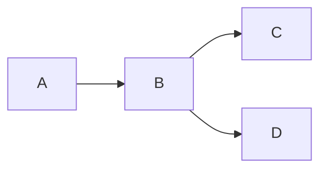
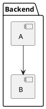

# BlockDiag 社区问题与解决方案

> **文档目的**: 汇总社区讨论的 BlockDiag 问题和解决方案
> **最后更新**: 2025-01-13

---

## 📚 概述

BlockDiag 是一个用 Python 编写的简单块状图表生成工具,采用类似 Graphviz DOT 的语法。本文档汇总了来自 GitHub Issues、Stack Overflow、OpenStack 邮件列表等社区的常见问题、已知限制和解决方案。

---

## 🔥 核心问题

### 1. Pillow 10+ 兼容性问题 ⚠️

**问题来源**: GitHub Issue #176, OpenStack 邮件列表 (2023-07)

**问题描述**:
BlockDiag 与 Pillow 10.x 及更高版本不兼容,导致项目无法构建或渲染失败。

**错误信息**:
```python
AttributeError: 'FreeTypeFont' object has no attribute 'getsize'
```

**根本原因**:
- Pillow 10.0 移除了已弃用的 `getsize()` 方法
- BlockDiag 使用旧版 API 进行文本测量
- 需要迁移到 `textbbox()` 方法

**影响范围**:
- BlockDiag 及所有 *diag 系列工具 (SeqDiag, ActDiag, NwDiag 等)
- sphinxcontrib-blockdiag 插件
- 依赖 BlockDiag 的 OpenStack 文档项目

**解决方案 1: 固定 Pillow 版本** (临时)
```bash
# requirements.txt
Pillow<10.0.0
```

**解决方案 2: 使用社区补丁** (部分修复)
```bash
# 2023 年 2 月有部分补丁提交,但未合并
git clone https://github.com/blockdiag/blockdiag
cd blockdiag
git fetch origin pull/177/head:pillow10
git checkout pillow10
pip install .
```

**解决方案 3: 切换到 Kroki** (推荐)
```bash
# 使用 Kroki 服务替代本地渲染
# 不依赖 Python/Pillow 环境
curl -X POST https://kroki.io/blockdiag/svg \
  -H "Content-Type: text/plain" \
  --data-binary @diagram.diag > output.svg
```

**OpenStack 社区的做法**:
> "我们最终将图表渲染为静态 SVG,然后移除了 sphinxcontrib-blockdiag 的使用,直接包含 SVG 图像。"
> — OpenStack 邮件列表, 2023-07-27

**状态**: 🔴 **项目维护停滞**
- 最后有意义的更新: 2019
- Issue #176 提交于 2020 年,至今未解决
- 社区正在寻找维护者

---

### 2. 项目维护状态问题

**问题来源**: GitHub Issue "Looking for maintainers?"

**现状分析**:
- **最后发布**: BlockDiag 1.5.4 (2015-12)
- **最后提交**: 零星更新,无活跃维护
- **开放 Issue**: 68 个未解决
- **Pull Request**: 8 个未合并

**社区建议的替代方案**:

| 工具 | 适用场景 | 优势 | 劣势 |
|------|---------|------|------|
| **Kroki** | 所有场景 | 无需本地安装,API 调用 | 需要网络连接 |
| **Mermaid** | Web 文档 | 活跃维护,广泛支持 | 语法不同 |
| **PlantUML** | UML 图表 | 功能强大 | 需要 Java |
| **D2** | 现代化图表 | 美观,活跃维护 | 生态较新 |

**迁移策略**:
```bash
# 1. 导出现有 BlockDiag 为 SVG
blockdiag *.diag -Tsvg

# 2. 将语法转换为 Mermaid (需手动调整)
# BlockDiag:
#   A -> B -> C
# Mermaid:
#   graph LR
#       A --> B --> C

# 3. 使用 Kroki 兼容现有语法
# 保持 .diag 文件不变,通过 Kroki API 渲染
```

---

## 🐛 已知 Bug

### 3. 字体大小错误

**问题**: GitHub Issue "ERROR: font size must be greater than 0"

**错误信息**:
```
ERROR: font size must be greater than 0
```

**可能原因**:
1. 系统缺少默认字体
2. `fontsize` 属性设置为 0 或负数
3. 环境变量 `FC_DEBUG` 干扰字体检测

**解决方案**:

**方案 1: 显式指定字体**
```blockdiag
blockdiag {
  default_fontsize = 12;  // 明确设置大小

  A [label = "Node A"];
}
```

**方案 2: 安装字体包** (Linux)
```bash
# Debian/Ubuntu
sudo apt-get install fonts-liberation

# RedHat/CentOS
sudo yum install liberation-fonts
```

**方案 3: 指定字体文件**
```bash
blockdiag --font=/usr/share/fonts/truetype/dejavu/DejaVuSans.ttf diagram.diag
```

---

### 4. PNG 标签损坏 (Windows OS)

**问题**: GitHub Issue "Labels in PNG broken (Windows OS)"

**症状**:
- SVG 输出正常
- PNG 输出中文本标签显示为乱码或方框

**原因**:
Windows 字体路径处理问题,Pillow 在 Windows 上字体回退机制不同。

**Workaround**:

**方案 1: 使用 SVG 输出**
```bash
blockdiag diagram.diag -Tsvg -o output.svg
```

**方案 2: 手动指定字体**
```bash
blockdiag --font="C:\\Windows\\Fonts\\arial.ttf" diagram.diag -Tpng
```

**方案 3: 转换 SVG → PNG** (推荐)
```bash
# 使用 Inkscape 或 ImageMagick
blockdiag diagram.diag -Tsvg -o temp.svg
convert temp.svg output.png  # ImageMagick
```

---

### 5. Portrait 模式不工作

**问题**: GitHub Issue "Portrait mode not working"

**期望行为**:
```blockdiag
blockdiag {
  orientation = portrait;
  A -> B -> C;
}
```
应该垂直布局。

**实际行为**:
`orientation` 参数被忽略,仍然水平布局。

**状态**: 🟡 **部分实现**
- 仅在特定条件下工作
- 与分组 (group) 结合使用时可能失效

**Workaround**:

**方案 1: 使用 rotate 插件** (如果可用)
```blockdiag
blockdiag {
  plugin = rotate;
  rotate = 90;
  A -> B -> C;
}
```

**方案 2: 后处理旋转**
```bash
# 使用 ImageMagick 旋转输出
blockdiag diagram.diag -o temp.png
convert temp.png -rotate 90 output.png
```

**方案 3: 重新设计图表**
```blockdiag
// 改用垂直流向的节点布局
blockdiag {
  A;
  B [style = none];
  C;

  A -> B [style = none];
  B -> C [style = none];

  // 使用分组模拟垂直布局
  group {
    orientation = portrait;
    A; B; C;
  }
}
```

---

### 6. SVG 中 URL 图像不工作

**问题**: GitHub Issue "url images in svg not working"

**场景**:
```blockdiag
blockdiag {
  A [background = "https://example.com/image.png"];
}
```

**问题描述**:
- 本地文件路径的图像可以显示
- HTTP/HTTPS URL 的图像不显示

**原因**:
BlockDiag 不支持网络图像获取,仅支持本地文件系统。

**Workaround**:

**方案 1: 预下载图像**
```bash
# 下载图像到本地
wget https://example.com/image.png -O local_image.png

# 使用本地路径
blockdiag diagram.diag
```

```blockdiag
blockdiag {
  A [background = "local_image.png"];
}
```

**方案 2: 使用 icon 属性**
```blockdiag
blockdiag {
  A [icon = "./icons/logo.png"];
}
```

**方案 3: 后处理 SVG**
```python
# 手动替换 SVG 中的图像引用
import xml.etree.ElementTree as ET

tree = ET.parse('output.svg')
root = tree.getroot()

for image in root.findall('.//{http://www.w3.org/2000/svg}image'):
    href = image.get('{http://www.w3.org/1999/xlink}href')
    if href.startswith('http'):
        # 替换为 base64 编码的图像
        image.set('{http://www.w3.org/1999/xlink}href', 'data:image/png;base64,...')

tree.write('output_fixed.svg')
```

---

## 🎨 样式和布局问题

### 7. 不同组使用不同大小

**问题**: GitHub Issue "Specify different sizes for different groups"

**需求**:
```blockdiag
blockdiag {
  group small {
    node_width = 100;
    A; B;
  }

  group large {
    node_width = 200;
    C; D;
  }
}
```

**限制**:
BlockDiag 不支持组级别的样式覆盖,`node_width` 等参数是全局的。

**Workaround**:

**方案 1: 手动调整每个节点**
```blockdiag
blockdiag {
  default_node_width = 100;

  A;
  B;
  C [width = 200];
  D [width = 200];
}
```

**方案 2: 使用多个图表**
```bash
# small_group.diag
blockdiag {
  node_width = 100;
  A; B;
}

# large_group.diag
blockdiag {
  node_width = 200;
  C; D;
}
```

**方案 3: 使用标签控制视觉大小**
```blockdiag
blockdiag {
  A [label = "A"];
  B [label = "B"];
  C [label = "Very Long Label C"];  // 标签长度影响节点宽度
  D [label = "Very Long Label D"];
}
```

---

### 8. 背景色配置 (SVG)

**问题**: GitHub Issue "Allow to configure the background color when generating SVG"

**需求**:
生成的 SVG 应该有自定义背景色,而不是透明或白色。

**限制**:
BlockDiag 生成的 SVG 没有 `<rect>` 背景元素。

**Workaround**:

**方案 1: 后处理 SVG**
```python
import xml.etree.ElementTree as ET

# 读取 SVG
tree = ET.parse('output.svg')
root = tree.getroot()

# 添加背景矩形
ns = {'svg': 'http://www.w3.org/2000/svg'}
svg_ns = "{http://www.w3.org/2000/svg}"

rect = ET.Element(f'{svg_ns}rect')
rect.set('width', '100%')
rect.set('height', '100%')
rect.set('fill', '#f0f0f0')  # 背景色

# 插入到第一个位置
root.insert(0, rect)

tree.write('output_bg.svg')
```

**方案 2: CSS 样式**
```html
<style>
svg {
  background-color: #f0f0f0;
}
</style>

```

**方案 3: 使用 PNG 输出**
```bash
# PNG 支持背景色参数
blockdiag --background=white diagram.diag -Tpng
```

---

## 🔧 工具集成

### 9. Sphinx 集成问题

**问题来源**: sphinxcontrib-blockdiag 用户反馈

**常见错误 1: 模块未找到**
```
Extension error: Could not import extension sphinxcontrib.blockdiag
```

**解决方案**:
```bash
pip install sphinxcontrib-blockdiag
```

**常见错误 2: Pillow 依赖**
```
ImportError: cannot import name 'PILLOW_VERSION' from 'PIL'
```

**解决方案**:
```bash
# 固定兼容版本
pip install "Pillow<10.0.0" "sphinxcontrib-blockdiag>=2.0.0"
```

**Sphinx conf.py 配置**:
```python
# conf.py
extensions = [
    'sphinxcontrib.blockdiag',
]

# BlockDiag 选项
blockdiag_html_image_format = 'SVG'
blockdiag_fontpath = '/usr/share/fonts/truetype/dejavu/DejaVuSans.ttf'
blockdiag_antialias = True
```

**使用示例**:
```rst
.. blockdiag::

   blockdiag {
     A -> B -> C;
     B -> D;
   }
```

---

### 10. Kroki 集成最佳实践

**问题来源**: DiagramAI 项目实践

**Kroki API 使用**:

**方案 1: POST 请求** (推荐,无 URL 长度限制)
```bash
curl -X POST https://kroki.io/blockdiag/svg \
  -H "Content-Type: text/plain" \
  --data-binary @diagram.diag \
  -o output.svg
```

**方案 2: GET 请求** (适合短代码)
```javascript
import pako from 'pako';

function generateBlockDiagURL(code) {
  // 1. Deflate 压缩
  const compressed = pako.deflate(code, { level: 9 });

  // 2. Base64 URL 编码
  const base64 = btoa(String.fromCharCode(...compressed))
    .replace(/\+/g, '-')
    .replace(/\//g, '_')
    .replace(/=+$/, '');

  // 3. 构建 URL
  return `https://kroki.io/blockdiag/svg/${base64}`;
}
```

**Next.js 代理配置** (避免 CORS):
```typescript
// app/api/kroki/[...path]/route.ts
export async function GET(request: NextRequest) {
  const pathname = request.nextUrl.pathname.replace('/api/kroki', '');
  const krokiUrl = process.env.KROKI_INTERNAL_URL || 'https://kroki.io';
  const targetUrl = `${krokiUrl}${pathname}`;

  const response = await fetch(targetUrl);
  const content = await response.arrayBuffer();

  return new NextResponse(content, {
    headers: {
      'Content-Type': 'image/svg+xml',
      'Cache-Control': 'public, max-age=3600', // 1 小时缓存
    },
  });
}
```

---

## 📊 实际应用案例

### 11. 系统架构图

**案例来源**: 开源项目文档

**需求**:
- 展示微服务架构
- 清晰的分层结构
- 组件间依赖关系

**实现**:
```blockdiag
blockdiag {
  // 样式定义
  default_fontsize = 11;
  node_width = 150;
  node_height = 60;

  // 分层分组
  group {
    label = "Frontend";
    color = "#E3F2FD";

    WebApp [label = "Web App\n(React)"];
    MobileApp [label = "Mobile App\n(React Native)"];
  }

  group {
    label = "API Gateway";
    color = "#FFF3E0";

    Gateway [label = "API Gateway\n(Kong)"];
  }

  group {
    label = "Backend Services";
    color = "#E8F5E9";
    orientation = portrait;

    AuthService [label = "Auth Service"];
    UserService [label = "User Service"];
    OrderService [label = "Order Service"];
  }

  group {
    label = "Data Layer";
    color = "#F3E5F5";

    PostgreSQL [label = "PostgreSQL", shape = "flowchart.database"];
    Redis [label = "Redis Cache", shape = "flowchart.database"];
  }

  // 连接关系
  WebApp -> Gateway;
  MobileApp -> Gateway;
  Gateway -> AuthService;
  Gateway -> UserService;
  Gateway -> OrderService;
  AuthService -> PostgreSQL;
  UserService -> PostgreSQL;
  OrderService -> PostgreSQL;
  UserService -> Redis [style = dashed, label = "cache"];
}
```

---

### 12. 网络拓扑图

**提示**: 网络图建议使用 **NwDiag** (BlockDiag 系列工具)

**BlockDiag 实现** (简化版):
```blockdiag
blockdiag {
  default_shape = "roundedbox";

  Internet [label = "Internet", shape = "cloud"];
  Firewall [label = "Firewall", color = "#FFE0E0"];
  LoadBalancer [label = "Load Balancer", color = "#E0E0FF"];

  group servers {
    label = "Web Servers";
    color = "#E0FFE0";

    Web1 [label = "Web Server 1"];
    Web2 [label = "Web Server 2"];
    Web3 [label = "Web Server 3"];
  }

  Database [label = "Database\nCluster", shape = "flowchart.database"];

  Internet -> Firewall;
  Firewall -> LoadBalancer;
  LoadBalancer -> Web1, Web2, Web3;
  Web1, Web2, Web3 -> Database;
}
```

---

## 🆚 BlockDiag 系列工具对比

### 13. 何时使用哪个 *diag 工具?

| 工具 | 用途 | 典型场景 | 特点 |
|------|------|---------|------|
| **BlockDiag** | 块状图、流程图 | 架构图、数据流图 | 最基础,自由度高 |
| **SeqDiag** | 序列图 | 时序交互、API 调用 | 自动布局 |
| **ActDiag** | 活动图 | 业务流程、泳道图 | 支持泳道 |
| **NwDiag** | 网络图 | 网络拓扑、服务器布局 | 专业网络图 |
| **PacketDiag** | 数据包图 | 协议头部、数据结构 | 字节级可视化 |
| **RackDiag** | 机柜图 | 数据中心、机架布局 | 3D 视觉效果 |

**选择建议**:
```
需求: 展示系统组件关系
  → 有时序 → SeqDiag
  → 有泳道 → ActDiag
  → 有网络层 → NwDiag
  → 通用 → BlockDiag

需求: 展示数据结构
  → 字节级 → PacketDiag
  → 表格式 → BlockDiag + table 插件

需求: 展示物理布局
  → 机柜 → RackDiag
  → 网络 → NwDiag
  → 其他 → BlockDiag
```

---

## 💡 最佳实践

### 14. 代码组织

**✅ 推荐做法**:

```blockdiag
blockdiag {
  // 1. 全局样式在开头
  default_fontsize = 11;
  node_width = 120;
  edge_layout = normal;

  // 2. 样式类定义
  class important [color = "#FFE0E0", style = "3,3"];
  class database [shape = "flowchart.database"];

  // 3. 节点定义
  A [label = "Component A"];
  B [label = "Component B"];
  DB [label = "Database", class = "database"];

  // 4. 分组定义
  group {
    label = "Backend";
    A; B;
  }

  // 5. 连接关系在最后
  A -> B -> DB;
  A -> DB [class = "important"];
}
```

**❌ 避免做法**:

```blockdiag
blockdiag {
  // ❌ 混乱的组织
  A -> B;
  default_fontsize = 11;
  group { C; }
  B -> C;
  A [label = "A"];
  // ... 难以维护
}
```

---

### 15. 性能优化

**问题**: 大型图表渲染慢或失败

**优化技巧**:

**技巧 1: 减少节点数量**
```blockdiag
// ❌ 100 个独立节点
blockdiag {
  A1; A2; A3; ... A100;
}

// ✅ 使用分组抽象
blockdiag {
  group {
    label = "Components (100 items)";
    A [label = "Representative\nNode"];
  }
}
```

**技巧 2: 简化边样式**
```blockdiag
// ❌ 复杂样式
blockdiag {
  A -> B [style = "3,3,3,3,15,3", color = "#FF5722"];
}

// ✅ 简单样式
blockdiag {
  A -> B [style = dashed];
}
```

**技巧 3: 使用 SVG 而非 PNG**
```bash
# SVG 生成更快,文件更小
blockdiag diagram.diag -Tsvg -o output.svg
```

**技巧 4: 拆分大图**
```blockdiag
// ✅ 拆分为多个小图表
// overview.diag
blockdiag {
  Frontend -> Backend -> Database;
}

// backend_detail.diag
blockdiag {
  API -> Service -> Cache;
}
```

---

### 16. 可维护性建议

**版本控制友好**:
```blockdiag
// ✅ 使用描述性标签
blockdiag {
  UserService [label = "User Service\nv2.1.0"];
  OrderService [label = "Order Service\nv1.5.3"];
}

// ✅ 添加注释
blockdiag {
  // 2025-01-10: 添加新服务
  PaymentService;

  // TODO: 迁移到新架构
  LegacyService [color = "#FFC107"];
}
```

**模块化**:
```bash
# 使用文件拆分
/diagrams
  ├── _common.diag      # 公共样式
  ├── overview.diag     # 总览
  ├── frontend.diag     # 前端详情
  └── backend.diag      # 后端详情
```

```blockdiag
// _common.diag
// 定义公共样式

// frontend.diag
// !include _common.diag  (如果支持)
blockdiag {
  // 前端组件
}
```

---

## 🐛 已知限制和替代方案

### 17. 不支持的特性

| 特性 | BlockDiag 支持 | 替代方案 |
|------|---------------|---------|
| 动画 | ❌ | CSS 动画 (后处理 SVG) |
| 交互 | ❌ | JavaScript 事件 (后处理) |
| 3D 效果 | ⚠️ 有限 (RackDiag) | 3D 建模工具 |
| 公式渲染 | ❌ | 图像标签 + MathJax |
| 子图 | ❌ | 手动组合多个图表 |
| 条件渲染 | ❌ | 脚本生成 .diag 文件 |

---

### 18. 迁移到其他工具

**迁移到 Mermaid**:

```blockdiag
// BlockDiag
blockdiag {
  A -> B -> C;
  B -> D;
}
```



**迁移到 PlantUML**:

```blockdiag
// BlockDiag
blockdiag {
  group {
    label = "Backend";
    A; B;
  }
  A -> B;
}
```



**迁移到 D2**:

```blockdiag
// BlockDiag
blockdiag {
  A [label = "Component A"];
  B [label = "Component B"];
  A -> B [label = "calls"];
}
```

```d2
# D2
A: Component A
B: Component B
A -> B: calls
```

---

## 🔗 参考资源

### 官方资源
- **BlockDiag 主页**: http://blockdiag.com/en/blockdiag/
- **示例集**: http://blockdiag.com/en/blockdiag/examples.html
- **属性参考**: http://blockdiag.com/en/blockdiag/attributes/
- **GitHub 仓库**: https://github.com/blockdiag/blockdiag

### 社区资源
- **PyPI**: https://pypi.org/project/blockdiag/
- **Stack Overflow**: 搜索 `[blockdiag]` 标签
- **OpenStack 讨论**: https://lists.openstack.org (搜索 "blockdiag")

### 相关工具
- **Kroki API**: https://kroki.io
- **sphinxcontrib-blockdiag**: https://pypi.org/project/sphinxcontrib-blockdiag/
- **Asciidoctor Diagram**: https://docs.asciidoctor.org/diagram-extension/

### DiagramAI 文档
- **官方文档**: `/docs/kroki/blockdiag/official-docs.md`
- **语法规则**: `/docs/kroki/blockdiag/syntax-rules.md`
- **常见错误**: `/docs/kroki/blockdiag/common-errors.md`

---

## 🤝 贡献和支持

### 报告问题

**GitHub Issues**:
- 仓库: https://github.com/blockdiag/blockdiag/issues
- 搜索现有 Issue 避免重复
- 提供最小可复现示例

**问题模板**:
```markdown
### 环境信息
- BlockDiag 版本: X.X.X
- Python 版本: 3.x
- Pillow 版本: X.X.X
- 操作系统: Linux/macOS/Windows

### 问题描述
[简要描述]

### 复现步骤
```blockdiag
[最小化代码]
```

### 期望输出
[描述期望行为]

### 实际输出
[错误信息或截图]
```

---

### 社区替代方案

**由于 BlockDiag 维护停滞,建议**:

1. **新项目**: 使用 Kroki (兼容 BlockDiag 语法) 或 Mermaid
2. **现有项目**:
   - 固定依赖版本 (Pillow < 10)
   - 迁移到 Kroki API
   - 导出为静态 SVG
3. **企业项目**: 考虑 PlantUML 或 D2 (活跃维护)

---

## 📝 总结：关键要点

### Top 10 注意事项

1. ⚠️ **Pillow 版本**: 必须 < 10.0 (或使用 Kroki)
2. 🔴 **维护状态**: 项目停滞,考虑替代方案
3. ✅ **Kroki 集成**: 推荐使用 Kroki 服务
4. 📐 **Portrait 模式**: 不可靠,避免依赖
5. 🎨 **SVG 输出**: 优于 PNG,兼容性更好
6. 🖼️ **网络图像**: 不支持,需预下载
7. 🔤 **字体问题**: 显式指定字体路径
8. 📊 **性能优化**: 限制节点数量,简化样式
9. 🔧 **Sphinx 集成**: 固定版本,配置字体
10. 🚀 **迁移计划**: 评估迁移到活跃维护的工具

---

### 快速诊断流程

```
问题: BlockDiag 渲染失败
  ↓
检查 Pillow 版本
  ↓ < 10.0
检查字体路径
  ↓ OK
检查语法错误
  ↓ OK
检查图表复杂度
  ↓ 简单
检查依赖版本
  ↓ 都正常
→ 使用 Kroki 替代
```

---

*文档整理: DiagramAI 项目 | 基于 GitHub Issues、社区邮件列表和实践经验*
