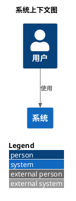

# C4-PlantUML 官方文档资源

## 项目概述

C4-PlantUML 是一个将 C4 模型与 PlantUML 结合的开源库,用于生成软件架构图。它已被集成到 PlantUML 标准库中。

- **官方仓库**: https://github.com/plantuml-stdlib/C4-PlantUML
- **官方文档网站**: https://plantuml-stdlib.github.io/C4-PlantUML/
- **当前版本**: v2.12.1 (PlantUML stdlib 集成版本)
- **PlantUML 版本**: 1.2025.2

## 核心资源

### 1. 官方仓库与文档

| 资源                   | 链接                                           |
| ---------------------- | ---------------------------------------------- |
| GitHub 主仓库          | https://github.com/plantuml-stdlib/C4-PlantUML |
| 官方文档站点           | https://plantuml-stdlib.github.io/C4-PlantUML/ |
| PlantUML 标准库        | https://plantuml.com/stdlib                    |
| PlantUML GitHub stdlib | https://github.com/plantuml/plantuml-stdlib    |

### 2. 核心教程

| 教程                                | 链接                                                                                                       | 特点                                |
| ----------------------------------- | ---------------------------------------------------------------------------------------------------------- | ----------------------------------- |
| Hitchhiker's Guide to PlantUML - C4 | https://crashedmind.github.io/PlantUMLHitchhikersGuide/C4/C4Stdlib.html                                    | 最详细的入门教程,包含 Big Bank 示例 |
| Apiumhub C4 PlantUML 指南           | https://apiumhub.com/tech-blog-barcelona/c4-plantuml/                                                      | 实用开发指南                        |
| Architecture as Code with C4        | https://florat.net/architecture-as-code-with-c4-and-plantuml/                                              | 架构即代码实践                      |
| LINE Corp Engineering Blog          | https://engineering.linecorp.com/en/blog/diagramming-software-architecture-using-c4-model-and-c4-plantuml/ | 企业级实战案例                      |

### 3. 语法参考

| 资源                    | 链接                                                              | 说明                           |
| ----------------------- | ----------------------------------------------------------------- | ------------------------------ |
| PlantUML 预处理器       | https://plantuml.com/preprocessing                                | !include, !define 等预处理指令 |
| PlantUML 命令行         | https://plantuml.com/command-line                                 | 命令行参数和选项               |
| PlantUML 语言参考 (PDF) | https://pdf.plantuml.net/PlantUML_Language_Reference_Guide_en.pdf | 完整语言参考手册               |

## Include 语法详解

### 两种 Include 格式

#### 1. 标准库短格式 (推荐用于 Kroki)

```plantuml
@startuml
!include <C4/C4_Context>
!include <C4/C4_Container>
!include <C4/C4_Component>
@enduml
```

**特点**:

- 使用 PlantUML 内置标准库
- 格式: `!include <库名/文件名>` (注意尖括号)
- **无需网络访问**
- **兼容 Kroki SECURE 模式**
- PlantUML v1.2020.11+ 自动支持

#### 2. HTTPS URL 格式 (需要 UNSAFE 模式)

```plantuml
@startuml
!include https://raw.githubusercontent.com/plantuml-stdlib/C4-PlantUML/master/C4_Context.puml
!include https://raw.githubusercontent.com/plantuml-stdlib/C4-PlantUML/master/C4_Container.puml
@enduml
```

**特点**:

- 直接从 GitHub 加载最新版本
- 需要网络访问
- **Kroki SECURE 模式会阻止此方式**
- 仅适用于 Kroki UNSAFE 模式或本地 PlantUML

### !include 与 !includeurl 的区别

- `!include <path>`: 标准库或本地文件
- `!includeurl <url>`: HTTPS URL (已弃用,建议用 `!include`)
- **Kroki 推荐**: 始终使用 `!include <C4/...>` 标准库格式

## 常见错误与解决方案

### 错误 1: `!include` 为空

**错误代码**:

```plantuml
@startuml
!include   <-- 错误: 没有指定文件
Person(user, "用户")
@enduml
```

**错误信息**:

```
Error 400: Syntax Error? (Assumed diagram type: sequence) (line: 4)
```

**原因**: PlantUML 无法识别 C4 宏 (Person, System 等),默认尝试按时序图解析,导致失败。

**正确代码**:


### 错误 2: 使用 HTTPS URL 在 Kroki SECURE 模式

**错误代码**:

```plantuml
@startuml
!include https://raw.githubusercontent.com/plantuml-stdlib/C4-PlantUML/master/C4_Context.puml
@enduml
```

**错误信息**:

```
Error: Cannot include from URL in SECURE mode
```

**解决方案**: 使用标准库格式

```plantuml
@startuml
!include <C4/C4_Context>
@enduml
```

## C4 文件类型说明

| 文件                 | 用途                   | 包含的宏                                          |
| -------------------- | ---------------------- | ------------------------------------------------- |
| `C4_Context.puml`    | 系统上下文图 (Level 1) | Person, System, System_Ext, Rel                   |
| `C4_Container.puml`  | 容器图 (Level 2)       | Person, Container, Container_Ext, System_Boundary |
| `C4_Component.puml`  | 组件图 (Level 3)       | Component, Component_Ext, Container_Boundary      |
| `C4_Deployment.puml` | 部署图 (Level 4)       | Deployment_Node, Node                             |
| `C4_Dynamic.puml`    | 动态图                 | RelIndex (带序号的关系)                           |
| `C4_Sequence.puml`   | 序列图                 | 基于 PlantUML 时序图的 C4 扩展                    |

## 布局与图例宏

### 布局宏

```plantuml
LAYOUT_TOP_DOWN()        ' 从上到下 (默认)
LAYOUT_LEFT_RIGHT()      ' 从左到右
LAYOUT_LANDSCAPE()       ' 横向布局 (别名: LEFT_RIGHT)
```

### 图例宏

```plantuml
LAYOUT_WITH_LEGEND()              ' 自动布局 + 图例 (右侧,图表下方)
SHOW_LEGEND(?hideStereotype, ?details)  ' 显示图例 (必须在最后一行)
SHOW_FLOATING_LEGEND(?alias, ?hideStereotype, ?details)  ' 浮动图例 (可自定义位置)
HIDE_STEREOTYPE()                 ' 隐藏构造型标签
```

**SHOW_LEGEND vs SHOW_FLOATING_LEGEND**:

| 宏                       | 位置             | 布局控制                                      | 使用场景                |
| ------------------------ | ---------------- | --------------------------------------------- | ----------------------- |
| `SHOW_LEGEND()`          | 固定在图表右下方 | 自动定位,无需额外配置                         | 大多数场景,简单直接     |
| `SHOW_FLOATING_LEGEND()` | 可自定义位置     | 需要 `Lay_Distance(from, LEGEND(), distance)` | 精确控制布局,多图例场景 |
| `LAYOUT_WITH_LEGEND()`   | 固定在右下方     | 自动布局 + 图例                               | **最推荐**,一行搞定     |

**示例: 浮动图例**

```plantuml
@startuml
!include <C4/C4_Context>

Person(user, "用户")
System(sys, "系统")
Rel(user, sys, "使用")

SHOW_FLOATING_LEGEND()
Lay_Distance(sys, LEGEND(), 1)  ' 将图例放在 sys 下方,距离 1 单位
@enduml
```

## Kroki 集成要点

### Kroki 安全模式限制

| 模式              | !include 支持        | !includeurl 支持 | 标准库 `<C4/...>`    |
| ----------------- | -------------------- | ---------------- | -------------------- |
| **SECURE** (默认) | ❌ 阻止文件系统/网络 | ❌ 阻止          | ✅ **允许** (内置库) |
| **SAFE**          | ⚠️ 需要白名单        | ⚠️ 需要白名单    | ✅ 允许              |
| **UNSAFE**        | ✅ 允许              | ✅ 允许          | ✅ 允许              |

**Kroki 配置**:

```bash
# SECURE 模式 (默认,推荐)
java -jar kroki-server.jar

# UNSAFE 模式 (允许外部 include)
java -DKROKI_SAFE_MODE=unsafe -jar kroki-server.jar

# SAFE 模式 (白名单控制)
java -DKROKI_SAFE_MODE=safe \
     -DKROKI_PLANTUML_INCLUDE_PATH=/path/to/includes \
     -DKROKI_PLANTUML_ALLOW_INCLUDE=true \
     -jar kroki-server.jar
```

### DiagramAI 推荐做法

**✅ 正确做法**:



**❌ 错误做法**:

```plantuml
@startuml
!include https://raw.githubusercontent.com/...  <-- Kroki SECURE 模式会阻止
@enduml
```

**❌ 致命错误**:

```plantuml
@startuml
!include   <-- 空 include,导致所有 C4 宏无法识别
@enduml
```

## 参考资料

### 关键链接

1. **C4-PlantUML GitHub README**: https://github.com/plantuml-stdlib/C4-PlantUML/blob/master/README.md
2. **Kroki 配置文档**: https://docs.kroki.io/kroki/setup/configuration/
3. **PlantUML 安全模式**: https://plantuml.com/security
4. **Kroki 架构文档**: https://docs.kroki.io/kroki/architecture/

### 社区资源

- **Medium 实战教程**: https://medium.com/@erickzanetti/understanding-the-c4-model-a-practical-guide-with-plantuml-examples-76cfdcbe0e01
- **VSCode 扩展教程**: https://medium.com/@robertdennyson/creating-c4-and-uml-diagrams-using-plantuml-with-vscode-extension-90032a21ec43
- **GitLab Kroki 集成**: https://docs.gitlab.com/administration/integration/kroki/

### C4 模型理论

- **C4 Model 官网**: https://c4model.com/
- **C4 模型介绍**: 系统上下文图 → 容器图 → 组件图 → 代码图 (4 个层级)
- **核心理念**: "Overview first, zoom and filter, then details-on-demand" (Shneiderman's mantra)

---

**最后更新**: 2025-10-13
**维护者**: DiagramAI Team
**相关文档**: `/root/Diagram/DiagramAI/logs/failcause/plantumlc4.txt` (实战失败案例分析)
