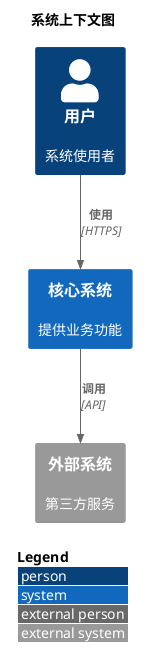
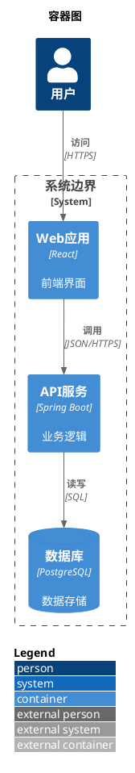
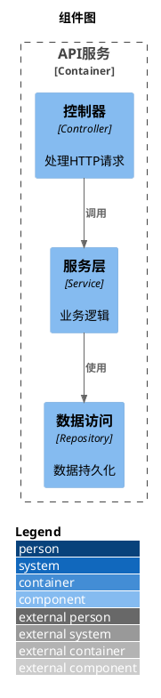
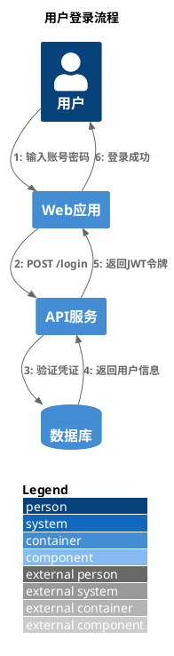

# C4-PlantUML 快速参考手册

## 基础模板

### 系统上下文图 (Level 1)



### 容器图 (Level 2)



### 组件图 (Level 3)



### 时序图 (动态视图)



## 核心宏定义

### 元素定义

#### 人员 (Person)

```plantuml
Person(alias, "标签", "描述")
Person_Ext(alias, "标签", "描述")  ' 外部人员 (灰色)
```

**可选参数**:

```plantuml
Person(user, "用户", "描述", $sprite="person2", $link="https://...")
```

#### 系统 (System)

```plantuml
System(alias, "标签", "描述")
System_Ext(alias, "标签", "描述")  ' 外部系统 (灰色)
```

#### 容器 (Container)

```plantuml
Container(alias, "标签", "技术栈", "描述")
Container_Ext(alias, "标签", "技术栈", "描述")  ' 外部容器
ContainerDb(alias, "标签", "技术栈", "描述")    ' 数据库容器
ContainerQueue(alias, "标签", "技术栈", "描述") ' 消息队列容器
```

#### 组件 (Component)

```plantuml
Component(alias, "标签", "技术栈", "描述")
Component_Ext(alias, "标签", "技术栈", "描述")  ' 外部组件
ComponentDb(alias, "标签", "技术栈", "描述")    ' 数据库组件
ComponentQueue(alias, "标签", "技术栈", "描述") ' 消息队列组件
```

### 关系定义

#### 基础关系

```plantuml
Rel(from, to, "标签")
Rel(from, to, "标签", "技术描述")
```

#### 方向关系

```plantuml
Rel_Up(from, to, "标签")      ' 向上
Rel_Down(from, to, "标签")    ' 向下
Rel_Left(from, to, "标签")    ' 向左
Rel_Right(from, to, "标签")   ' 向右

' 简写形式
Rel_U(from, to, "标签")
Rel_D(from, to, "标签")
Rel_L(from, to, "标签")
Rel_R(from, to, "标签")
```

#### 带序号关系 (动态图)

```plantuml
RelIndex(1, from, to, "标签")
RelIndex(2, from, to, "标签", "技术描述")
```

### 边界定义

```plantuml
System_Boundary(alias, "边界标签") {
    ' 系统内的元素
}

Container_Boundary(alias, "边界标签") {
    ' 容器内的元素
}

Enterprise_Boundary(alias, "企业边界") {
    ' 企业范围内的系统
}
```

## 布局控制

### 基础布局

```plantuml
LAYOUT_TOP_DOWN()       ' 从上到下 (默认)
LAYOUT_LEFT_RIGHT()     ' 从左到右
LAYOUT_LANDSCAPE()      ' 横向布局

LAYOUT_WITH_LEGEND()    ' 自动布局 + 图例 (推荐)
```

### 精确布局

```plantuml
' 布局方向控制
Lay_U(from, to)   ' from 在 to 上方
Lay_D(from, to)   ' from 在 to 下方
Lay_L(from, to)   ' from 在 to 左侧
Lay_R(from, to)   ' from 在 to 右侧

' 距离控制
Lay_Distance(from, to, 2)  ' 设置距离为 2 个单位
```

**示例**:

```plantuml
@startuml
!include <C4/C4_Context>

Person(a, "A")
System(b, "B")
System(c, "C")

Lay_U(a, b)  ' A 在 B 上方
Lay_R(a, c)  ' A 在 C 左侧

Rel(a, b, "使用")
Rel(a, c, "访问")
@enduml
```

### 图例控制

#### 标准图例

```plantuml
SHOW_LEGEND()                    ' 显示默认图例
SHOW_LEGEND($hideStereotype)     ' 隐藏构造型
SHOW_LEGEND($hideStereotype=true, $details=false)  ' 简化图例
```

#### 浮动图例

```plantuml
SHOW_FLOATING_LEGEND()           ' 显示浮动图例
SHOW_FLOATING_LEGEND($alias="MY_LEGEND")  ' 自定义别名
LEGEND()                         ' 默认图例别名

' 控制图例位置
Lay_Distance(element, LEGEND(), 1)  ' 将图例放在元素下方
```

**完整示例**:

```plantuml
@startuml
!include <C4/C4_Context>

Person(user, "用户")
System(sys, "系统")

Rel(user, sys, "使用")

SHOW_FLOATING_LEGEND()
Lay_D(sys, LEGEND())  ' 图例在 sys 下方
@enduml
```

### 隐藏构造型

```plantuml
HIDE_STEREOTYPE()  ' 隐藏所有 <<Person>>, <<System>> 等标签
```

## 样式定制

### 自定义标签/标记

```plantuml
AddElementTag("custom", $bgColor="#FF6655", $fontColor="white", $borderColor="red")
AddRelTag("async", $lineColor="blue", $textColor="blue", $lineStyle="dashed")

' 使用标签
Person(user, "用户", $tags="custom")
Rel(user, sys, "异步调用", $tags="async")
```

### 更新默认样式

```plantuml
UpdateElementStyle("system", $bgColor="#1168bd", $fontColor="white")
UpdateRelStyle($lineColor="grey", $textColor="grey")
```

### 手绘风格

```plantuml
LAYOUT_AS_SKETCH()
SET_SKETCH_STYLE($bgColor="lightblue")
```

## Sprite 图标支持

### 使用内置 Sprite

```plantuml
!include <office/Users/user>
!include <office/Devices/device_laptop>
!include <aws/Storage/AmazonS3/AmazonS3>

Person(user, "用户", "", $sprite="user")
Container(web, "Web应用", "React", "", $sprite="device_laptop")
Container(s3, "对象存储", "S3", "", $sprite="AmazonS3")
```

### 外部 Sprite 库

```plantuml
!define AWSPuml https://raw.githubusercontent.com/awslabs/aws-icons-for-plantuml/v18.0/dist
!include AWSPuml/AWSCommon.puml
!include AWSPuml/Compute/Lambda.puml

Container(lambda, "Lambda函数", "Python", "", $sprite="Lambda")
```

## 常用场景示例

### 微服务架构

```plantuml
@startuml
!include <C4/C4_Container>
LAYOUT_WITH_LEGEND()

title 微服务架构

Person(user, "用户")

System_Boundary(microservices, "微服务系统") {
    Container(gateway, "API网关", "Nginx", "路由分发")
    Container(auth, "认证服务", "OAuth2", "用户认证")
    Container(order, "订单服务", "Spring Boot", "订单管理")
    Container(payment, "支付服务", "Spring Boot", "支付处理")
    ContainerDb(db1, "订单数据库", "MySQL")
    ContainerDb(db2, "支付数据库", "MySQL")
    ContainerQueue(mq, "消息队列", "RabbitMQ")
}

Rel(user, gateway, "HTTPS")
Rel(gateway, auth, "验证", "gRPC")
Rel(gateway, order, "调用", "REST")
Rel(gateway, payment, "调用", "REST")
Rel(order, db1, "读写", "JDBC")
Rel(payment, db2, "读写", "JDBC")
Rel(order, mq, "发布事件", "AMQP")
Rel(payment, mq, "订阅事件", "AMQP")
@enduml
```

### 外部集成系统

```plantuml
@startuml
!include <C4/C4_Context>
LAYOUT_WITH_LEGEND()

title 电商系统集成

Person(customer, "顾客")
Person(admin, "管理员")

System(ecommerce, "电商系统", "核心业务平台")

System_Ext(payment, "支付网关", "支付宝/微信支付")
System_Ext(logistics, "物流系统", "顺丰/京东物流")
System_Ext(sms, "短信服务", "阿里云短信")
System_Ext(analytics, "数据分析", "Google Analytics")

Rel(customer, ecommerce, "购物", "HTTPS")
Rel(admin, ecommerce, "管理", "HTTPS")
Rel(ecommerce, payment, "支付", "API")
Rel(ecommerce, logistics, "发货", "API")
Rel(ecommerce, sms, "通知", "API")
Rel(ecommerce, analytics, "埋点", "JavaScript")
@enduml
```

### 数据流架构

```plantuml
@startuml
!include <C4/C4_Container>
LAYOUT_LEFT_RIGHT()
LAYOUT_WITH_LEGEND()

title 数据处理流水线

Container(source, "数据源", "MySQL", "业务数据库")
Container(etl, "ETL服务", "Apache NiFi", "数据提取转换")
ContainerQueue(kafka, "流数据", "Kafka", "消息队列")
Container(stream, "流处理", "Flink", "实时计算")
ContainerDb(dw, "数据仓库", "ClickHouse", "分析存储")
Container(bi, "BI平台", "Superset", "数据可视化")

Rel_R(source, etl, "CDC", "Binlog")
Rel_R(etl, kafka, "发送", "Avro")
Rel_R(kafka, stream, "消费", "Kafka API")
Rel_R(stream, dw, "写入", "JDBC")
Rel_R(dw, bi, "查询", "SQL")
@enduml
```

## DiagramAI 最佳实践

### 标准模板 (推荐)

```plantuml
@startuml
' 1. 必须包含 C4 库 (使用标准库格式,兼容 Kroki SECURE 模式)
!include <C4/C4_Context>

' 2. 推荐使用 LAYOUT_WITH_LEGEND() 自动布局和图例
LAYOUT_WITH_LEGEND()

' 3. 添加标题
title 系统上下文图

' 4. 定义元素
Person(user, "用户", "描述")
System(sys, "系统", "描述")

' 5. 定义关系
Rel(user, sys, "使用", "HTTPS")

@enduml
```

### 错误避免清单

#### ❌ 致命错误

```plantuml
@startuml
!include   <-- 空 include,导致所有 C4 宏无法识别
@enduml
```

#### ❌ Kroki SECURE 模式不兼容

```plantuml
@startuml
!include https://raw.githubusercontent.com/...  <-- 会被阻止
@enduml
```

#### ❌ 弃用的宏

```plantuml
@startuml
!include <C4/C4_Context>
SHOW_LEGEND()  <-- 旧版宏,建议用 LAYOUT_WITH_LEGEND()
@enduml
```

#### ✅ 正确做法

```plantuml
@startuml
!include <C4/C4_Context>
LAYOUT_WITH_LEGEND()
' 其他代码...
@enduml
```

## 调试技巧

### 1. 验证 C4 库加载

```plantuml
@startuml
!include <C4/C4_Context>

' 测试最简单的元素
Person(test, "测试")
@enduml
```

如果此代码渲染成功,说明 C4 库加载正确。

### 2. 检查元素别名冲突

```plantuml
@startuml
!include <C4/C4_Context>

' ❌ 错误: 重复别名
Person(user, "用户A")
Person(user, "用户B")  <-- 冲突!

' ✅ 正确: 不同别名
Person(user_a, "用户A")
Person(user_b, "用户B")
@enduml
```

### 3. 使用注释调试

```plantuml
@startuml
!include <C4/C4_Context>

' 逐步注释元素,定位问题
Person(user, "用户")
' System(sys, "系统")  <-- 先注释掉测试
' Rel(user, sys, "使用")

@enduml
```

## 参考链接

- **官方文档**: https://github.com/plantuml-stdlib/C4-PlantUML
- **Kroki 文档**: https://docs.kroki.io/
- **PlantUML 标准库**: https://plantuml.com/stdlib
- **失败案例分析**: `/root/Diagram/DiagramAI/logs/failcause/plantumlc4.txt`

---

**最后更新**: 2025-10-13
**适用版本**: C4-PlantUML v2.12.1, PlantUML 1.2025.2
**Kroki 兼容**: SECURE 模式 (使用标准库格式)
