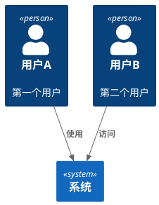
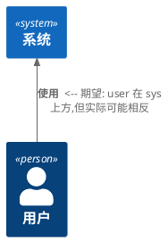
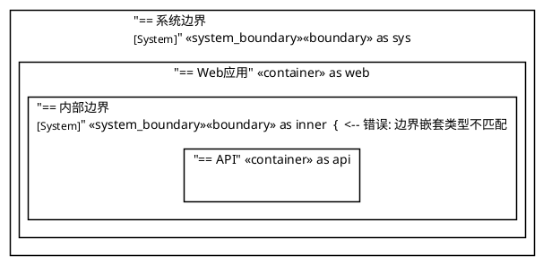
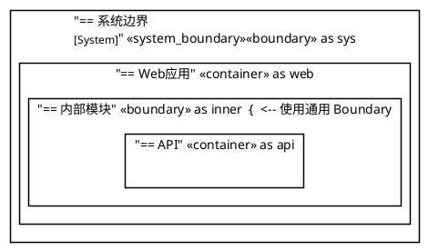

# C4-PlantUML 常见错误与解决方案

## 错误分类

本文档整理了 C4-PlantUML 在 DiagramAI 中常见的错误类型和解决方案,特别关注 Kroki 渲染环境下的问题。

---

## 错误 1: `!include` 指令为空或缺失

### 错误现象

**错误代码**:
```plantuml
@startuml
!include   <-- 没有指定要包含的文件
title 系统上下文图

Person(customer, "顾客", "在线购物用户")
System(ecommerce, "电商系统", "提供商品展示、订单管理等功能")
Rel(customer, ecommerce, "浏览商品、下单购买", "HTTPS/Web")
@enduml
```

**Kroki 返回的错误信息**:
```
Error 400: Syntax Error? (Assumed diagram type: sequence) (line: 4)
```

### 错误原因

1. **C4 宏未加载**: PlantUML 不认识 `Person`, `System`, `Rel` 等 C4 专用关键字
2. **默认按时序图解析**: PlantUML 无法识别图表类型时,默认尝试按时序图 (sequence) 解析
3. **语法解析失败**: C4 元素在时序图语法下无效,导致语法错误

### 根本原因

C4-PlantUML 是一个**宏库**,不是 PlantUML 的内置语法。必须通过 `!include` 显式加载,否则所有 C4 关键字都是未定义的。

### 解决方案

**✅ 正确代码**:
```plantuml
@startuml
!include <C4/C4_Context>  <-- 必须包含 C4 库

title 系统上下文图

Person(customer, "顾客", "在线购物用户")
System(ecommerce, "电商系统", "提供商品展示、订单管理等功能")
Rel(customer, ecommerce, "浏览商品、下单购买", "HTTPS/Web")

LAYOUT_WITH_LEGEND()
@enduml
```

### 预防措施

- DiagramAI 的 Prompt 必须**明确要求 AI 生成 `!include` 行**
- 在代码清理阶段**验证 `!include` 是否存在**
- 如果用户手动删除了 `!include`,应在验证时提示错误

---

## 错误 2: 使用 HTTPS URL 在 Kroki SECURE 模式

### 错误现象

**错误代码**:
```plantuml
@startuml
!include https://raw.githubusercontent.com/plantuml-stdlib/C4-PlantUML/master/C4_Context.puml
title 系统上下文图

Person(user, "用户")
System(sys, "系统")
Rel(user, sys, "使用")
@enduml
```

**Kroki 返回的错误信息**:
```
Error: Cannot include from URL in SECURE mode
```

或者:
```
Error 403: Forbidden - Remote file includes disabled
```

### 错误原因

1. **Kroki SECURE 模式限制**: 默认情况下,Kroki 运行在 SECURE 模式,阻止所有文件系统和网络访问
2. **`!include` 和 `!includeurl` 被阻止**: 任何从外部 URL 加载文件的尝试都会被拒绝
3. **安全策略**: 防止恶意代码通过 include 指令读取服务器文件或发起网络请求

### Kroki 安全模式说明

| 模式 | 文件系统访问 | 网络访问 | 标准库 `<C4/...>` |
|------|--------------|----------|-------------------|
| **SECURE** (默认) | ❌ 禁止 | ❌ 禁止 | ✅ **允许** (内置) |
| **SAFE** | ⚠️ 白名单控制 | ⚠️ 白名单控制 | ✅ 允许 |
| **UNSAFE** | ✅ 允许 | ✅ 允许 | ✅ 允许 |

### 解决方案

#### 方案 1: 使用标准库格式 (推荐)

**✅ 正确代码**:
```plantuml
@startuml
!include <C4/C4_Context>  <-- 使用尖括号,表示标准库
title 系统上下文图

Person(user, "用户")
System(sys, "系统")
Rel(user, sys, "使用")
@enduml
```

**优点**:
- 无需网络访问
- 兼容 Kroki SECURE 模式
- PlantUML v1.2020.11+ 内置支持
- 渲染速度更快

#### 方案 2: 修改 Kroki 配置 (不推荐)

如果必须使用 HTTPS URL (例如开发环境测试最新版本):

```bash
# 切换到 UNSAFE 模式
java -DKROKI_SAFE_MODE=unsafe -jar kroki-server.jar
```

**缺点**:
- **安全风险**: 允许任意文件/网络访问
- 需要修改服务器配置
- 生产环境**不推荐**使用

#### 方案 3: 白名单控制 (中级方案)

```bash
# 使用 SAFE 模式 + 白名单
java -DKROKI_SAFE_MODE=safe \
     -DKROKI_PLANTUML_ALLOW_INCLUDE=true \
     -DKROKI_PLANTUML_INCLUDE_WHITELIST=/path/to/whitelist.txt \
     -jar kroki-server.jar
```

**whitelist.txt 示例**:
```
^https://raw\.githubusercontent\.com/plantuml-stdlib/C4-PlantUML/.*$
^https://raw\.githubusercontent\.com/awslabs/aws-icons-for-plantuml/.*$
```

### DiagramAI 推荐策略

1. **永远使用标准库格式**: `!include <C4/C4_Context>`
2. **Prompt 中强制要求**: AI 必须生成标准库格式
3. **代码清理时替换**: 自动将 HTTPS URL 替换为标准库格式
4. **验证逻辑**: 检测到 HTTPS include 时,自动转换或报错

---

## 错误 3: `SHOW_LEGEND()` 已弃用警告

### 错误现象

**代码**:
```plantuml
@startuml
!include <C4/C4_Context>

Person(user, "用户")
System(sys, "系统")
Rel(user, sys, "使用")

LAYOUT_TOP_DOWN()
SHOW_LEGEND()  <-- 旧版宏,可能引发警告
@enduml
```

**警告信息**:
```
Warning: SHOW_LEGEND() is deprecated, consider using LAYOUT_WITH_LEGEND() or SHOW_FLOATING_LEGEND()
```

### 问题说明

1. **不是致命错误**: 代码仍可正常渲染
2. **向后兼容**: C4-PlantUML 仍支持 `SHOW_LEGEND()`,但不推荐
3. **功能限制**: `SHOW_LEGEND()` 必须放在最后一行,且无法自定义位置

### 解决方案

#### 方案 1: 使用 `LAYOUT_WITH_LEGEND()` (推荐)

**✅ 正确代码**:
```plantuml
@startuml
!include <C4/C4_Context>
LAYOUT_WITH_LEGEND()  <-- 自动布局 + 图例,一步到位

title 系统上下文图

Person(user, "用户")
System(sys, "系统")
Rel(user, sys, "使用")
@enduml
```

**优点**:
- 自动布局
- 自动添加图例
- 无需单独的布局宏

#### 方案 2: 使用 `SHOW_FLOATING_LEGEND()` (高级)

**✅ 自定义图例位置**:
```plantuml
@startuml
!include <C4/C4_Context>

Person(user, "用户")
System(sys, "系统")
Rel(user, sys, "使用")

SHOW_FLOATING_LEGEND()
Lay_Distance(sys, LEGEND(), 1)  <-- 控制图例位置
@enduml
```

**使用场景**:
- 需要精确控制图例位置
- 多图例场景
- 复杂布局调整

### 对比总结

| 宏 | 位置 | 布局控制 | 使用难度 | 推荐场景 |
|---|------|----------|----------|----------|
| `SHOW_LEGEND()` | 固定右下方 | 无 | 简单 | ❌ 已弃用 |
| `LAYOUT_WITH_LEGEND()` | 固定右下方 | 自动 | 简单 | ✅ **首选** |
| `SHOW_FLOATING_LEGEND()` | 可自定义 | 手动 | 中等 | 高级场景 |

---

## 错误 4: 元素别名冲突

### 错误现象

**错误代码**:
```plantuml
@startuml
!include <C4/C4_Context>

Person(user, "用户A", "第一个用户")
Person(user, "用户B", "第二个用户")  <-- 别名冲突!

System(sys, "系统")
Rel(user, sys, "使用")
@enduml
```

**错误信息**:
```
Error: Duplicate identifier 'user'
```

### 错误原因

1. **别名唯一性**: 每个元素的第一个参数 (alias) 必须唯一
2. **作用域全局**: 在同一个 @startuml...@enduml 块中,所有别名共享命名空间
3. **引用错误**: 关系定义 `Rel(user, sys, ...)` 无法确定指向哪个 `user`

### 解决方案

**✅ 正确代码**:


### 命名规范建议

1. **使用下划线分隔**: `user_admin`, `user_customer`
2. **添加前缀**: `person_user`, `system_backend`
3. **有意义的命名**: `api_gateway`, `auth_service`
4. **避免通用名称**: `user`, `system`, `db` 等单独使用易冲突

---

## 错误 5: 关系方向错误

### 错误现象

**代码**:


**问题**: 箭头方向和元素位置不符合预期

### 问题原因

1. **方向宏的含义**: `Rel_Up(from, to)` 表示**箭头向上**,不是 `from` 在上方
2. **布局与关系分离**: 关系方向不自动控制元素位置
3. **需要显式布局**: 使用 `Lay_*` 宏控制元素位置

### 解决方案

#### 方案 1: 使用布局宏

**✅ 正确代码**:
```plantuml
@startuml
!include <C4/C4_Context>

Person(user, "用户")
System(sys, "系统")

Lay_U(user, sys)  <-- 明确: user 在 sys 上方
Rel(user, sys, "使用")  <-- 使用普通关系,布局已控制
@enduml
```

#### 方案 2: 使用 `LAYOUT_WITH_LEGEND()`

**✅ 自动布局**:
```plantuml
@startuml
!include <C4/C4_Context>
LAYOUT_WITH_LEGEND()  <-- 自动优化布局

Person(user, "用户")
System(sys, "系统")

Rel(user, sys, "使用")
@enduml
```

### 布局宏说明

| 宏 | 含义 | 示例 |
|---|------|------|
| `Lay_U(a, b)` | a 在 b 上方 | 用户在系统上方 |
| `Lay_D(a, b)` | a 在 b 下方 | 系统在数据库下方 |
| `Lay_L(a, b)` | a 在 b 左侧 | 前端在后端左侧 |
| `Lay_R(a, b)` | a 在 b 右侧 | API 在数据库右侧 |

---

## 错误 6: 边界嵌套错误

### 错误现象

**错误代码**:


**错误信息**:
```
Error: Cannot nest System_Boundary inside System_Boundary
```

### 错误原因

1. **边界类型限制**: `System_Boundary` 只能包含 `Container`,不能嵌套
2. **层级规则**: C4 模型有严格的层级关系

### C4 层级规则

| 边界类型 | 可包含元素 | 典型用途 |
|----------|-----------|----------|
| `Enterprise_Boundary` | System, System_Boundary | 企业范围 |
| `System_Boundary` | Container, ContainerDb, ContainerQueue | 单个系统 |
| `Container_Boundary` | Component, ComponentDb | 单个容器 |
| `Boundary` | 任意元素 (通用边界) | 自定义分组 |

### 解决方案

**✅ 正确代码**:
```plantuml
@startuml
!include <C4/C4_Container>

System_Boundary(sys, "系统边界") {
    Container(web, "Web应用")

    Container_Boundary(api_boundary, "API模块") {  <-- 使用 Container_Boundary
        Component(controller, "控制器")
        Component(service, "服务层")
    }
}
@enduml
```

或者使用通用边界:



---

## 错误 7: 参数数量错误

### 错误现象

**错误代码**:
```plantuml
@startuml
!include <C4/C4_Context>

Person(user)  <-- 错误: 缺少必需参数 "标签"
System(sys, "系统", "描述", "额外参数")  <-- 错误: 参数过多
@enduml
```

**错误信息**:
```
Error: Invalid number of parameters for Person
Error: Invalid number of parameters for System
```

### 正确参数格式

#### Person / Person_Ext

```plantuml
Person(alias, "标签")                      ' 最少 2 个参数
Person(alias, "标签", "描述")              ' 可选描述
Person(alias, "标签", "描述", $sprite="icon")  ' 可选参数
```

#### System / System_Ext

```plantuml
System(alias, "标签")                      ' 最少 2 个参数
System(alias, "标签", "描述")              ' 可选描述
System(alias, "标签", "描述", $link="url") ' 可选参数
```

#### Container / Container_Ext

```plantuml
Container(alias, "标签", "技术栈")         ' 最少 3 个参数
Container(alias, "标签", "技术栈", "描述") ' 可选描述
```

#### Component / Component_Ext

```plantuml
Component(alias, "标签", "技术栈")         ' 最少 3 个参数
Component(alias, "标签", "技术栈", "描述") ' 可选描述
```

#### Rel / Rel_*

```plantuml
Rel(from, to, "标签")                      ' 最少 3 个参数
Rel(from, to, "标签", "技术")              ' 可选技术描述
Rel(from, to, "标签", "技术", $tags="tag") ' 可选参数
```

---

## 错误 8: Sprite 加载失败

### 错误现象

**代码**:
```plantuml
@startuml
!include <C4/C4_Context>
!include <aws/Storage/S3>  <-- Sprite 文件不存在或路径错误

Container(storage, "对象存储", "S3", "", $sprite="S3")
@enduml
```

**错误信息**:
```
Error: Cannot include <aws/Storage/S3>
Error: Sprite 'S3' not found
```

### 解决方案

#### 1. 验证 Sprite 路径

查阅官方 sprite 库文档:
- **AWS**: https://github.com/awslabs/aws-icons-for-plantuml
- **Azure**: https://github.com/plantuml-stdlib/Azure-PlantUML
- **GCP**: https://github.com/plantuml-stdlib/gcp-plantuml

#### 2. 正确的 AWS Sprite 示例

```plantuml
@startuml
!include <C4/C4_Container>
!define AWSPuml https://raw.githubusercontent.com/awslabs/aws-icons-for-plantuml/v18.0/dist
!include AWSPuml/AWSCommon.puml
!include AWSPuml/Storage/SimpleStorageService.puml

Container(s3, "对象存储", "S3", "", $sprite="SimpleStorageService")
@enduml
```

#### 3. 使用内置 Sprite

```plantuml
@startuml
!include <C4/C4_Context>
!include <office/Users/user>
!include <office/Devices/device_laptop>

Person(user, "用户", "", $sprite="user")
Container(web, "Web应用", "React", "", $sprite="device_laptop")
@enduml
```

---

## 错误调试流程

### 步骤 1: 最小化复现

从最简单的代码开始:

```plantuml
@startuml
!include <C4/C4_Context>
Person(test, "测试")
@enduml
```

如果失败,说明 `!include` 问题。

### 步骤 2: 逐步添加元素

```plantuml
@startuml
!include <C4/C4_Context>

' 测试 Person
Person(user, "用户")

' 测试 System
' System(sys, "系统")

' 测试 Rel
' Rel(user, sys, "使用")

@enduml
```

逐步取消注释,定位问题元素。

### 步骤 3: 检查参数

```plantuml
@startuml
!include <C4/C4_Context>

' 检查参数是否正确
Person(user, "用户", "描述")  ' ✅ 正确
' Person(user)                 ' ❌ 错误: 缺少标签

@enduml
```

### 步骤 4: 验证别名

```plantuml
@startuml
!include <C4/C4_Context>

Person(user1, "用户1")
Person(user2, "用户2")  ' ✅ 别名不同
' Person(user1, "用户3")  ' ❌ 别名冲突

@enduml
```

---

## DiagramAI 特定错误

### 错误 9: AI 生成的代码缺少 `@startuml/@enduml`

**问题**: AI 有时只生成中间部分,缺少包裹标签

**错误代码**:
```plantuml
!include <C4/C4_Context>
Person(user, "用户")
System(sys, "系统")
```

**解决**: 代码清理阶段自动添加
```typescript
if (!code.includes('@startuml')) {
  code = '@startuml\n' + code;
}
if (!code.includes('@enduml')) {
  code = code + '\n@enduml';
}
```

### 错误 10: AI 混用不同层级元素

**问题**: AI 在 Context 图中使用 Container 元素

**错误代码**:
```plantuml
@startuml
!include <C4/C4_Context>

Person(user, "用户")
System(sys, "系统")
Container(web, "Web应用", "React")  <-- 错误: Context 图不应有 Container
@enduml
```

**解决**: Prompt 中强调层级规则
```
- Context 图 (Level 1): 只用 Person, System
- Container 图 (Level 2): 用 Person, System_Boundary, Container
- Component 图 (Level 3): 用 Container_Boundary, Component
```

---

## 预防措施清单

### 1. Prompt 层面

- [x] 明确要求生成 `!include <C4/...>` 标准库格式
- [x] 强调使用 `LAYOUT_WITH_LEGEND()`
- [x] 说明不同图表层级的元素限制
- [x] 要求唯一的元素别名

### 2. 代码清理层面

- [x] 验证 `!include` 是否存在
- [x] 将 HTTPS URL 替换为标准库格式
- [x] 检测重复别名
- [x] 验证参数数量
- [x] 自动添加 `@startuml/@enduml`

### 3. 用户引导层面

- [x] 提供标准模板
- [x] 错误信息友好提示
- [x] 一键修复常见错误
- [x] 实时语法验证

---

## 参考资料

- **官方文档**: https://github.com/plantuml-stdlib/C4-PlantUML
- **Kroki 安全配置**: https://docs.kroki.io/kroki/setup/configuration/
- **PlantUML 预处理器**: https://plantuml.com/preprocessing
- **失败案例库**: `/root/Diagram/DiagramAI/logs/failcause/plantumlc4.txt`

---

**最后更新**: 2025-10-13
**维护者**: DiagramAI Team
**版本**: v1.0 (基于实战失败案例整理)
