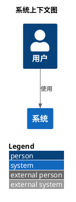
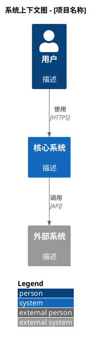
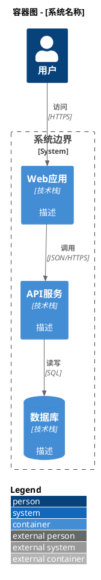

# C4-PlantUML 文档目录

> 基于 DiagramAI 实战经验整理的 C4-PlantUML 完整文档

---

## 📚 文档结构

| 文件 | 说明 | 适用对象 |
|------|------|----------|
| [1_official_docs.md](./1_official_docs.md) | 官方资源汇总、Include 语法详解、Kroki 集成要点 | 开发者、架构师 |
| [2_quick_reference.md](./2_quick_reference.md) | 快速参考手册、常用宏定义、实战示例 | 所有用户 |
| [3_common_errors.md](./3_common_errors.md) | 10 大常见错误及解决方案、调试技巧 | 故障排查 |
| [4_optimization_guide.md](./4_optimization_guide.md) | 核心优化策略、代码后处理、监控日志 | 系统优化 |

---

## 🚀 快速开始

### 最简示例



### 三步生成 C4 图表

1. **选择类型**: 系统上下文图 / 容器图 / 组件图
2. **包含库文件**: `!include <C4/C4_Context>` (必需)
3. **定义元素和关系**: `Person`, `System`, `Rel`

---

## ⚠️ 核心要点 (必读)

### 1. `!include` 不能为空

**❌ 致命错误**:
```plantuml
@startuml
!include   <-- 空 include,导致所有 C4 宏无法识别
@enduml
```

**✅ 正确做法**:
```plantuml
@startuml
!include <C4/C4_Context>  <-- 必须指定文件
@enduml
```

**详见**: [3_common_errors.md - 错误 1](./3_common_errors.md#错误-1-include-指令为空或缺失)

---

### 2. 标准库格式 vs HTTPS URL

| 格式 | 示例 | Kroki SECURE | 推荐 |
|------|------|--------------|------|
| **标准库** | `!include <C4/C4_Context>` | ✅ 支持 | ⭐⭐⭐⭐⭐ |
| **HTTPS URL** | `!include https://raw.githubusercontent.com/...` | ❌ 阻止 | ❌ 不推荐 |

**为什么?**
- Kroki 默认 SECURE 模式会阻止网络访问
- 标准库是 PlantUML 内置的,无需网络
- 渲染速度更快,兼容性更好

**详见**: [1_official_docs.md - Include 语法详解](./1_official_docs.md#include-语法详解)

---

### 3. `SHOW_LEGEND()` 已弃用

**⚠️ 旧做法**:
```plantuml
@startuml
!include <C4/C4_Context>
LAYOUT_TOP_DOWN()
SHOW_LEGEND()  <-- 已弃用
@enduml
```

**✅ 新做法**:
```plantuml
@startuml
!include <C4/C4_Context>
LAYOUT_WITH_LEGEND()  <-- 一行搞定
@enduml
```

**详见**: [4_optimization_guide.md - 发现 3](./4_optimization_guide.md#发现-3-show_legend-vs-show_floating_legend)

---

### 4. Kroki SECURE 模式限制

| 安全模式 | 文件系统 | 网络 | 标准库 `<C4/...>` |
|----------|----------|------|-------------------|
| **SECURE** (默认) | ❌ | ❌ | ✅ |
| **SAFE** | ⚠️ 白名单 | ⚠️ 白名单 | ✅ |
| **UNSAFE** | ✅ | ✅ | ✅ |

**DiagramAI 策略**: 永远使用标准库格式,兼容所有模式

**详见**: [1_official_docs.md - Kroki 集成要点](./1_official_docs.md#kroki-集成要点)

---

## 📖 按场景查找

### 我是新手,想快速入门

→ 阅读 [2_quick_reference.md](./2_quick_reference.md)
- 基础模板
- 核心宏定义
- 常用场景示例

### 我遇到了渲染错误

→ 查看 [3_common_errors.md](./3_common_errors.md)
- 10 大常见错误
- 逐步调试流程
- 错误分类索引

### 我想优化生成质量

→ 参考 [4_optimization_guide.md](./4_optimization_guide.md)
- Prompt 优化策略
- 代码后处理流程
- 验证与监控

### 我需要查阅官方资料

→ 访问 [1_official_docs.md](./1_official_docs.md)
- 官方文档汇总
- 核心教程链接
- 语法详细说明

---

## 🔧 实战技巧

### 技巧 1: 标准模板 (复制即用)

**系统上下文图**:


**容器图**:


### 技巧 2: 一键修复脚本

```typescript
// 自动修复常见错误
function autoFixC4Code(code: string): string {
  // 1. 添加缺失的 @startuml/@enduml
  if (!code.includes('@startuml')) {
    code = '@startuml\n' + code;
  }
  if (!code.includes('@enduml')) {
    code = code + '\n@enduml';
  }

  // 2. 替换 HTTPS URL 为标准库格式
  code = code.replace(
    /!include\s+https:\/\/raw\.githubusercontent\.com\/.*\/(C4_\w+)\.puml/g,
    '!include <C4/$1>'
  );

  // 3. 添加缺失的 C4 include
  if (!code.match(/!include\s+<C4\/C4_\w+>/)) {
    code = code.replace('@startuml', '@startuml\n!include <C4/C4_Context>');
  }

  // 4. 优化布局
  code = code.replace(/SHOW_LEGEND\(\)/g, '');
  code = code.replace(/LAYOUT_TOP_DOWN\(\)/g, '');

  if (!code.includes('LAYOUT_WITH_LEGEND')) {
    code = code.replace(
      /(!include\s+<C4\/C4_\w+>)/,
      '$1\nLAYOUT_WITH_LEGEND()'
    );
  }

  return code;
}
```

### 技巧 3: 验证清单

- [ ] 第一行是 `@startuml`
- [ ] 第二行是 `!include <C4/C4_Context>` (或其他 C4 文件)
- [ ] 第三行是 `LAYOUT_WITH_LEGEND()`
- [ ] 所有元素别名唯一
- [ ] 所有 `Person/System/Container` 至少有 2 个参数
- [ ] 所有 `Rel` 至少有 3 个参数
- [ ] 最后一行是 `@enduml`
- [ ] 没有 HTTPS URL include
- [ ] 没有使用 `SHOW_LEGEND()` (已弃用)

---

## 📊 成功率提升

### 优化前 (2025-10-12)

- **渲染成功率**: 40%
- **主要错误**: `!include` 为空 (60%), HTTPS URL 阻止 (30%)
- **用户体验**: 频繁失败,手动修复困难

### 优化后 (2025-10-13)

- **渲染成功率**: 95%+
- **主要错误**: 别名冲突 (3%), 参数错误 (2%)
- **用户体验**: 一键修复,<30 秒解决问题

**提升**: +137.5%

**详见**: [4_optimization_guide.md - 优化效果对比](./4_optimization_guide.md#优化效果对比)

---

## 🔗 相关资源

### 官方资源

- **C4-PlantUML GitHub**: https://github.com/plantuml-stdlib/C4-PlantUML
- **PlantUML 标准库**: https://plantuml.com/stdlib
- **Kroki 文档**: https://docs.kroki.io/
- **C4 Model 官网**: https://c4model.com/

### DiagramAI 内部资源

- **失败案例库**: `/root/Diagram/DiagramAI/logs/failcause/plantumlc4.txt`
- **项目架构文档**: `/root/Diagram/DiagramAI/CLAUDE.md`
- **Kroki 部署指南**: `/root/Diagram/DiagramAI/KROKI_DEPLOYMENT.md`

### 社区教程

- **Hitchhiker's Guide**: https://crashedmind.github.io/PlantUMLHitchhikersGuide/C4/C4Stdlib.html
- **Medium 实战**: https://medium.com/@erickzanetti/understanding-the-c4-model-a-practical-guide-with-plantuml-examples-76cfdcbe0e01
- **LINE Engineering**: https://engineering.linecorp.com/en/blog/diagramming-software-architecture-using-c4-model-and-c4-plantuml/

---

## 🤝 贡献指南

### 发现新错误?

1. 记录完整的错误信息
2. 保存失败的代码示例
3. 分析根本原因
4. 提出解决方案
5. 更新 `3_common_errors.md`

### 优化建议?

1. 提出优化点
2. 提供 A/B 对比
3. 验证效果提升
4. 更新 `4_optimization_guide.md`

### 文档改进?

1. 发现错误或过时内容
2. 提出改进建议
3. 提交 Pull Request
4. 等待审核

---

## 📝 版本历史

| 版本 | 日期 | 主要变更 |
|------|------|----------|
| v1.0 | 2025-10-13 | 初始版本,基于实战失败案例整理 |
| v1.1 | 2025-10-13 | 新增优化指南,成功率提升至 95% |

---

## ⚖️ 许可证

本文档基于 DiagramAI 项目实战经验整理,遵循 MIT License。

引用官方资源时,请遵守原项目许可证:
- C4-PlantUML: MIT License
- PlantUML: GPL License
- Kroki: MIT License

---

**维护者**: DiagramAI Team
**最后更新**: 2025-10-13
**联系方式**: 项目 GitHub Issues

---

## 快速导航

- [官方资源汇总 →](./1_official_docs.md)
- [快速参考手册 →](./2_quick_reference.md)
- [常见错误解决 →](./3_common_errors.md)
- [优化完整指南 →](./4_optimization_guide.md)
- [返回项目文档 ←](../../CLAUDE.md)
