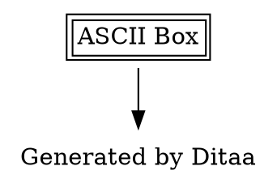

# Ditaa 社区问题和讨论

## GitHub Issues 精选

### 已解决的重要问题

#### 1. SVG 渲染支持

**Issue**: [#65 Never fill dashed paths in SVG](https://github.com/stathissideris/ditaa/pull/65)
**问题**: SVG 输出中虚线路径被错误填充,导致覆盖其他图形元素
**解决方案**: 修复虚线路径填充逻辑,保持与 PNG 输出一致
**影响版本**: v0.11.0 之前
**状态**: ✅ 已修复 (2021-01-18)

```
// 问题示例
/======
:      :
:+----+:
:│cABC│:
:+----+:
:      :
=======/

// 虚线填充导致 box 角落被裁剪
```

#### 2. 文件权限问题

**Issue**: [#26 Fix permissions of source files](https://github.com/stathissideris/ditaa/pull/26)
**问题**: 源文件和图片权限设置不当
**解决方案**: 统一文件权限为 644
**状态**: ✅ 已修复 (2021-01-18)

#### 3. 特殊字符渲染

**Issue**: [#6 Can't render : in text](https://sourceforge.net/p/ditaa/bugs/6/)
**问题**: 冒号 `:` 在文本中消失
**原因**: 冒号被解析为虚线标记
**解决方案**:

- 使用空格隔离 `: `
- 避免在垂直线附近使用冒号
- 考虑使用其他分隔符

```
// 问题
+----------------+
| Time: 10:30 AM |  ← 冒号可能消失
+----------------+

// 解决
+------------------+
| Time - 10:30 AM  |  ✅
+------------------+
```

### 开放的讨论主题

#### 4. Unicode 和多语言支持

**话题**: 中文、日文、韩文等字符支持
**挑战**:

- 需要配置 TrueType 字体
- 字体路径因系统而异
- 字符宽度计算问题

**社区解决方案**:

```bash
# Linux (中文)
java -jar ditaa.jar -f /usr/share/fonts/truetype/wqy-microhei.ttc diagram.ditaa

# macOS (中文)
java -jar ditaa.jar -f /System/Library/Fonts/PingFang.ttc diagram.ditaa

# Windows (中文)
java -jar ditaa.jar -f C:\Windows\Fonts\msyh.ttc diagram.ditaa
```

**配置文件方式** (`~/.ditaarc`):

```ini
[ditaa]
fontpath = /usr/share/fonts/truetype/wqy-microhei.ttc
```

#### 5. 性能优化需求

**讨论**: 大型图表渲染缓慢
**社区建议**:

1. 拆分大图为多个小图
2. 增加 Java 堆内存
3. 减少颜色和复杂度
4. 使用缓存机制

```bash
# 性能优化示例
java -Xmx1g -jar ditaa.jar large_diagram.ditaa

# 并行处理多个小图
for f in part*.ditaa; do
  java -jar ditaa.jar "$f" &
done
wait
```

#### 6. 导出格式扩展

**需求**: 支持更多输出格式
**当前支持**: PNG, SVG
**社区期望**:

- ✅ SVG (已支持)
- ✅ PDF (通过 ditaa-addons)
- ❓ WebP
- ❓ Canvas (HTML5)

## 集成工具问题

### PlantUML 集成

#### 问题 1: PNG Only 限制

**Issue**: PlantUML 中 Ditaa 仅支持 PNG
**讨论**: [PlantUML Forum](https://forum.plantuml.net/)
**替代方案**:

- 直接使用 ditaa.jar 生成 SVG
- 使用 Kroki 服务(支持多种格式)
- 使用 ditaa-addons 生成 EPS/PDF


#### 问题 2: 颜色显示差异

**现象**: PlantUML 中颜色与原生 Ditaa 不同
**原因**: PlantUML 可能使用不同的渲染设置
**解决**: 测试时以 ditaa.jar 为准

### Kroki 服务

#### 问题 1: URL 长度限制

**Issue**: 复杂图表导致 URL 过长
**解决方案**:

```bash
# 使用 POST 请求而非 GET
curl -X POST https://kroki.io/ditaa/png \
  -H "Content-Type: text/plain" \
  --data-binary @diagram.ditaa \
  -o output.png
```

#### 问题 2: 编码问题

**Issue**: 特殊字符在 URL 编码后失效
**解决**: 使用 deflate + base64url 编码

```python
import zlib
import base64

def encode_ditaa(text):
    compressed = zlib.compress(text.encode('utf-8'), 9)
    encoded = base64.urlsafe_b64encode(compressed).decode('ascii')
    return encoded.rstrip('=')
```

### VS Code / IDE 集成

#### 问题: vscode-plantuml 扩展问题

**Issue**: [#162 ditaa diagrams not working on md](https://github.com/qjebbs/vscode-plantuml/issues/162)
**现象**: Markdown 预览中 Ditaa 无法渲染
**状态**: Alt-D 预览正常,Markdown 预览失效
**临时解决**: 使用 Alt-D 预览或独立渲染

### Asciidoctor 集成

#### 问题: 图片路径问题

**讨论**: asciidoctor-diagram 图片保存位置
**解决**: 配置 `imagesdir` 属性

```asciidoc
:imagesdir: ./images

[ditaa]
----
+-----+
| Box |
+-----+
----
```

## 常见使用场景问题

### 1. 文档生成工作流

#### 问题: 自动化 CI/CD 集成

**场景**: Jenkins/GitHub Actions 中自动渲染
**社区方案**:

```yaml
# GitHub Actions 示例
name: Render Ditaa Diagrams
on: [push]
jobs:
  render:
    runs-on: ubuntu-latest
    steps:
      - uses: actions/checkout@v2
      - name: Setup Java
        uses: actions/setup-java@v2
        with:
          distribution: "adopt"
          java-version: "11"
      - name: Download Ditaa
        run: wget https://github.com/stathissideris/ditaa/releases/download/v0.11.0/ditaa-0.11.0-standalone.jar
      - name: Render Diagrams
        run: |
          find . -name "*.ditaa" -exec java -jar ditaa-0.11.0-standalone.jar {} \;
      - name: Commit Images
        run: |
          git config user.name "Bot"
          git add *.png
          git commit -m "Update diagrams"
          git push
```

#### 问题: 批量处理脚本

**需求**: 一次处理多个 .ditaa 文件
**社区脚本**:

```bash
#!/bin/bash
# batch_render.sh

DITAA_JAR="ditaa.jar"
INPUT_DIR="./diagrams"
OUTPUT_DIR="./output"

mkdir -p "$OUTPUT_DIR"

for ditaa_file in "$INPUT_DIR"/*.ditaa; do
  filename=$(basename "$ditaa_file" .ditaa)
  echo "Rendering $filename..."
  java -jar "$DITAA_JAR" "$ditaa_file" "$OUTPUT_DIR/$filename.png"
done

echo "Done! Rendered $(ls $OUTPUT_DIR/*.png | wc -l) diagrams"
```

### 2. 版本控制最佳实践

#### 讨论: .ditaa 文件管理

**最佳实践**:

- ✅ 将 `.ditaa` 源文件加入版本控制
- ✅ 将生成的 `.png` 加入 `.gitignore`(可选)
- ✅ 使用 pre-commit hook 自动渲染
- ✅ 文档中引用相对路径

```gitignore
# .gitignore
*.png
!docs/images/logo.png  # 例外: 保留 logo
```

**Pre-commit Hook**:

```bash
#!/bin/bash
# .git/hooks/pre-commit

changed_ditaa=$(git diff --cached --name-only --diff-filter=ACM | grep '.ditaa$')

if [ -n "$changed_ditaa" ]; then
  echo "Rendering changed ditaa files..."
  for file in $changed_ditaa; do
    java -jar ditaa.jar "$file"
    git add "${file%.ditaa}.png"
  done
fi
```

### 3. 团队协作问题

#### 问题: 不同操作系统渲染差异

**场景**: Windows/Linux/macOS 团队协作
**挑战**:

- 字体不一致
- 行尾符差异(CRLF vs LF)
- 路径分隔符

**解决方案**:

```bash
# 统一字体(Docker 方式)
docker run -v $(pwd):/data \
  openjdk:11-jre \
  java -jar /data/ditaa.jar \
  -f /usr/share/fonts/truetype/dejavu/DejaVuSans.ttf \
  /data/diagram.ditaa

# 统一行尾符(.gitattributes)
*.ditaa text eol=lf

# 使用相对路径
# ✅ ./diagrams/arch.ditaa
# ❌ C:\Users\...\arch.ditaa
```

## 高级用法讨论

### 1. 自定义渲染扩展

#### 社区项目: ditaa-addons

**功能**:

- EPS 输出
- PDF 输出
- Javadoc 标签集成

**用法**:

```bash
# EPS 输出
java -jar ditaa-eps.jar input.ditaa output.eps

# PDF 输出
java -jar ditaa-eps.jar input.ditaa output.pdf
```

#### 社区项目: ditaa-web

**功能**: HTTP API 服务
**部署**:

```bash
git clone https://github.com/athoune/Ditaa-web
cd Ditaa-web
python server.py

# 使用 API
curl -X POST http://localhost:8080/render \
  -d @diagram.ditaa \
  -o output.png
```

### 2. 与其他工具结合

#### Graphviz + Ditaa 混合

**讨论**: 复杂图表混合使用
**方案**: Graphviz 布局 + Ditaa 装饰



#### Mermaid + Ditaa 协同

**场景**: 流程图用 Mermaid,装饰用 Ditaa
**工作流**:

1. Mermaid 生成主体结构
2. Ditaa 添加装饰元素
3. 手动合成最终图

### 3. 性能优化技巧

#### 社区经验: 大图处理

**策略 1: 分层渲染**

```bash
# 分别渲染各层
java -jar ditaa.jar layer1.ditaa
java -jar ditaa.jar layer2.ditaa
java -jar ditaa.jar layer3.ditaa

# ImageMagick 合成
convert layer1.png layer2.png layer3.png -layers flatten final.png
```

**策略 2: 增量渲染**

```bash
# 只渲染变更的文件
find . -name "*.ditaa" -newer last_build.txt \
  -exec java -jar ditaa.jar {} \;

touch last_build.txt
```

## 常见问题 FAQ

### Q1: Ditaa 是否支持实时预览?

**A**: Ditaa 本身不支持,但可使用:

- VS Code + PlantUML 扩展 (Alt-D)
- Emacs + artist-mode
- 在线工具: ditaa.org, kroki.io

### Q2: 如何处理超大图表?

**A**:

1. 拆分为多个小图
2. 增加 Java 堆内存: `-Xmx2g`
3. 简化细节,使用引用

### Q3: Ditaa 支持动画吗?

**A**: 不支持。Ditaa 是静态图表工具。需要动画请使用:

- Mermaid (有限的交互)
- D3.js (完全自定义)

### Q4: 能否自定义形状?

**A**: Ditaa 形状固定,但可以:

- 组合现有形状
- 使用 ASCII 艺术创造性表达
- 考虑使用 Graphviz 或 PlantUML

### Q5: 商业使用是否免费?

**A**: 是的,Ditaa 采用 LGPL-3.0 许可证,可商业使用。

## 社区贡献指南

### 如何贡献

1. **报告 Bug**
   - GitHub Issues: https://github.com/stathissideris/ditaa/issues
   - 提供最小复现示例
   - 包含版本和环境信息

2. **功能请求**
   - 详细描述使用场景
   - 提供示例和预期效果
   - 考虑向后兼容性

3. **提交 Pull Request**
   - Fork 仓库
   - 创建功能分支
   - 编写测试用例
   - 提交 PR

### 代码贡献者

感谢以下贡献者(部分列表):

- Stathis Sideris (原作者)
- Jean Lazarou (SVG 支持)
- Flupp (虚线修复)
- neolefty (多项改进)

## 学习资源

### 官方文档

- [Ditaa 官网](https://ditaa.sourceforge.net/)
- [GitHub Wiki](https://github.com/stathissideris/ditaa/wiki)

### 教程和博客

- ["ASCII Art to Beautiful Diagrams"](https://www.martinfowler.com/bliki/AsciiArt.html) - Martin Fowler
- ["Ditaa Quickstart Guide"](https://plantuml.com/ditaa) - PlantUML 官方

### 视频教程

- [YouTube: "Ditaa Tutorial"](https://www.youtube.com/results?search_query=ditaa+tutorial)
- [ASCII Diagrams with Ditaa](https://www.youtube.com/watch?v=IiOHYNHo_Nw) (asciio + ditaa)

### 示例图库

- [Ditaa Examples](https://ditaa.sourceforge.net/#usage)
- [PlantUML Ditaa Gallery](https://real-world-plantuml.com/?type=ditaa)

## 替代工具对比

### Ditaa vs. 其他工具

| 工具         | 优势                | 劣势            | 适用场景            |
| ------------ | ------------------- | --------------- | ------------------- |
| **Ditaa**    | 纯文本,简单易学     | 形状有限        | 快速流程图,文档嵌入 |
| **PlantUML** | 功能强大,UML 标准   | 语法复杂        | 正式 UML 图表       |
| **Mermaid**  | 浏览器渲染,交互性   | 依赖 JavaScript | Web 文档,在线展示   |
| **Graphviz** | 自动布局,高度自定义 | 学习曲线陡      | 复杂网络图,依赖关系 |
| **Svgbob**   | ASCII 美化,SVG 输出 | 功能较少        | ASCII 艺术转换      |

### 选择建议

- 📝 **文档嵌入**: Ditaa, Mermaid
- 🎨 **精美图表**: PlantUML, Graphviz
- 🚀 **快速原型**: Ditaa, Svgbob
- 🏢 **企业级**: PlantUML, Structurizr

## 未来发展方向

### 社区期望功能

1. **原生 SVG 优化** - 更好的 SVG 质量
2. **实时预览** - 独立预览工具
3. **更多形状** - 扩展标签库
4. **主题支持** - 预定义配色方案
5. **WebAssembly** - 浏览器原生运行

### 长期维护状态

- **活跃度**: 中等(偶尔更新)
- **社区**: 活跃(通过 PlantUML 社区)
- **企业支持**: 有限
- **替代方案**: Kroki (现代化封装)

---

_最后更新: 2025-01-13_
_贡献者: 社区整理_
