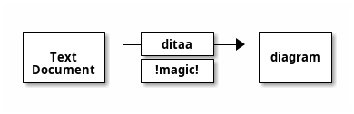

# Ditaa 官方文档

## 概述

**Ditaa** (DIagrams Through Ascii Art) 是一个用 Java 编写的命令行工具,可以将 ASCII 艺术图转换为正式的位图图形。

## 官方资源

- **主页**: https://ditaa.sourceforge.net/
- **GitHub**: https://github.com/stathissideris/ditaa
- **PlantUML 集成**: https://plantuml.com/ditaa
- **许可证**: LGPL-3.0

## 核心功能

### 1. ASCII 到图形转换

Ditaa 将包含类似线条的字符(`| / - +`)的 ASCII 艺术图转换为漂亮的位图图形。

**示例输入**:
```
+--------+   +-------+    +-------+
|        | --+ ditaa +--> |       |
|  Text  |   +-------+    |diagram|
|Document|   |!magic!|    |       |
|     {d}|   |       |    |       |
+---+----+   +-------+    +-------+
    :                         ^
    |       Lots of work      |
    +-------------------------+
```

### 2. 支持的输出格式

- **PNG** (默认,推荐用于高质量输出)
- **SVG** (矢量格式,使用 `--svg` 选项)
- **PDF** (需要安装额外依赖)

### 3. 命令行用法

```bash
# 基本用法
java -jar ditaa.jar input.ditaa

# 生成 SVG
java -jar ditaa.jar --svg input.ditaa

# 指定输出文件
java -jar ditaa.jar input.ditaa output.png
```

## PlantUML 集成

### 基本语法



### 支持的选项

- `-E` 或 `--no-separation`: 移除分隔线
- `-S` 或 `--no-shadows`: 移除阴影效果
- `scale=<XYZ>`: 缩放图表

**示例**:


## 特殊标记和符号

### 形状标签 (Tags)

在矩形内使用 `{tag}` 来指定特殊形状:

| 标签 | 说明 | 示例 |
|------|------|------|
| `{c}` | Choice/Decision (菱形) | 决策节点 |
| `{d}` | Document (文档符号) | 文档图标 |
| `{io}` | Input/Output (输入输出) | I/O 符号 |
| `{mo}` | Manual Operation (手动操作) | 手动流程 |
| `{o}` | Ellipse (椭圆) | 椭圆形状 |
| `{s}` | Storage (存储) | 数据库/硬盘 |
| `{tr}` | Trapezoid (梯形) | 梯形符号 |

**示例**:
```
+------+------+------+
| c {c}|d {d} |io{io}|
+------+------+------+
```

### 圆角

使用 `/` 和 `\` 连接角落可以渲染为圆角:

```
/--+
|  |
+--/
```

### 颜色

#### 十六进制颜色码

格式: `cXXX` (其中 X 是十六进制数字,RGB 格式)

```
/----\ /----\
|c33F| |cC02|  // 红色和橙色
|    | |    |
\----/ \----/

/----\ /----\
|c1FF| |c1AB|  // 蓝色和青色
|    | |    |
\----/ \----/
```

#### 预定义颜色

```
Color codes
/-------------+-------------\
|cRED RED     |cBLU BLU     |
+-------------+-------------+
|cGRE GRE     |cPNK PNK     |
+-------------+-------------+
|cBLK BLK     |cYEL YEL     |
\-------------+-------------/
```

**重要**: 颜色代码仅在闭合形状内有效。深色背景会自动将文本颜色改为白色。

### 虚线

- **水平虚线**: 至少包含一个 `=`
- **垂直虚线**: 至少包含一个 `:`

```
----+  /----\  +----+
    :  |    |  :    |
    |  |    |  |{s} |
    v  \-=--+  +----+
```

特殊符号(如 document、storage)也可以使用虚线。

### 点标记 (Point Markers)

在线条中间使用 `*` 创建点标记(实验性功能):

```
*----*
|    |      /--*
*    *      |
|    |  -*--+
*----*
```

### 文本处理

#### 项目符号

模式 `' o XXXXX'` 会将 'o' 渲染为项目符号(注意前后的空格):

```
/-----------------\
| Things to do    |
| cGRE            |
| o Cut the grass |
| o Buy jam       |
| o Fix car       |
| o Make website  |
\-----------------/
```

## 命令行选项

### 渲染选项

```bash
-A, --no-antialias              # 关闭抗锯齿
-d, --debug                     # 显示调试网格
-E, --no-separation             # 禁用边缘分离
-S, --no-shadows                # 移除阴影效果
-r, --round-corners             # 所有角落渲染为圆角
-T, --transparent               # 透明背景
```

### 输出控制

```bash
-o, --overwrite                 # 覆盖现有文件
-s, --scale <SCALE>             # 缩放因子 (默认 1.0)
-b, --background <COLOR>        # 背景颜色 (十六进制)
    --svg                       # 输出 SVG 格式
```

### 输入处理

```bash
-e, --encoding <ENCODING>       # 输入文件编码
-t, --tabs <TABS>               # Tab 宽度 (默认 8)
-h, --html                      # HTML 模式
```

### HTML 模式

在 HTML 文件中,`<pre class="textdiag">` 标签内的内容会被渲染为图表:

```html
<pre class="textdiag" id="diagram1">
+-----+
| Box |
+-----+
</pre>
```

- 如果有 `id` 属性,使用其值作为文件名
- 否则使用 `ditaa_diagram_X.png` 格式
- 输出 HTML 文件名为 `xxxx_processed.html`

## 系统要求

- **Java**: JRE 1.5 或更高版本(最佳抗锯齿效果)
- **依赖库**:
  - JArgs (命令行解析)
  - Jericho HTML Parser (HTML 模式)

## 字体配置

### 命令行指定字体

```bash
java -jar ditaa.jar -f /usr/share/fonts/truetype/DejaVuSerif.ttf diagram.ditaa
```

### 配置文件

创建 `$HOME/.ditaarc`:

```ini
[ditaa]
fontpath = /usr/share/fonts/truetype/DejaVuSerif.ttf
```

## 集成工具

### 1. Asciidoctor

使用 `asciidoctor-diagram` 扩展:

```asciidoc
[ditaa]
----
+-----+
| Box |
+-----+
----
```

### 2. Org-mode (Emacs)

```org
#+BEGIN_SRC ditaa :file diagram.png
+-----+
| Box |
+-----+
#+END_SRC
```

### 3. DokuWiki

安装 ditaa 插件后可直接使用。

### 4. Markdown (Markdeep)

Markdeep 原生支持 ASCII 图表渲染。

## 设计理念

### 为什么使用 Ditaa?

1. **Hack Value**: 探索 ASCII 到图形的转换可能性
2. **美学和传统**: 将丑陋的 ASCII 图转换为现代化图形
3. **文本格式嵌入**: 在 HTML、DocBook、LaTeX 等文本格式中嵌入可编辑图表
4. **代码可重用性**: 保留 ASCII 源码,随时用新版本重新渲染

### 适用场景

- ✅ 快速绘制简单流程图
- ✅ 在纯文本文档中嵌入图表
- ✅ 将旧 FAQ 中的 ASCII 图现代化
- ✅ 与版本控制系统(Git)友好集成
- ❌ 复杂的 UML 图表(推荐使用 PlantUML)
- ❌ 需要精确像素控制的设计

## 最佳实践

1. **使用一致的字符**: 坚持使用 `+` 作为角落连接符
2. **保持线条笔直**: 避免不对齐的字符
3. **利用颜色增强**: 使用颜色区分不同类型的节点
4. **合理使用标签**: 为特定符号(文档、存储等)使用正确的标签
5. **版本控制**: 将 `.ditaa` 源文件纳入 Git 管理

## 示例图库

### 基础流程图
```
+--------+   +-------+    +-------+
|  Start | ->|Process| -> |  End  |
+--------+   +-------+    +-------+
```

### 带决策节点
```
+-------+
|Input  |
+---+---+
    |
    v
+---+---+
|Valid? |
| cGRE  |
|  {c}  |
+---+---+
    |
  +-+-+
  |   |
Yes   No
  |   |
  v   v
```

### 系统架构
```
/----------\     +---------+     /--------\
| Client   |---->| Server  |---->|Database|
| cBLU     |     | cGRE    |     |  {s}   |
\----------/     +---------+     \--------/
```

## 参考资源

- [Ditaa 官方网站](https://ditaa.sourceforge.net/)
- [GitHub 仓库](https://github.com/stathissideris/ditaa)
- [PlantUML Ditaa 集成](https://plantuml.com/ditaa)
- [Asciidoctor Diagram 文档](https://docs.asciidoctor.org/diagram-extension/latest/diagram_types/ditaa/)
