# Graphviz 常见错误与解决方案

> **最后更新**: 2025-01-13

---

## 🔴 语法错误

### 1. 混用连接符

```dot
// ❌ 错误: 有向图用无向连接符
digraph {
  A -- B  // 应该用 ->
}

// ❌ 错误: 无向图用有向连接符
graph {
  A -> B  // 应该用 --
}

// ✅ 正确
digraph { A -> B }
graph { A -- B }
```

**错误信息**: `syntax error near line X`

---

### 2. 引号问题

```dot
// ❌ 错误: 特殊字符未引号
node-name -> other-node

// ❌ 错误: 引号未闭合
"node name

// ✅ 正确
"node-name" -> "other-node"
"node name" -> B
```

---

### 3. 端口语法错误

```dot
// ❌ 错误: 端口格式
struct1.f0 -> struct2.f1  // 应该用 :

// ✅ 正确
struct1:f0 -> struct2:f1
```

---

## 🟡 布局问题

### 1. 性能问题 (大图)

**现象**: 渲染超过10分钟

**原因**: DOT 算法复杂度高

**解决方案**:

```bash
# 1. 使用快速引擎
sfdp -Tsvg large.dot -o out.svg    # 大规模图

# 2. 简化复杂度
neato -n2 -Tsvg input.dot          # 跳过初始布局

# 3. 限制迭代
fdp -Gmaxiter=100 input.dot
```

---

### 2. 边穿透节点

```dot
// 使用 splines 属性
digraph {
  splines=ortho      // 正交边
  // splines=curved   // 曲线边
  // splines=polyline // 折线边
}
```

---

### 3. 节点重叠

```dot
graph {
  overlap=false      // 移除重叠 (neato/fdp)
  sep="+0.5"         // 节点间距
}
```

---

## 🟠 HTML Label 错误

### 1. 标签未闭合

```dot
// ❌ 错误
A [label=<
  <TABLE><TR><TD>Cell
  // 缺少 </TD></TR></TABLE>
>]

// ✅ 正确
A [label=<
  <TABLE><TR><TD>Cell</TD></TR></TABLE>
>]
```

---

### 2. 特殊字符转义

```dot
// ❌ 错误: 未转义
A [label=<Text with < and >>]

// ✅ 正确
A [label=<Text with &lt; and &gt;>]
```

XML 转义:

- `<` → `&lt;`
- `>` → `&gt;`
- `&` → `&amp;`
- `"` → `&quot;`

---

## 🔵 Cluster 错误

### 1. 名称不以 cluster 开头

```dot
// ❌ 不会渲染边框
subgraph my_group {
  label="Group"
  a -> b
}

// ✅ 正确
subgraph cluster_my_group {
  label="Group"
  a -> b
}
```

---

### 2. 跨集群边



---

## 🟣 常见调试技巧

### 1. 逐步排查

```bash
# 1. 检查语法
dot -Tcanon input.dot > /dev/null

# 2. 输出调试信息
dot -v -Tsvg input.dot

# 3. 生成 XDOT 检查
dot -Txdot input.dot
```

### 2. 简化测试



---

## 📋 错误排查清单

- [ ] 图类型与连接符匹配?
- [ ] 特殊字符已引号包裹?
- [ ] HTML 标签正确闭合?
- [ ] Cluster 名称以 cluster 开头?
- [ ] 端口使用 `:` 语法?
- [ ] 属性名拼写正确?

---

## 🔗 参考

- FAQ: https://graphviz.org/faq/
- 论坛: https://forum.graphviz.org/
