# Graphviz 官方文档参考

> 来源: https://graphviz.org/ | 最后更新: 2025-10-13

---

## 📚 核心概念

### Graphviz 是什么?

**Graphviz (Graph Visualization Software)** 是开源的图形可视化软件,使用 DOT 语言描述图形结构,支持多种布局引擎和输出格式。

**核心特点**:
- ✅ 成熟稳定 (1991年至今,30+ 年历史)
- ✅ 强大的布局算法 (分层、力导向、环形等)
- ✅ 丰富的输出格式 (SVG, PNG, PDF, PostScript 等)
- ✅ 广泛集成 (Doxygen, Sphinx, Jupyter 等)
- ✅ 跨平台支持 (Linux, macOS, Windows)

---

## 🎯 DOT 语言基础

### 1. 图类型

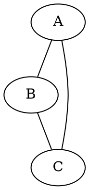

**关键字**:
- `graph`: 无向图
- `digraph`: 有向图
- `strict`: 严格模式 (去重复边)

---

### 2. 节点 (Nodes)


**常用形状**:
- `box`, `rectangle`, `square`
- `circle`, `ellipse`, `oval`
- `diamond`, `trapezium`, `parallelogram`
- `hexagon`, `octagon`, `pentagon`
- `triangle`, `invtriangle`
- `Mrecord`, `record` (表格)
- `note`, `tab`, `folder`, `box3d`
- `cylinder`, `component`

---

### 3. 边 (Edges)

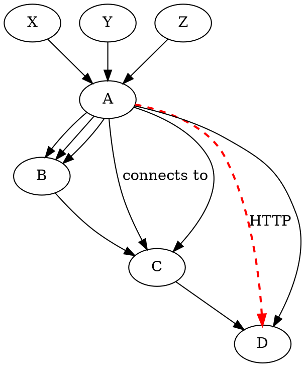

**边样式**:
- `solid` (实线,默认)
- `dashed` (虚线)
- `dotted` (点线)
- `bold` (粗线)
- `invis` (不可见)

---

### 4. 子图和集群 (Subgraphs & Clusters)

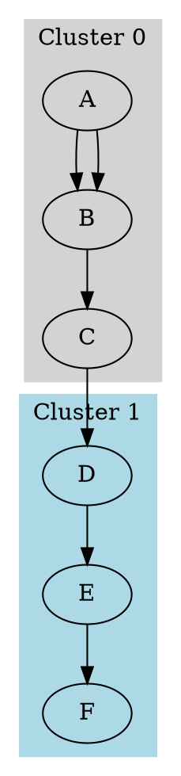

**重要**:
- ⚠️ 集群名必须以 `cluster` 开头 (如 `cluster_0`, `cluster_backend`)
- ⚠️ 集群会被绘制为带边框的矩形区域
- ⚠️ 普通子图仅用于逻辑分组,不会绘制边框

---

### 5. 属性 (Attributes)

#### 全局属性

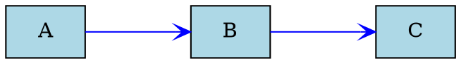

#### 节点属性


#### 边属性

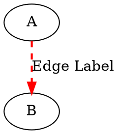

**箭头类型**:
- `normal`, `vee`, `tee`, `diamond`
- `box`, `crow`, `curve`, `icurve`
- `inv`, `dot`, `odot`, `none`

---

### 6. 记录结构 (Record Shapes)

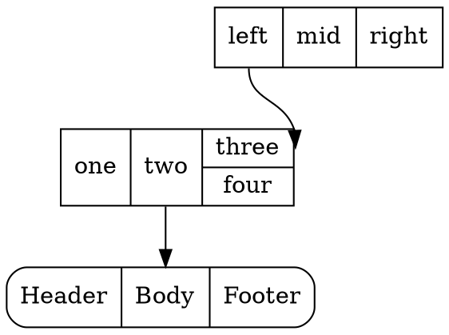

**端口语法**:
- `node:port` - 连接到节点的特定端口
- `node:port:compass` - 连接到端口的特定方位
  - 方位: `n` (北), `ne`, `e`, `se`, `s`, `sw`, `w`, `nw`, `c` (中心)

---

### 7. HTML-Like 标签

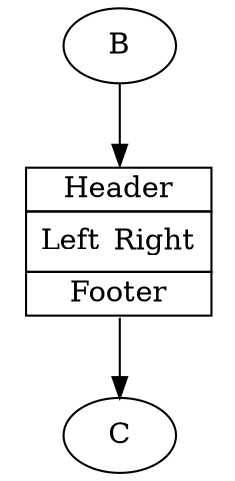

**HTML 标签规则**:
- ✅ 使用 `< >` 包围 HTML 内容 (不用引号)
- ✅ 支持 `<TABLE>`, `<TR>`, `<TD>`, `<BR/>`, `<FONT>`, ``
- ✅ 支持 `PORT` 属性定义端口
- ⚠️ 必须是有效的 XML (标签必须闭合)

---

## 🔧 布局引擎

### dot - 分层布局

**适用**: 有向无环图 (DAG), 流程图, 调用图

```bash
dot -Tsvg input.dot -o output.svg
```

**特点**:
- ✅ 层次化布局
- ✅ 最小化边交叉
- ⚠️ 要求图无环 (自动反转部分边)

**关键属性**:
```dot
digraph {
  rankdir=TB     # TB (上下), LR (左右), BT, RL
  rank=same      # 强制节点在同一层
  constraint=false  # 边不参与排序
}
```

---

### neato - 力导向布局

**适用**: 无向图, 关系图

```bash
neato -Tsvg input.dot -o output.svg
```

**特点**:
- ✅ 基于弹簧模型
- ✅ 自然的节点分布
- ⚠️ 计算量大 (O(n³))

---

### fdp - 力导向布局 (改进)

**适用**: 大型无向图

```bash
fdp -Tsvg input.dot -o output.svg
```

**特点**:
- ✅ 比 neato 更快
- ✅ 适合大图 (1000+ 节点)

---

### circo - 环形布局

**适用**: 环形结构, 循环图

```bash
circo -Tsvg input.dot -o output.svg
```

**特点**:
- ✅ 节点排列成环形
- ✅ 适合周期性结构

---

### twopi - 径向布局

**适用**: 树形结构, 辐射图

```bash
twopi -Tsvg input.dot -o output.svg
```

**特点**:
- ✅ 中心节点向外辐射
- ✅ 适合层次树

---

### sfdp - 多尺度力导向

**适用**: 超大图 (10,000+ 节点)

```bash
sfdp -Tsvg input.dot -o output.svg
```

**特点**:
- ✅ 可扩展到百万节点
- ✅ 多尺度算法

---

## 📊 输出格式

### 常用格式

```bash
# SVG (矢量,推荐)
dot -Tsvg input.dot -o output.svg

# PNG (位图)
dot -Tpng input.dot -o output.png

# PDF (文档)
dot -Tpdf input.dot -o output.pdf

# PostScript
dot -Tps input.dot -o output.ps

# JSON
dot -Tjson input.dot -o output.json

# DOT (格式化后的 DOT)
dot -Tdot input.dot -o formatted.dot
```

### 嵌入格式

```bash
# CMAPX (HTML 图像映射)
dot -Tcmapx input.dot -o output.map

# IMAP (服务器端图像映射)
dot -Timap input.dot -o output.imap
```

---

## 🎨 样式与主题

### 颜色

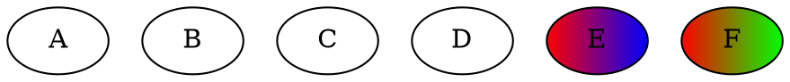

**X11 颜色名**: 支持 140+ 颜色名 (red, blue, green, lightblue, darkgreen 等)

---

### 字体

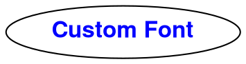

---

### 样式组合

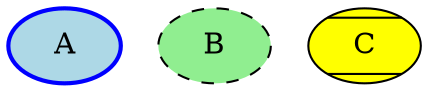

**节点样式**:
- `filled`, `solid`, `dashed`, `dotted`, `bold`
- `rounded`, `diagonals`, `striped`, `wedged`

---

## 🔗 高级特性

### 1. 排序控制

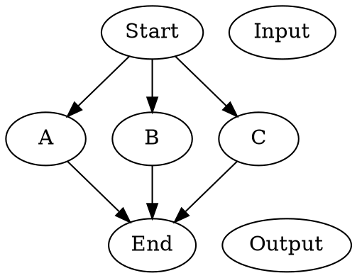

---

### 2. 边路由


---

### 3. 节点重叠


---

### 4. 图像嵌入

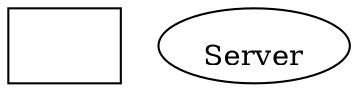

---

### 5. 超链接

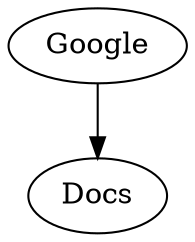

---

### 6. 工具提示

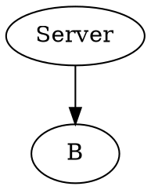

---

## 📝 注释与宏

### 注释

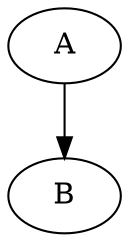

---

### 预处理器

```dot
// 使用 -P 标志启用预处理器
#define NODE_STYLE filled,rounded
#define EDGE_COLOR blue

digraph {
  node [style=NODE_STYLE]
  edge [color=EDGE_COLOR]

  A -> B
}
```

---

## ⚙️ 命令行工具

### 基本用法

```bash
# 基本渲染
dot -Tsvg input.dot -o output.svg

# 指定布局引擎
neato -Tpng input.dot > output.png

# 多个输出
dot -Tsvg -o output.svg -Tpng -o output.png input.dot

# 管道
echo "digraph {A -> B}" | dot -Tsvg > output.svg

# 详细输出
dot -v -Tsvg input.dot -o output.svg
```

---

### 常用工具

```bash
# dot - 分层布局
dot -Tsvg input.dot -o output.svg

# neato - 力导向
neato -Tsvg input.dot -o output.svg

# fdp - 快速力导向
fdp -Tsvg input.dot -o output.svg

# circo - 环形布局
circo -Tsvg input.dot -o output.svg

# twopi - 径向布局
twopi -Tsvg input.dot -o output.svg

# sfdp - 大图力导向
sfdp -Tsvg input.dot -o output.svg

# osage - 打包布局
osage -Tsvg input.dot -o output.svg

# patchwork - 树形图布局
patchwork -Tsvg input.dot -o output.svg
```

---

### 辅助工具

```bash
# gvpr - 图形处理器
gvpr -f script.gvpr input.dot

# gvpack - 合并多个图
gvpack -u graph1.dot graph2.dot | dot -Tsvg > combined.svg

# unflatten - 改善长链
unflatten -l 3 input.dot | dot -Tsvg > output.svg

# tred - 传递约简
tred input.dot | dot -Tsvg > output.svg

# sccmap - 强连通分量
sccmap input.dot | dot -Tsvg > output.svg

# ccomps - 连通分量
ccomps -x input.dot | dot -Tsvg > output.svg

# acyclic - 消除环
acyclic input.dot | dot -Tsvg > output.svg
```

---

## 🔗 集成示例

### Python (graphviz 库)

```python
from graphviz import Digraph

dot = Digraph(comment='Architecture')

dot.node('A', 'API Server', shape='box')
dot.node('B', 'Database', shape='cylinder')

dot.edge('A', 'B', label='queries')

dot.render('output', format='svg', view=True)
```

### C/C++ API

```c
#include <graphviz/gvc.h>

GVC_t *gvc = gvContext();
graph_t *g = agread(stdin, NULL);
gvLayout(gvc, g, "dot");
gvRender(gvc, g, "svg", stdout);
gvFreeLayout(gvc, g);
agclose(g);
gvFreeContext(gvc);
```

---

## 📚 参考资源

### 官方文档
- **官网**: https://graphviz.org/
- **DOT 语言**: https://graphviz.org/doc/info/lang.html
- **属性参考**: https://graphviz.org/doc/info/attrs.html
- **形状库**: https://graphviz.org/doc/info/shapes.html
- **颜色名**: https://graphviz.org/doc/info/colors.html

### 下载与安装
- **下载页**: https://graphviz.org/download/
- **源代码**: https://gitlab.com/graphviz/graphviz

### 工具文档
- **命令行参考**: https://graphviz.org/documentation/#command-line
- **布局引擎**: https://graphviz.org/documentation/#layout-engines
- **输出格式**: https://graphviz.org/documentation/#output-formats

### 学习资源
- **Gallery**: https://graphviz.org/gallery/
- **FAQ**: https://graphviz.org/faq/
- **PDF Guide**: https://www2.eecs.berkeley.edu/Pubs/TechRpts/2013/EECS-2013-176.pdf

---

**最后更新**: 2025-10-13
**Graphviz 版本**: 2.50+
