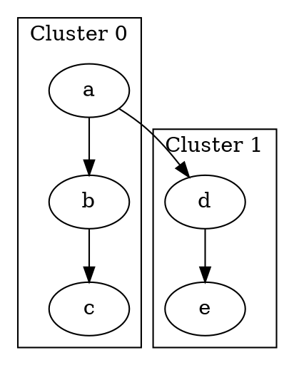

# Graphviz 官方文档汇总

> **更新时间**: 2025-01-13  
> **官方网站**: https://graphviz.org  
> **当前版本**: 13.1.0+

---

## 📚 核心文档

### 官方资源

- **主站**: https://graphviz.org
- **文档中心**: https://graphviz.org/documentation/
- **DOT 语言规范**: https://graphviz.org/doc/info/lang.html
- **属性参考**: https://graphviz.org/doc/info/attrs.html
- **下载**: https://graphviz.org/download/

### GitHub

- **主仓库**: https://gitlab.com/graphviz/graphviz
- **镜像**: https://github.com/graphviz
- **Python 绑定**: https://github.com/xflr6/graphviz

---

## 🎯 DOT 语言核心

### 基础语法

```dot
// 有å‘图
digraph G {
  A -> B
  B -> C
}

// æ— å‘图
graph G {
  A -- B
  B -- C
}
```



### 节点与边属性



### 子图与集群



---

## 🎨 布局引擎

| 引擎          | 用途     | 特点                |
| ------------- | -------- | ------------------- |
| **dot**       | 层次图   | 有向无环图,自顶向下 |
| **neato**     | 无向图   | 弹簧模型,适合小图   |
| **fdp**       | 无向图   | 力导向,适合大图     |
| **sfdp**      | 大规模图 | 多尺度力导向        |
| **circo**     | 环形图   | 圆形布局            |
| **twopi**     | 径向图   | 从中心向外辐射      |
| **patchwork** | 树图     | 方块树布局          |

```bash
dot -Tsvg input.dot -o output.svg
neato -Tpng input.dot -o output.png
```

---

## 📦 节点形状

### 基础形状

- `box`, `circle`, `ellipse`, `oval`, `polygon`
- `diamond`, `trapezium`, `parallelogram`
- `house`, `pentagon`, `hexagon`, `octagon`

### 特殊形状

- `record`, `Mrecord`: 记录型节点
- `plaintext`: 无边框文本
- `point`: 点

### Record 语法

```dot
node [shape=record]
struct [label="{<f0> left|<f1> middle|<f2> right}"]
```

---

## 🔧 关键属性

### 图属性

- `rankdir`: TB (上下), LR (左右), BT (下上), RL (右左)
- `size`: 图大小
- `ratio`: 宽高比
- `bgcolor`: 背景色

### 节点属性

- `shape`, `color`, `fillcolor`, `style`
- `label`, `fontname`, `fontsize`, `fontcolor`
- `width`, `height`, `fixedsize`

### 边属性

- `color`, `style` (solid, dashed, dotted, bold)
- `arrowhead`, `arrowtail` (normal, inv, dot, none)
- `label`, `labelangle`, `labeldistance`
- `constraint`: 是否影响排序

---

## 🌐 输出格式

### 图形格式

- **SVG**: 网页最佳
- **PNG**: 栅格图
- **PDF**: 打印质量
- **PS/EPS**: PostScript

### 数据格式

- **DOT**: 源格式
- **JSON**: 结构化数据
- **XDOT**: 扩展 DOT

```bash
dot -Tsvg -o out.svg input.dot      # SVG
dot -Tpng -o out.png input.dot      # PNG
dot -Tpdf -o out.pdf input.dot      # PDF
dot -Tjson -o out.json input.dot    # JSON
```

---

## 📖 学习资源

### 官方教程

- **Getting Started**: https://graphviz.org/doc/info/lang.html
- **Drawing Guide**: https://graphviz.org/pdf/dotguide.pdf
- **属性手册**: https://graphviz.org/doc/info/attrs.html
- **形状目录**: https://graphviz.org/doc/info/shapes.html

### 工具

- **在线编辑器**: https://dreampuf.github.io/GraphvizOnline/
- **Python API**: https://graphviz.readthedocs.io/
- **VS Code 插件**: Graphviz Preview

### 社区

- **论坛**: https://forum.graphviz.org/
- **Stack Overflow**: `[graphviz]` 标签

---

## 🔗 重要链接

- 官网: https://graphviz.org
- GitLab: https://gitlab.com/graphviz/graphviz
- 文档: https://graphviz.org/documentation/
- 下载: https://graphviz.org/download/
- 论坛: https://forum.graphviz.org/
- FAQ: https://graphviz.org/faq/
