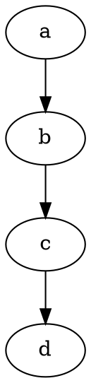

```dot
digraph {
  A -> B             // 基础è¿æ¥
  A -> B -> C        // 链å¼è¿æ¥
  A -> {B C D}       // 一对多
  {A B} -> C         // 多对一
}
```

```dot
graph {
  A -- B             // 基础è¿æ¥
  A -- B -- C        // 链å¼
  A -- {B C D}       // 一对多
}
```

```dot
digraph {
  // 1. 全局默认
  graph [bgcolor=lightgray]
  node [shape=box, color=blue]
  edge [color=red]

  // 2. 节点/边直æ¥è®¾ç½®
  A [label="Node A", color=green]
  A -> B [label="edge", style=dashed]

  // 3. 赋值语å¥
  rankdir=LR
}
```

```dot
digraph {
  // 全局æ’åº
  ordering=out  // 按出边æ’åº

  // 节点内æ’åº
  A [ordering="a:b:c"]  // 指定出边顺åº
}
```

# Graphviz DOT 语法规则

> **DOT 语言版本**: 2.50+  
> **最后更新**: 2025-01-13

---

## 🎯 基础语法

### 图类型

```dot
// 严格图 (strict): 防止多重边
strict digraph {}
strict graph {}

// 有向图 (digraph)
digraph G {}

// 无向图 (graph)
graph G {}
```

### 语句类型

1. **节点语句**: `node_id [attrs]`
2. **边语句**: `node1 -> node2 [attrs]`
3. **属性语句**: `graph/node/edge [attrs]`
4. **赋值语句**: `id=value`
5. **子图语句**: `subgraph {...}`

---

## 📝 标识符规则

### 合法标识符

```dot
// 1. 字母数字下划线 (不以数字开头)
node1
_node
myNode_123

// 2. 数字 (整数或浮点数)
-5
3.14

// 3. 双引号字符串
"node with spaces"
"node:with:special"

// 4. HTML 字符串
<html><b>Bold</b></html>
```

### 转义规则

```dot
// 双引号内只有 \" 需要转义
"node with \"quotes\""

// 反斜杠不转义
"path\\to\\file"  // 保持 \\
```

---

## 🔗 连接语法

### 有向图



### 无向图



### 端口连接

```dot
// 使用 record 形状
node [shape=record]
struct1 [label="<f0> left|<f1> right"]
struct2 [label="<f0> left|<f1> right"]

struct1:f0 -> struct2:f1  // 端口连接
```

---

## 🎨 属性语法

### 三种设置方式



### 属性列表语法

```dot
// 逗号或分号分隔
A [color=red, shape=box]
A [color=red; shape=box]

// 多个属性列表
A [color=red] [shape=box]
```

---

## 📦 子图规则

### 普通子图



### 集群 (Cluster)

```dot
digraph {
  // å称必须以 "cluster" 开头
  subgraph cluster_0 {
    label="Cluster 0"
    a -> b
  }

  subgraph cluster_1 {
    label="Cluster 1"
    c -> d
  }
}
```



### 子图边界连接



---

## 🔲 Record 语法

### 基础 Record

```dot
node [shape=record]
struct [label="field1|field2|field3"]
```

### 端口命名

```dot
struct [label="<f0> left|<f1> middle|<f2> right"]
```

### 嵌套 Record

```dot
struct [label="{{<f0> a|<f1> b}|{<f2> c|<f3> d}}"]
```

### 垂直/水平分割

```dot
// | 水平分割
// {|} 垂直分割
node [label="{a|{b|c}|d}"]
```

---

## 📐 HTML-Like Labels

### 基础表格

```dot
A [label=<
  <TABLE>
    <TR><TD>Row1</TD></TR>
    <TR><TD>Row2</TD></TR>
  </TABLE>
>]
```

### 端口表格

```dot
A [label=<
  <TABLE>
    <TR><TD PORT="f0">Left</TD></TR>
    <TR><TD PORT="f1">Right</TD></TR>
  </TABLE>
>]

A:f0 -> B
```

### 样式表格

```dot
A [label=<
  <TABLE BORDER="0" CELLBORDER="1" CELLSPACING="0">
    <TR><TD BGCOLOR="lightblue"><B>Header</B></TD></TR>
    <TR><TD>Content</TD></TR>
  </TABLE>
>]
```

---

## 🎯 布局控制

### Rank 控制



### 节点排序



---

## ⚙️ 特殊属性

### 边约束

```dot
A -> B [constraint=false]  // 不影响排序
A -> C [weight=5]          // 权重越大越倾向短且直
```

### 节点尺寸

```dot
A [width=2, height=1, fixedsize=true]  // 固定尺寸
```

### 样式

```dot
// 节点样式
node [style="filled,rounded", fillcolor=lightblue]

// 边样式
edge [style=dashed]  // solid, dashed, dotted, bold
```

---

## 📋 语法检查清单

- [ ] 图类型正确 (`graph` vs `digraph`)
- [ ] 连接符匹配 (`--` vs `->`)
- [ ] 特殊字符用引号包裹
- [ ] HTML 标签正确闭合
- [ ] Cluster 名称以 "cluster" 开头
- [ ] 端口引用格式正确 (`node:port`)
- [ ] 属性名拼写正确
- [ ] 分号/逗号分隔符正确

---

## 🔗 参考

- DOT 语言: https://graphviz.org/doc/info/lang.html
- 属性参考: https://graphviz.org/doc/info/attrs.html
- 形状参考: https://graphviz.org/doc/info/shapes.html
