# Graphviz DOT 语法规则与约束

> 基于官方规范整理 | 最后更新: 2025-10-13

---

## 📏 DOT 语言语法

### 1. 基本结构

```bnf
graph     ::= [strict] (graph | digraph) [ID] '{' stmt_list '}'
stmt_list ::= [stmt [';'] stmt_list]
stmt      ::= node_stmt | edge_stmt | attr_stmt | ID '=' ID | subgraph
```

**完整示例**:
```dot
strict digraph MyGraph {
  // 语å¥åˆ—表
  A -> B;
  C -> D;
}
```

**规则**:
- ✅ 图类型: `graph` (无向) 或 `digraph` (有向)
- ✅ 可选 `strict` 关键字 (去重复边)
- ✅ 可选图 ID (标识符)
- ✅ 语句以分号 `;` 分隔 (可选,建议添加)
- ⚠️ 大括号 `{}` 必须匹配

---

### 2. 标识符 (ID) 规则

**有效标识符格式**:

**无效标识符**:
```dot
digraph {
  // ❌ 特殊字符开头 (非引号)
  @invalid
  #invalid
  -invalid  # 除非是数字

  // ❌ 关键字冲突
  graph     # 如果用作节点名,必须加引号 "graph"
  node
  edge
  subgraph
  strict
  digraph
}
```

**关键字**:
- `graph`, `digraph`, `node`, `edge`, `subgraph`, `strict`
- 作为标识符时必须加引号

---

### 3. 节点语句

**语法**:
```bnf
node_stmt ::= node_id [attr_list]
node_id   ::= ID [port]
port      ::= ':' ID [':' compass_pt]
          | ':' compass_pt
compass_pt ::= n | ne | e | se | s | sw | w | nw | c | _
```

**示例**:

**端口方位**:
- `n` (north), `ne`, `e`, `se`, `s`, `sw`, `w`, `nw`
- `c` (center), `_` (自动)

---

### 4. 边语句

**语法**:
```bnf
edge_stmt ::= (node_id | subgraph) edgeRHS [attr_list]
edgeRHS   ::= edgeop (node_id | subgraph) [edgeRHS]
edgeop    ::= '--' | '->'
```

**规则**:
- ✅ `graph` 使用 `--` (无向)
- ✅ `digraph` 使用 `->` (有向)
- ❌ 混用会导致错误

**示例**:

---

### 5. 属性语句

**语法**:
```bnf
attr_stmt ::= (graph | node | edge) attr_list
attr_list ::= '[' [a_list] ']' [attr_list]
a_list    ::= ID '=' ID [(',' | ';') [a_list]]
```

**示例**:

**分隔符**:
- `,` 或 `;` 分隔属性
- 两者可混用,但建议统一

---

### 6. 子图

**语法**:
```bnf
subgraph ::= [subgraph [ID]] '{' stmt_list '}'
```

**规则**:
- ✅ `subgraph` 关键字可选
- ✅ 子图 ID 可选
- ✅ 集群名必须以 `cluster` 开头

**示例**:

---

### 7. 引号规则

**双引号字符串**:

**转义序列**:
- `\"` - 双引号
- `\\` - 反斜杠
- `\n` - 换行
- `\t` - 制表符
- `\r` - 回车
- `\l` - 左对齐换行
- `\N` - 节点名
- `\G` - 图名

---

### 8. HTML-Like 标签

**语法规则**:
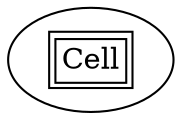

**规则**:
- ✅ 使用 `< >` 包围 (不用引号)
- ✅ 必须是有效的 XML
- ✅ 标签必须闭合
- ⚠️ 不支持所有 HTML 标签

**支持的标签**:
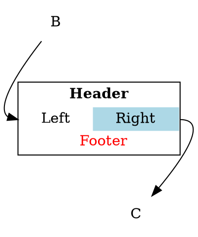

**支持的 HTML 元素**:
- `<TABLE>`, `<TR>`, `<TD>`
- `<BR/>`, `<HR/>`
- `<FONT>`, `<B>`, `<I>`, `<U>`, `<S>`
- ``
- `<SUB>`, `<SUP>`

**重要属性**:
- `<TABLE>`: `BORDER`, `CELLBORDER`, `CELLSPACING`, `CELLPADDING`
- `<TD>`: `COLSPAN`, `ROWSPAN`, `PORT`, `BGCOLOR`, `ALIGN`, `VALIGN`
- `<FONT>`: `COLOR`, `FACE`, `POINT-SIZE`

---

## 🎨 属性约束

### 1. 颜色属性

**有效格式**:
```dot
digraph {
  // ✅ X11 颜色å
  A [fillcolor=red]
  B [fillcolor=lightblue]

  // ✅ RGB å六进制
  C [fillcolor="#FF0000"]
  D [fillcolor="#FF000080"]  # RGBA

  // ✅ HSV (0-1 范围)
  E [fillcolor="0.0 1.0 1.0"]

  // ✅ æ¸å˜ (用冒å·åˆ†éš”)
  F [fillcolor="red:blue"]
  G [fillcolor="red:green:blue"]

  // ✅ 加æƒæ¸å˜
  H [fillcolor="red;0.3:blue;0.7"]
}
```

**无效格式**:
```dot
digraph {
  // ❌ RGB 函数语法
  A [fillcolor=rgb(255,0,0)]

  // ❌ 无效颜色名
  B [fillcolor=redd]

  // ❌ 错误的十六进制
  C [fillcolor=#FF00]  # 缺少位数
}
```

---

### 2. 数值属性

**规则**:
```dot
digraph {
  // ✅ 整数
  A [penwidth=2]

  // ✅ 浮点数
  B [width=1.5]

  // ✅ 布尔值 (true/false)
  graph [splines=true]

  // ⌠错误: 使用字符串表示数字
  // C [penwidth="2"]
}
```

**单位**:
- 长度: 英寸 (默认)
- 角度: 度 (0-360)
- 布尔: `true`, `false`

---

### 3. 枚举属性

**形状 (shape)**:
```dot
digraph {
  // ✅ 有效形状
  A [shape=box]
  B [shape=circle]
  C [shape=diamond]

  // ⌠无效形状
  // D [shape=square]  # 应使用 box
}
```

**方向 (rankdir)**:
```dot
digraph {
  // ✅ 有效方向
  graph [rankdir=TB]  # Top to Bottom
  graph [rankdir=LR]  # Left to Right
  graph [rankdir=BT]  # Bottom to Top
  graph [rankdir=RL]  # Right to Left

  // ❌ 无效方向
  // graph [rankdir=horizontal]
}
```

**边路由 (splines)**:
```dot
digraph {
  // ✅ 有效选项
  graph [splines=none]       # 直线
  graph [splines=line]       # 折线
  graph [splines=polyline]   # 多段线
  graph [splines=curved]     # 曲线
  graph [splines=ortho]      # 正交
  graph [splines=spline]     # 样条 (默认)

  // ❌ 无效选项
  // graph [splines=straight]
}
```

---

### 4. 样式属性

**节点样式 (style)**:

**边样式 (style)**:
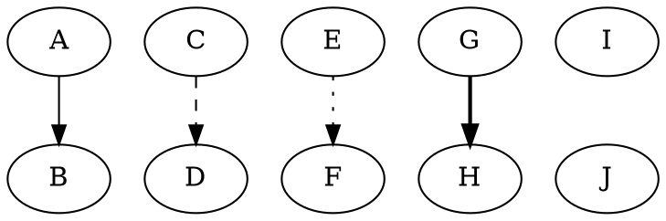

---

## 🔗 连接规则

### 1. 端口连接

**语法**:

**方位缩写**:
- `n` (north/北), `ne` (东北), `e` (east/东)
- `se` (东南), `s` (south/南), `sw` (西南)
- `w` (west/西), `nw` (西北), `c` (center/中心)

---

### 2. 边的约束

**constraint 属性**:
```dot
digraph {
  // ✅ 正常边 (å‚ä¸æ’åº)
  A -> B [constraint=true]

  // ✅ é约æŸè¾¹ (ä¸å‚ä¸æ’åº,仅绘制)
  C -> D [constraint=false]

  // 示例: å馈边
  A -> B -> C
  C -> A [constraint=false]  # å馈边,ä¸å½±å“层次
}
```

---

### 3. 逻辑边 (Logical Edges)

**lhead/ltail 属性** (用于集群):
```dot
digraph {
  compound=true  # 必须启用

  subgraph cluster_0 {
    A -> B
  }

  subgraph cluster_1 {
    C -> D
  }

  // ✅ 逻辑边: 从 A 到整个 cluster_1
  A -> C [lhead=cluster_1]

  // ✅ 逻辑边: 从整个 cluster_0 到 D
  B -> D [ltail=cluster_0]

  // ✅ 集群到集群
  A -> C [ltail=cluster_0 lhead=cluster_1]
}
```

**规则**:
- ⚠️ 必须设置 `compound=true` (图属性)
- ⚠️ `lhead`/`ltail` 值必须是有效的集群名

---

## 🏗️ 子图与集群

### 1. 集群命名规则

```dot
digraph {
  // ✅ 正确: 以 cluster 开头
  subgraph cluster_0 { ... }
  subgraph cluster_backend { ... }
  subgraph clusterFrontend { ... }

  // ❌ 错误: 不以 cluster 开头 (不会显示边框)
  subgraph backend { ... }
  subgraph sg_0 { ... }
}
```

**规则**:
- ✅ 集群名必须以 `cluster` 开头 (区分大小写)
- ✅ 后缀可以是任何有效标识符
- ⚠️ 不符合规则的子图仍然有效,但不显示边框

---

### 2. 排序约束

```dot
digraph {
  // ✅ 强制节点在同一层
  {rank=same; A; B; C}

  // ✅ 最小层级 (顶部)
  {rank=min; Start}
  {rank=source; Start}  # 等价

  // ✅ 最大层级 (底部)
  {rank=max; End}
  {rank=sink; End}  # 等价

  Start -> A -> End
  Start -> B -> End
  Start -> C -> End
}
```

**rank 值**:
- `same` - 同一层
- `min`/`source` - 最小层 (顶部)
- `max`/`sink` - 最大层 (底部)

---

## 🚫 常见语法错误

### 1. 图类型不匹配

```dot
// ❌ 错误: 无向图使用有向边
graph {
  A -> B  # 应使用 A -- B
}

// ❌ 错误: 有向图使用无向边
digraph {
  A -- B  # 应使用 A -> B
}
```

---

### 2. 缺少分号

```dot
// ⚠️ 分号可选,但建议添加
digraph {
  A -> B  # 有效,但不推荐
  C -> D; # 推荐
}
```

---

### 3. 引号错误

```dot
digraph {
  // ❌ 错误: 内部引号未转义
  A [label="He said "Hello""]

  // ✅ 正确: 转义引号
  A [label="He said \"Hello\""]

  // ✅ 或使用 HTML 标签
  A [label=<He said "Hello">]
}
```

---

### 4. HTML 标签未闭合

```dot
digraph {
  // ❌ 错误: <BR> 未闭合
  A [label=<Line1<BR>Line2>]

  // ✅ 正确: 自闭合标签
  A [label=<Line1<BR/>Line2>]
}
```

---

### 5. 属性值类型错误

```dot
digraph {
  // ❌ 错误: 数值用引号
  A [penwidth="2"]

  // ✅ 正确: 数值不加引号
  A [penwidth=2]

  // ❌ 错误: 布尔值大写
  graph [splines=True]

  // ✅ 正确: 小写布尔值
  graph [splines=true]
}
```

---

## ✅ 最佳实践

### 1. 一致的格式化

```dot
// ✅ 推荐格式
digraph MyGraph {
  // 图属性
  graph [
    rankdir=LR
    bgcolor=white
  ]

  // 默认节点属性
  node [
    shape=box
    style=filled
    fillcolor=lightblue
  ]

  // 默认边属性
  edge [
    color=blue
    arrowhead=vee
  ]

  // 节点定义
  A [label="Node A"]
  B [label="Node B"]

  // 边定义
  A -> B [label="connects"]
}
```

---

### 2. 使用注释

```dot
digraph {
  // 系统架构图
  // 作者: John Doe
  // 日期: 2025-10-13

  // Frontend 层
  subgraph cluster_frontend {
    label="Frontend"
    UI [label="User Interface"]
  }

  // Backend 层
  subgraph cluster_backend {
    label="Backend"
    API [label="REST API"]
    DB [label="Database"]
  }

  // 连接
  UI -> API [label="HTTP"]
  API -> DB [label="SQL"]
}
```

---

### 3. 模块化

```dot
// main.dot
digraph {
  rankdir=LR

  // 导入子图定义 (使用预处理器)
  #include "nodes.dot"
  #include "edges.dot"
}

// nodes.dot
node [shape=box style=filled]
A [label="Node A"]
B [label="Node B"]

// edges.dot
edge [color=blue]
A -> B
```

---

### 4. 语义化命名

```dot
digraph {
  // ✅ 语义化节点名
  api_server [label="API Server"]
  database [label="PostgreSQL"]
  cache [label="Redis"]

  // ✅ 描述性边标签
  api_server -> database [label="queries"]
  api_server -> cache [label="reads/writes"]

  // ❌ 避免无意义命名
  // n1 -> n2 -> n3
}
```

---

## 📚 参考资源

- **DOT 语法规范**: https://graphviz.org/doc/info/lang.html
- **属性参考**: https://graphviz.org/doc/info/attrs.html
- **形状目录**: https://graphviz.org/doc/info/shapes.html
- **颜色名称**: https://graphviz.org/doc/info/colors.html

---

**最后更新**: 2025-10-13
