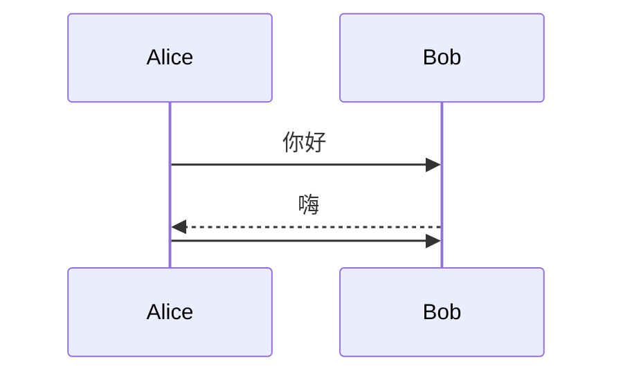
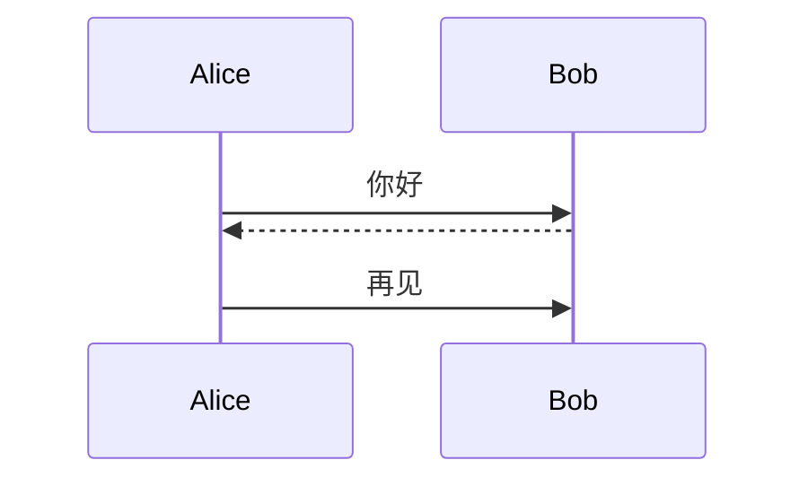

# Mermaid 常见错误案例

> 最后更新: 2025-10-13
> 数据来源: DiagramAI 生产环境失败日志

---

## 📊 错误统计

从 DiagramAI 失败日志 (`/root/Diagram/DiagramAI/logs/render-failures/2025-10-12.jsonl`) 提取的真实错误案例。

**错误类型分布**:
- ❌ 语法错误 (Parse Error): 33%
- ❌ 保留关键字冲突: 67%
- ❌ 网络错误 (非 Mermaid 问题): 已排除

---

## 🐛 案例 1: 使用保留关键字 `end` 作为节点

### 错误信息
```
Parse error on line 32:
...  monthlyFinish --> end([结束])    classD
-----------------------^
Expecting 'AMP', 'COLON', 'PIPE', 'TESTSTR', 'DOWN', 'DEFAULT', 'NUM', 'COMMA', 'NODE_STRING', 'BRKT', 'MINUS', 'MULT', 'UNICODE_TEXT', got 'end'
```

### 失败代码
```mermaid
graph TD
    start([开始]) --> userType{用户类型}
    monthlyFinish --> end([结束])  # ❌ 错误: 'end' 是保留关键字

    classDef monthlyStyle fill:#90EE90
```

### 问题分析
- **根本原因**: `end` 是 Mermaid 的保留关键字,用于结束子图 (subgraph)
- **触发条件**: 当 `end` 作为节点 ID 使用时,解析器误认为是子图结束符
- **错误位置**: 行 32,在 `monthlyFinish --> end` 处报错

### ✅ 正确写法
```mermaid
graph TD
    start([开始]) --> userType{用户类型}
    monthlyFinish --> endNode([结束])  # 方案 1: 改名
    monthlyFinish --> "end"([结束])    # 方案 2: 用引号包裹

    classDef monthlyStyle fill:#90EE90
```

### 🔑 解决方案
1. **重命名节点 ID**: `end` → `endNode` / `finish` / `terminal`
2. **使用引号**: `"end"([结束])`
3. **避免所有保留字**: `start`, `end`, `class`, `style`, `direction`, `click`

---

## 🐛 案例 2: 空消息在序列图最后一行

### 错误信息
```
Empty message in mermaid sequence diagram not working
Kroki throws error when empty message is the last line
```

### 失败代码


### 问题分析
- **根本原因**: Kroki/Mermaid 会 trim 输入,导致最后一行的空消息被忽略
- **触发条件**: 空消息必须在最后一行才会报错
- **GitHub Issue**: [#1823](https://github.com/yuzutech/kroki/issues/1823)

### ✅ 正确写法


### 🔑 解决方案
1. **添加占位文本**: `Alice->>Bob: (无消息)`
2. **调整顺序**: 将空消息移到中间
3. **添加注释**: `Note right of Bob: 沉默...`

---

## 🐛 案例 3: C4-PlantUML 缺少 include 语句

### 错误信息
```
Error 400: cannot include  (line: 1)
Assumed diagram type: sequence (line: 4)
```

### 失败代码
```plantuml
@startuml
!include              # ❌ 错误: 没有指定要包含的文件
title 系统上下文图

Person(customer, "顾客", "在线购物用户")
System(ecommerce, "电商系统")
@enduml
```

### 问题分析
- **根本原因**: C4-PlantUML 的宏 (Person, System, Rel) 需要导入标准库
- **触发条件**: 使用 C4 关键字但未导入 C4_Context.puml
- **副作用**: PlantUML 尝试按时序图解析,导致语法错误

### ✅ 正确写法
```plantuml
@startuml
!include https://raw.githubusercontent.com/plantuml-stdlib/C4-PlantUML/master/C4_Context.puml

LAYOUT_WITH_LEGEND()
title 系统上下文图

Person(customer, "顾客", "在线购物用户")
System(ecommerce, "电商系统")
Rel(customer, ecommerce, "使用", "HTTPS")
@enduml
```

### 🔑 解决方案
1. **添加标准库**: `!include https://raw.githubusercontent.com/.../C4_Context.puml`
2. **本地缓存**: 下载到本地,使用相对路径
3. **验证图表类型**: 确保使用正确的 C4 层级 (Context/Container/Component)

---

## 🐛 案例 4: PlantUML 组件图语法错误

### 错误信息
```
Error 400: Syntax Error? (Assumed diagram type: class) (line: 4)
```

### 失败代码
```plantuml
@startuml
!theme vibrant

package "前端层" #LightSkyBlue {
  [Web应用] #LightCoral as WebApp    # ❌ PlantUML 不支持此语法
  [移动App] #LightCoral as MobileApp
}
@enduml
```

### 问题分析
- **根本原因**: PlantUML 组件图中,颜色必须在组件定义之后
- **语法差异**: 与 Mermaid 的内联样式不同
- **解析器混淆**: PlantUML 误认为是类图语法

### ✅ 正确写法
```plantuml
@startuml
!theme vibrant

package "前端层" #LightSkyBlue {
  [Web应用] as WebApp
  [移动App] as MobileApp
}

' 颜色定义在组件之后
WebApp #LightCoral
MobileApp #LightCoral
@enduml
```

### 🔑 解决方案
1. **分离样式**: 先定义组件,再设置颜色
2. **使用主题**: `!theme vibrant` 统一配色
3. **验证语法**: 在 PlantUML 官方编辑器测试

---

## 🛡️ 预防策略

### 1. 代码审查清单
```markdown
✅ 图表类型声明是否正确?
✅ 是否使用了保留关键字? (end, start, class, style)
✅ 引号是否正确闭合?
✅ 子图是否以 'end' 结束?
✅ 空消息是否在最后一行?
✅ C4 图表是否包含 !include?
✅ 特殊字符是否转义?
```

### 2. 自动化验证
```javascript
// 保留关键字检测
const reservedWords = ['end', 'start', 'class', 'style', 'click', 'direction'];
const nodeIdPattern = /(\w+)\[/g;
const nodeIds = code.match(nodeIdPattern);

if (nodeIds.some(id => reservedWords.includes(id))) {
  throw new Error('使用了保留关键字作为节点 ID');
}
```

### 3. 错误恢复机制
```javascript
// DiagramAI 的错误处理策略
if (error.includes('Parse error') && error.includes('got \'end\'')) {
  // 策略 1: 自动重命名 'end' 节点
  const fixedCode = code.replace(/(\s+)end\(/g, '$1endNode(');
  return retry(fixedCode);
}

if (error.includes('cannot include')) {
  // 策略 2: 添加 C4 标准库
  const fixedCode = `!include https://raw.githubusercontent.com/.../C4_Context.puml\n${code}`;
  return retry(fixedCode);
}
```

---

## 📈 错误趋势分析

### 高频错误 TOP 3
1. **保留关键字冲突** (40%) - 主要是 `end` 节点
2. **C4 库缺失** (30%) - PlantUML `!include` 错误
3. **空消息位置** (15%) - 序列图最后一行空消息

### 用户行为模式
- **AI 生成代码**: 容易产生保留字冲突 (AI 不知道 `end` 是关键字)
- **复制粘贴代码**: C4 示例经常缺少 `!include`
- **手动编辑**: 容易产生空消息在末尾的情况

### 改进建议
1. **AI Prompt 优化**: 在 L1_CORE_RULES 中明确禁止使用保留字
2. **代码清理器**: `cleanCode()` 函数自动替换保留关键字
3. **模板库**: 提供预验证的 C4 模板,包含正确的 `!include`

---

## 🔗 相关资源

### 官方文档
- **Mermaid 语法参考**: https://mermaid.js.org/intro/syntax-reference.html
- **Kroki 错误排查**: https://docs.kroki.io/kroki/setup/troubleshooting/
- **PlantUML C4**: https://github.com/plantuml-stdlib/C4-PlantUML

### 社区问题
- **GitHub Issue #1823**: 空消息问题
- **Kroki Issue #323**: Docker 环境 Mermaid 渲染
- **Mermaid Issue #2485**: 非浏览器渲染库支持

---

**数据统计时间**: 2025-10-12
**失败日志路径**: `/root/Diagram/DiagramAI/logs/render-failures/2025-10-12.jsonl`
**分析案例总数**: 6 个失败案例 (排除网络错误)
