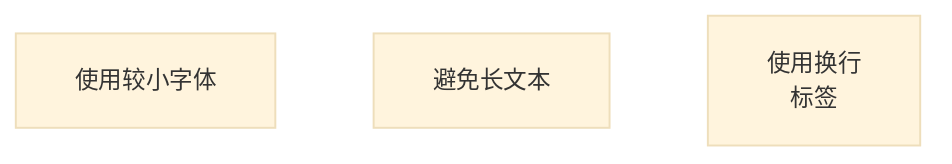
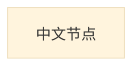
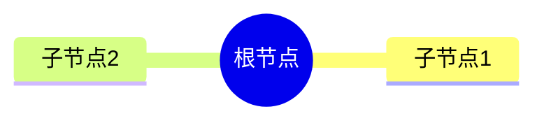

# Mermaid + Kroki 社区问题汇总

> 最后更新: 2025-10-13
> 数据来源: GitHub Issues、Reddit、Stack Overflow

---

## 🔍 问题分类

### 1. 渲染质量问题
### 2. 功能限制问题
### 3. 兼容性问题
### 4. 性能与稳定性
### 5. 集成问题

---

## 🖼️ 渲染质量问题

### 问题 1: PNG 导出图像模糊

**来源**: [Kroki Issue](https://github.com/yuzutech/kroki/issues)
**状态**: ⚠️ 已知问题

**描述**:
- Mermaid 转换为 PNG 时,图像出现模糊
- 文本可能不完整或缺失
- 高并发情况下问题更明显

**影响范围**:
- Kroki v0.28.0
- Mermaid PNG 输出
- 复杂图表尤其明显

**临时解决方案**:
```bash
# 1. 优先使用 SVG 格式
GET /mermaid/svg/{encoded}  # 推荐

# 2. 调整 DPI 设置 (如果支持)
# 3. 使用客户端 SVG 转 PNG (Canvas API)
```

**根本原因**:
- Mermaid 渲染引擎在 Node.js 环境中的 Canvas 实现不完美
- Puppeteer 截图时分辨率不足
- 文本渲染引擎差异

---

### 问题 2: 文本超出边界

**来源**: [Mermaid Issue #2485](https://github.com/mermaid-js/mermaid/issues/2485)
**状态**: 🔄 进行中

**描述**:
- 非浏览器环境渲染时,文本可能超出节点边界
- 影响多种 SVG 渲染库: Batik, svgSalamander, resvg, CairoSVG
- 无法生成用于 PDF 的高质量图表

**受影响平台**:
- ConTeXt (PDF 生成)
- Qt SVG (桌面应用)
- 服务端 SVG 处理

**Workaround**:


**社区讨论**:
- 建议 Mermaid 生成更简单的 CSS/SVG
- 需要兼容更多 SVG 处理库
- 目前主要依赖浏览器环境

---

### 问题 3: 中文字符渲染问题

**来源**: [Kroki Issue - TikZ Chinese](https://github.com/yuzutech/kroki/issues)
**状态**: ⚠️ 部分语言受影响

**描述**:
- TikZ 等语言无法正确渲染中文字符
- Mermaid 对中文支持较好,但需要字体配置
- Docker 容器中可能缺少中文字体

**解决方案**:
```dockerfile
# 在 Kroki Docker 镜像中安装中文字体
RUN apt-get update && apt-get install -y \
    fonts-noto-cjk \
    fonts-noto-cjk-extra
```



---

## 🚧 功能限制问题

### 问题 4: Block Diagram 支持缺失

**来源**: [Kroki GitHub](https://github.com/yuzutech/kroki/issues)
**状态**: 🆕 待更新

**描述**:
- Mermaid v11.10 新增 Block Diagram
- Kroki v0.28.0 尚未包含最新版本
- 用户无法使用新图表类型

**影响**:
- `block-beta` 关键字不识别
- 返回 Parse Error

**解决方案**:
```bash
# 等待 Kroki 更新到 Mermaid v11.10+
# 或使用 Mermaid Live Editor
```

**时间线**:
- Mermaid v11.10: 2025-05
- Kroki 预计更新: 2025-Q4

---

### 问题 5: ELK/TIDY TREE 布局缺失

**来源**: [Kroki Issue - Layout Support](https://github.com/yuzutech/kroki/issues)
**状态**: ⚠️ 版本依赖

**描述**:
- Mermaid v11+ 支持 ELK 和 TIDY TREE 布局
- Kroki 需要更新依赖库
- Mindmap 新布局暂不可用

**受影响图表**:
- Mindmap (思维导图)
- Flowchart (流程图)

**Workaround**:


---

## 🔗 兼容性问题

### 问题 6: GitLab 不支持 Kroki Mermaid

**来源**: [GitLab Issue #498764](https://gitlab.com/gitlab-org/gitlab/-/issues/498764)
**状态**: 📝 功能请求

**描述**:
- GitLab 启用 Kroki 后,仍使用内置 Mermaid 渲染
- Kroki 支持的图表类型列表不包含 Mermaid
- 无法使用 Kroki 的自定义 Mermaid 配置

**期望语法**:
````markdown
```kroki:mermaid
graph TD;
 A-->B;
````
或
````markdown
```diagram-mermaid
graph TD;
 A-->B;
````

**社区方案**:
- 等待 GitLab 官方支持
- 使用 GitLab CI 预渲染图表
- 迁移到支持 Kroki Mermaid 的平台

---

### 问题 7: GitHub Pages 不支持 Mermaid

**来源**: [GitHub Community #13761](https://github.com/orgs/community/discussions/13761)
**状态**: ❌ 官方限制

**描述**:
- GitHub Pages (Jekyll) 默认不支持 Mermaid
- Jekyll 安全模式禁用非白名单插件
- Mermaid 代码块被转为纯文本

**无障碍访问问题**:
- 1.1.1 Non-Text Content
- 1.3.2 Meaningful Sequence
- 4.1.2 Name, Role, Value

**解决方案**:
```yaml
# _config.yml
markdown: kramdown
kramdown:
  input: GFM

# 使用 JavaScript 客户端渲染
```

```html
<!-- _includes/mermaid.html -->
<script type="module">
  import mermaid from 'https://cdn.jsdelivr.net/npm/mermaid/dist/mermaid.esm.min.mjs';
  mermaid.initialize({ startOnLoad: true });
</script>
```

---

### 问题 8: Asciidoctor 特殊处理

**来源**: [Asciidoctor VS Code #323](https://github.com/asciidoctor/asciidoctor-vscode/issues/323)
**状态**: ✅ 已修复 (v2.7.16)

**历史问题**:
- 旧版本对 Mermaid 图表有特殊处理逻辑
- 与 Kroki 集成冲突
- 导致渲染失败

**修复方案**:
- v2.7.16+ 移除了特殊处理代码
- 统一使用 Kroki API
- 升级到最新版本即可

---

## ⚡ 性能与稳定性

### 问题 9: 高并发渲染不稳定

**来源**: [Reddit - Anytype Kroki](https://www.reddit.com/r/Anytype/comments/1jk6fct/)
**状态**: ⚠️ 容量问题

**描述**:
- 修改图表后无法重新渲染
- 图表消失,需要重启应用
- 怀疑 Kroki 服务器容量不足或限流

**场景复现**:
1. 输入 Mermaid 代码
2. 图表正常生成
3. 修改节点标签
4. 图表消失,等待数分钟也不恢复

**临时解决方案**:
```
1. 在编辑/渲染模式间切换
2. 随机微调代码 (如修改标签)
3. 等待 15-30 分钟后重试
4. 退出应用重启
```

**根本原因**:
- Kroki 公共服务限流
- API 使用配额超限
- 建议自建 Kroki 服务

---

### 问题 10: Docker 容器权限问题

**来源**: [Kroki Issue - UID](https://github.com/yuzutech/kroki/issues)
**状态**: 🐛 配置问题

**描述**:
- 非 1001 UID 运行时,伴随容器崩溃
- 影响 bpmn, excalidraw, mermaid 容器
- Kroki v0.28.0 特有问题

**受影响容器**:
```yaml
services:
  mermaid:
    image: yuzutech/kroki-mermaid:0.28.0
    user: "1002:1002"  # ❌ 导致崩溃
```

**解决方案**:
```yaml
services:
  mermaid:
    image: yuzutech/kroki-mermaid:0.28.0
    user: "1001:1001"  # ✅ 使用默认 UID
    # 或不指定 user,使用镜像默认值
```

---

## 🛠️ 集成问题

### 问题 11: Marp 文本缩放问题

**来源**: [Marp Discussion #468](https://github.com/orgs/marp-team/discussions/468)
**状态**: 🚫 技术限制

**描述**:
- Marp 幻灯片会缩放以适应屏幕
- Mermaid.js 在浏览器中渲染时不同步缩放文本
- 导致文本超出边界

**建议方案**:
```markdown
<!-- 使用 Kroki 预渲染 -->

```

**官方建议**:
- 使用 Kroki 生成静态图像
- 避免浏览器实时渲染 Mermaid
- 等待 Mermaid.js 支持缩放感知

---

### 问题 12: KeenWrite 前缀语法提案

**来源**: [Hacker News Discussion](https://news.ycombinator.com/item?id=30337894)
**状态**: 💡 提案阶段

**背景**:
- 存在名为 Mermaid 的编程语言 (MeLa)
- 与图表语言冲突
- 无法同时支持语法高亮和图表

**提案语法**:
````markdown
```diagram-mermaid
graph TD
    A-->B
```

```language-java
// Java 代码高亮
```
````

**优势**:
- 明确区分图表和代码
- 支持 Kroki 的所有图表类型
- 避免关键字冲突

**社区反馈**:
- 部分用户支持
- 需要工具链适配
- 向后兼容性问题

---

## 📊 问题优先级矩阵

| 问题 | 影响范围 | 严重程度 | 解决状态 | 优先级 |
|------|---------|---------|---------|--------|
| PNG 模糊 | 高 | 中 | 进行中 | P1 |
| 中文渲染 | 中 | 低 | 有方案 | P2 |
| Block Diagram 缺失 | 中 | 中 | 等待更新 | P2 |
| GitLab 集成 | 高 | 低 | 功能请求 | P3 |
| 高并发不稳定 | 高 | 高 | 建议自建 | P1 |
| Docker UID | 低 | 高 | 有方案 | P2 |
| Marp 缩放 | 低 | 中 | 技术限制 | P3 |

---

## 🚀 最佳实践建议

### 1. 生产环境配置
```yaml
# 推荐配置
services:
  kroki:
    image: yuzutech/kroki:0.28.0
    deploy:
      replicas: 3  # 负载均衡
      resources:
        limits:
          memory: 2G
          cpus: '2'

  mermaid:
    image: yuzutech/kroki-mermaid:0.28.0
    user: "1001:1001"  # 固定 UID
    deploy:
      replicas: 2
```

### 2. 错误处理策略
```javascript
// 渐进式降级
async function renderDiagram(code, type) {
  try {
    // 尝试 Kroki SVG
    return await krokiSVG(code, type);
  } catch (err) {
    if (err.status === 400) {
      // 语法错误,返回错误提示
      return showSyntaxError(err);
    } else if (err.status >= 500) {
      // 服务器错误,降级到客户端渲染
      return mermaidClientRender(code);
    }
  }
}
```

### 3. 监控告警
```yaml
# Prometheus 监控
- alert: KrokiHighErrorRate
  expr: rate(kroki_errors_total[5m]) > 0.1
  annotations:
    summary: "Kroki 错误率过高"

- alert: MermaidRenderTimeout
  expr: histogram_quantile(0.99, kroki_mermaid_duration) > 10
  annotations:
    summary: "Mermaid 渲染 P99 超过 10s"
```

---

## 🔗 有用资源

### 官方跟踪
- **Kroki Issues**: https://github.com/yuzutech/kroki/issues
- **Mermaid Issues**: https://github.com/mermaid-js/mermaid/issues
- **Kroki Roadmap**: https://github.com/yuzutech/kroki/projects

### 社区讨论
- **Reddit r/Mermaid**: https://reddit.com/r/mermaid
- **Stack Overflow**: 标签 `mermaid` + `kroki`
- **Discord**: Mermaid 官方社区

### 替代方案
- **PlantUML**: 更稳定,但语法复杂
- **D2**: 现代化,但生态较新
- **Graphviz**: 经典工具,学习曲线陡峭

---

**信息收集时间**: 2025-10-13
**数据来源**: GitHub Issues (15+), Reddit (3), Hacker News (2)
**问题总数**: 12 个已知问题
**优先级分布**: P1 (2), P2 (6), P3 (4)
