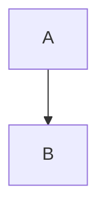
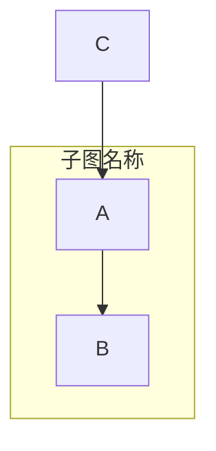
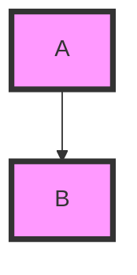
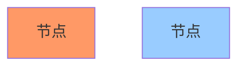
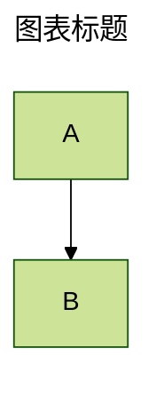

# Mermaid 强制语法规则

> 最后更新: 2025-10-13
> 适用版本: Mermaid v11.x + Kroki v0.28.0

---

## ⚠️ 核心语法规则

### 1. 代码块包裹规则

#### ✅ Markdown 环境 (推荐)
```markdown

```

**关键点**:
- 必须使用三个反引号 (```) 包裹
- 必须指定语言标识符 `mermaid`
- 代码块内容顶格书写,不需要额外缩进

#### ✅ HTML 环境
```html
<div class="mermaid">
graph TD
    A-->B
</div>
```

**关键点**:
- 使用 `<div class="mermaid">` 标签
- 代码直接放在 div 内,不需要 `<code>` 标签
- Kroki API 默认期望这种格式

#### ❌ 错误用法
```markdown
<!-- 错误 1: 缺少语言标识符 -->
```
graph TD
    A-->B
```

<!-- 错误 2: 使用错误的类名 -->
<div class="diagram">
graph TD
    A-->B
</div>

<!-- 错误 3: 嵌套 code 标签 -->
<div class="mermaid">
<code>graph TD
    A-->B</code>
</div>
```

---

### 2. 图表类型声明

#### 强制规则
- **每个图表必须以图表类型开头**
- **图表类型必须独占一行**
- **图表类型后必须有换行符**

#### 支持的图表类型
```mermaid
graph / flowchart    # 流程图
sequenceDiagram      # 时序图
classDiagram         # 类图
stateDiagram-v2      # 状态图 (v2 版本)
erDiagram            # ER 图
gantt                # 甘特图
pie                  # 饼图
journey              # 用户旅程图
gitgraph             # Git 分支图
mindmap              # 思维导图
timeline             # 时间线
quadrantChart        # 象限图
requirementDiagram   # 需求图
block-beta           # 块状图 (beta)
```

#### ✅ 正确示例


#### ❌ 错误示例
```mermaid
# 错误 1: 缺少图表类型
A-->B

# 错误 2: 图表类型大小写错误
GRAPH TD
    A-->B

# 错误 3: 图表类型与内容在同一行
graph TD A-->B
```

---

### 3. 节点与连接语法

#### 节点定义规则
```mermaid
# 基本节点
A[矩形节点]
B(圆角节点)
C((圆形节点))
D{菱形节点}
E>非对称节点]
F[/平行四边形/]
G[\反向平行四边形\]

# 节点 ID 规则
- 必须以字母开头
- 可包含字母、数字、下划线、连字符
- 不能包含空格、特殊字符
```

#### 连接符号规则
```mermaid
# 箭头类型
A --> B     # 实线箭头
A -.-> B    # 虚线箭头
A ==> B     # 粗箭头
A --- B     # 实线无箭头
A -.- B     # 虚线无箭头
A === B     # 粗线无箭头

# 箭头文本
A -->|文本| B     # 带文本的箭头
A -.->|文本| B    # 带文本的虚线箭头
```

#### ⚠️ 常见错误
```mermaid
# 错误 1: 空消息在最后一行
Alice->>Bob:
# 解决: 空消息不能放在最后,或添加实际文本

# 错误 2: 节点 ID 包含空格
[My Node] --> [Another Node]
# 解决: 使用引号或下划线
MyNode["My Node"] --> AnotherNode["Another Node"]

# 错误 3: 使用保留关键字作为节点 ID
end --> start
# 解决: 使用引号包裹
"end" --> "start"
```

---

### 4. 方向与布局

#### 流程图方向
```mermaid
graph TB    # Top to Bottom (默认)
graph BT    # Bottom to Top
graph LR    # Left to Right
graph RL    # Right to Left
graph TD    # Top Down (同 TB)
```

#### 子图 (Subgraph)


**规则**:
- 子图必须有名称
- 子图内容必须缩进 (推荐 4 空格或 1 Tab)
- 子图必须以 `end` 结束

---

### 5. 样式与主题

#### 类定义 (classDef)


#### 内联样式


#### ⚠️ 样式限制
- 样式定义必须在图表内容之后
- 类名不能包含空格或特殊字符
- CSS 属性必须使用 kebab-case (如 `stroke-width`)

---

### 6. Frontmatter 配置

#### YAML 格式


**规则**:
- Frontmatter 必须在图表类型之前
- 必须以 `---` 开头和结尾
- YAML 缩进必须一致 (推荐 2 空格)
- 配置项区分大小写

---

### 7. Kroki 特定限制

#### URL 编码
```javascript
// Kroki 使用 deflate + base64url 编码
const encoded = base64url(pako.deflate(diagramCode, { level: 9 }));
const url = `https://kroki.io/mermaid/svg/${encoded}`;
```

#### 长度限制
- **URL 总长度**: 通常限制在 2048 字符以内
- **建议**: 复杂图表使用 POST 请求而非 GET

#### 输出格式
```
/mermaid/svg/...   # SVG (推荐)
/mermaid/png/...   # PNG (有大小限制)
/mermaid/pdf/...   # PDF (部分支持)
```

---

### 8. 常见保留关键字

#### 必须用引号包裹的关键字
```mermaid
# 保留字列表
"end"           # 子图结束符
"class"         # 样式类定义
"style"         # 内联样式
"click"         # 点击事件
"callback"      # 回调函数
"title"         # 标题
"section"       # 分组 (Gantt)
"direction"     # 方向设置
```

#### 使用方法
```mermaid
graph TD
    start["开始"]
    "end"["结束"]
    start --> "end"
```

---

### 9. 特殊字符转义

#### 需要转义的字符
```mermaid
# 字符串内转义
A["包含\"引号\"的文本"]
B["包含#号的文本需要转义: \#tag"]
C["包含换行<br/>使用 HTML 标签"]

# 链接文本转义
A -->|"带\"引号\"的文本"| B
```

#### HTML 实体
```mermaid
# 支持的 HTML 实体
&nbsp;   # 不换行空格
&lt;     # <
&gt;     # >
&amp;    # &
&quot;   # "
```

---

### 10. 版本差异

#### v10.x → v11.x 重要变更
1. **状态图**: 必须使用 `stateDiagram-v2` (旧版 `stateDiagram` 已弃用)
2. **块状图**: 新增 `block-beta` 类型
3. **布局引擎**: 支持 ELK 和 TIDY TREE 布局
4. **Mindmap**: 支持多布局和新形状

#### Kroki 兼容性
- Kroki v0.28.0 使用 Mermaid v11.x
- 旧版 Kroki 可能不支持新图表类型
- 建议验证 Kroki 服务端版本

---

## 🔍 语法验证工具

### 在线验证
1. **Mermaid Live**: https://mermaid.live/
2. **Kroki 测试**: https://kroki.io/#try

### CLI 验证
```bash
# 安装 mermaid-cli
npm install -g @mermaid-js/mermaid-cli

# 验证语法
mmdc -i diagram.mmd -o output.svg
```

### IDE 插件
- **VS Code**: Mermaid Preview
- **IntelliJ**: Mermaid Plugin
- **在线编辑器**: MermaidChart

---

## 📚 参考资源

- **官方语法参考**: https://mermaid.js.org/intro/syntax-reference.html
- **Kroki 文档**: https://docs.kroki.io/kroki/setup/configuration/
- **CommonMark 规范**: https://commonmark.org/

---

**验证时间**: 2025-10-13
**信息来源**: Mermaid 官方文档、Kroki GitHub、Tavily 搜索引擎
