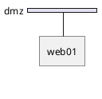

# NwDiag 常见错误和解决方案

> **文档目的**: 汇总 NwDiag 使用中的常见错误和解决方法
> **最后更新**: 2025-01-13

---

## 🚨 语法错误

### 1. 连字符命名错误

**错误示例**:

```nwdiag
nwdiag {
  network dmz {
    web-server-01;  // ❌ 语法错误
    db-server-01;   // ❌ 语法错误
  }
}
```

**错误信息**:

```
Syntax error at line X
```

**原因**:

- NwDiag 不支持在节点名或网络名中使用连字符 `-`
- 连字符被解析为减号运算符

**解决方案**:

```nwdiag
nwdiag {
  network dmz {
    web_server_01;  // ✅ 使用下划线
    dbServer01;     // ✅ 使用驼峰命名
  }
}
```

**相关资源**:

- [PlantUML Forum #14346](https://forum.plantuml.net/14346/hyphen-in-node-id-causes-syntax-error)

---

### 2. 缺少分号

**错误示例**:

```nwdiag
nwdiag {
  network dmz {
    web01 [address = "210.x.x.1"]  // ❌ 缺少分号
    web02 [address = "210.x.x.2"]  // ❌ 缺少分号
  }
}
```

**错误信息**:

```
Syntax error: unexpected token
```

**解决方案**:

```nwdiag
nwdiag {
  network dmz {
    web01 [address = "210.x.x.1"];  // ✅ 添加分号
    web02 [address = "210.x.x.2"];  // ✅ 添加分号
  }
}
```

---

### 3. 地址分隔符错误

**错误示例**:

```nwdiag
nwdiag {
  network dmz {
    // ❌ 使用空格分隔多个地址
    web01 [address = "210.x.x.1 210.x.x.20"];
  }
}
```

**解决方案**:

```nwdiag
nwdiag {
  network dmz {
    // ✅ 使用逗号分隔多个地址
    web01 [address = "210.x.x.1, 210.x.x.20"];
  }
}
```

---

### 4. 引号不匹配

**错误示例**:

```nwdiag
nwdiag {
  network dmz {
    address = "210.x.x.x/24';  // ❌ 引号不匹配
    web01 [description = Web Server];  // ❌ 缺少引号
  }
}
```

**解决方案**:

```nwdiag
nwdiag {
  network dmz {
    address = "210.x.x.x/24";  // ✅ 引号匹配
    web01 [description = "Web Server"];  // ✅ 添加引号
  }
}
```

---

## 🔧 布局问题

### 5. 组定义位置导致样式失效

**问题描述**:
组定义在网络之前时,描述、颜色和样式可能被忽略。

**错误示例**:

```nwdiag
nwdiag {
  // ❌ 组定义在网络之前,样式可能失效
  group {
    color = "#FF0000";
    description = "Web Servers";
    web01;
    web02;
  }

  network dmz {
    web01;
    web02;
  }
}
```

**解决方案 1**: 将组定义移到网络之后

```nwdiag
nwdiag {
  network dmz {
    web01;
    web02;
  }

  // ✅ 组定义在网络之后
  group {
    color = "#FF0000";
    description = "Web Servers";
    web01;
    web02;
  }
}
```

**解决方案 2**: 在网络内定义组

```nwdiag
nwdiag {
  network dmz {
    // ✅ 在网络内定义组
    group web {
      web01;
      web02;
    }
  }
}
```

**相关资源**:

- [GitHub Issue #1301](https://github.com/plantuml/plantuml/issues/1301)

---

### 6. 跨网络节点连接错误

**问题描述**:
组定义导致节点连接到错误的网络。

**错误示例**:

```nwdiag
nwdiag {
  group {
    web01;
    db01;
  }

  network dmz {
    web01;  // ❌ 可能连接错误
  }

  network internal {
    web01;
    db01;
  }
}
```

**解决方案**:

```nwdiag
nwdiag {
  network dmz {
    web01;
  }

  network internal {
    web01;
    db01;
  }

  // ✅ 组定义在最后
  group {
    web01;
    db01;
  }
}
```

---

### 7. 网络宽度不对齐

**问题描述**:
部分网络宽度不一致,导致布局混乱。

**错误示例**:

```nwdiag
nwdiag {
  network n1 {
    width = full
    a; b; c;
  }

  network n2 {
    // ❌ 缺少 width 设置
    c; d; e;
  }

  network n3 {
    width = full
    b; f;
  }
}
```

**解决方案**:

```nwdiag
nwdiag {
  network n1 {
    width = full
    a; b; c;
  }

  network n2 {
    width = full  // ✅ 统一设置宽度
    c; d; e;
  }

  network n3 {
    width = full
    b; f;
  }
}
```

---

### 8. 其他内部网络布局问题

**问题描述**:
使用新布局引擎时,其他内部网络(非 TCP/IP)的布局可能出现问题。

**错误示例**:

```nwdiag
nwdiag {
  network LAN {
    switch;
  }

  // ❌ 布局可能错位
  switch -- device;
  device -- printer;
}
```

**解决方案**: 明确设置地址或类型

```nwdiag
nwdiag {
  network LAN {
    switch [address = "192.168.1.1"];
  }

  // ✅ 添加地址信息
  switch -- device;
  device [address = "USB"];
  device -- printer;
  printer [address = "LPT"];
}
```

**相关资源**:

- [PlantUML Forum #14458](https://forum.plantuml.net/14458/nwdiag-issue-other-internal-networks-with-the-layout-engine)

---

## 🎨 样式问题

### 9. hide footbox 导致错误

**问题描述**:
在 PlantUML 中使用 `hide footbox` 会导致 nwdiag 语法错误。

**错误示例**:

```plantuml
@startuml
hide footbox  // ❌ 导致 nwdiag 块语法错误

nwdiag {
  network dmz {
    web01;
  }
}
@enduml
```

**错误信息**:

```
Syntax error in nwdiag block
```

**解决方案**: 移除 `hide footbox` 或仅用于序列图



**相关资源**:

- [GitHub Issue #800](https://github.com/plantuml/plantuml/issues/800)

---

### 10. 样式定义不生效

**问题描述**:
全局样式定义被忽略。

**错误示例**:



**解决方案**: 使用内联样式

```nwdiag
nwdiag {
  network dmz {
    color = "pink"  // ✅ 使用内联颜色
    web01;
  }
}
```

---

### 11. Hexagon 和 Folder 形状标签重叠

**问题描述**:
某些形状的标签可能重叠或显示不正常。

**错误示例**:

```nwdiag
nwdiag {
  network test {
    node01 [shape = hexagon, description = "Very Long Label Text"];
    node02 [shape = folder, description = "Another Long Label"];
  }
}
```

**解决方案**: 使用换行符缩短标签

```nwdiag
nwdiag {
  network test {
    node01 [
      shape = hexagon,
      description = "Very Long\nLabel Text"  // ✅ 使用换行
    ];
    node02 [
      shape = folder,
      description = "Another\nLong Label"
    ];
  }
}
```

---

## ⚙️ 配置问题

### 12. 字体未找到

**问题描述**:
系统找不到合适的字体渲染文本。

**错误信息**:

```
Font not found
```

**解决方案 1**: 指定字体路径

```bash
nwdiag -f /usr/share/fonts/truetype/dejavu/DejaVuSans.ttf diagram.diag
```

**解决方案 2**: 配置 .blockdiagrc

```ini
[nwdiag]
fontpath = /usr/share/fonts/truetype/dejavu/DejaVuSans.ttf
```

---

### 13. 图像生成超时

**问题描述**:
复杂图表生成时间过长导致超时。

**错误信息**:

```
Timeout error
```

**解决方案**:

1. **简化图表**: 减少节点和网络数量
2. **分解图表**: 将大图拆分为多个小图
3. **优化节点名称**: 使用较短的名称

```nwdiag
// ❌ 过于复杂
nwdiag {
  network n1 { s1; s2; s3; s4; s5; }
  network n2 { s1; s2; s3; s4; s5; s6; s7; s8; }
  network n3 { s1; s2; s3; s4; s5; s6; s7; s8; s9; s10; }
  // ... 更多网络
}

// ✅ 分解为多个图表
// 图表 1: DMZ 网络
nwdiag {
  network dmz {
    web01; web02;
  }
}

// 图表 2: 内部网络
nwdiag {
  network internal {
    app01; app02; db01;
  }
}
```

---

## 🔍 调试技巧

### 14. 逐步构建图表

**策略**: 从简单开始,逐步添加复杂性

```nwdiag
// Step 1: 基本网络
nwdiag {
  network dmz {
    web01;
  }
}

// Step 2: 添加节点
nwdiag {
  network dmz {
    web01;
    web02;
  }
}

// Step 3: 添加地址
nwdiag {
  network dmz {
    address = "210.x.x.x/24"
    web01 [address = ".1"];
    web02 [address = ".2"];
  }
}

// Step 4: 添加第二个网络
nwdiag {
  network dmz {
    address = "210.x.x.x/24"
    web01 [address = ".1"];
    web02 [address = ".2"];
  }

  network internal {
    address = "172.x.x.x/24"
    web01 [address = ".1"];
    web02 [address = ".2"];
  }
}
```

---

### 15. 使用注释定位问题

```nwdiag
nwdiag {
  network dmz {
    web01;
    web02;
  }

  /* 暂时注释掉问题部分
  network internal {
    web01;
    web02;
    db01;
  }
  */
}
```

---

### 16. 检查语法基础

**检查清单**:

- [ ] 所有大括号 `{}` 都正确闭合
- [ ] 所有节点定义以分号 `;` 结束
- [ ] 所有字符串用引号包围
- [ ] 节点名不包含连字符 `-`
- [ ] 多个地址用逗号 `,` 分隔
- [ ] 网络定义在 `nwdiag {}` 块内

---

## 📊 性能优化

### 17. 减少跨网络节点

**问题**: 过多跨网络节点导致布局复杂。

**优化前**:

```nwdiag
nwdiag {
  network n1 { web01; web02; web03; }
  network n2 { web01; web02; web03; db01; db02; }
  network n3 { web01; web02; web03; db01; db02; cache01; }
  network n4 { web01; web02; web03; db01; db02; cache01; backup01; }
}
```

**优化后**:

```nwdiag
nwdiag {
  // 减少跨网络共享
  network frontend {
    web01; web02; web03;
  }

  network backend {
    db01; db02;
  }

  network services {
    cache01; backup01;
  }
}
```

---

### 18. 使用组简化视图

```nwdiag
// ❌ 复杂的独立节点
nwdiag {
  network dmz {
    web01; web02; web03; web04;
    app01; app02; app03; app04;
  }
}

// ✅ 使用组整理
nwdiag {
  network dmz {
    group web {
      web01; web02; web03; web04;
    }

    group app {
      app01; app02; app03; app04;
    }
  }
}
```

---

## 🔧 Kroki 集成问题

### 19. URL 编码错误

**问题**: Kroki URL 生成时编码错误。

**解决方案**: 确保使用正确的 deflate + base64url 编码

```javascript
// ✅ 正确的编码方式
import pako from 'pako';

function encodeKrokiURL(code: string): string {
  const compressed = pako.deflate(code, { level: 9 });
  const encoded = btoa(String.fromCharCode(...compressed))
    .replace(/\+/g, '-')
    .replace(/\//g, '_')
    .replace(/=+$/, '');
  return encoded;
}
```

---

### 20. CORS 问题

**问题**: 浏览器 CORS 限制阻止 Kroki 请求。

**解决方案**: 使用代理

```typescript
// DiagramAI 的解决方案
const krokiUrl = "/api/kroki/nwdiag/svg/" + encodedCode;
// 通过 Next.js API 代理到 Kroki
```

---

## 📚 故障排查流程

### 完整排查步骤

1. **检查基本语法**
   - 大括号闭合
   - 分号结束
   - 引号匹配

2. **验证命名规则**
   - 无连字符
   - 无空格
   - 非保留字

3. **检查属性格式**
   - 地址格式正确
   - 颜色格式有效
   - 形状名称正确

4. **简化图表**
   - 注释部分内容
   - 逐步添加复杂性
   - 隔离问题区域

5. **查看错误信息**
   - 记录完整错误
   - 搜索相关问题
   - 参考官方文档

---

## 🔗 参考资源

### 官方资源

- **NwDiag 文档**: http://blockdiag.com/en/nwdiag/
- **PlantUML NwDiag**: https://plantuml.com/nwdiag

### 社区资源

- **PlantUML Forum**: https://forum.plantuml.net/
- **GitHub Issues**: https://github.com/plantuml/plantuml/issues
- **Stack Overflow**: 搜索 `nwdiag` 标签

### DiagramAI 文档

- **语法规则**: `/docs/kroki/nwdiag/syntax-rules.md`
- **官方文档**: `/docs/kroki/nwdiag/official-docs.md`

---

## 📝 错误报告模板

当遇到新错误时,请提供以下信息:

````markdown
### 问题描述

[简要描述问题]

### 复现代码

```nwdiag
[最小化的复现代码]
```
````

### 错误信息

```
[完整的错误信息]
```

### 环境信息

- NwDiag 版本: [版本号]
- Kroki 版本: [版本号]
- PlantUML 版本: [如适用]
- 浏览器: [如适用]

### 预期结果

[描述预期行为]

### 实际结果

[描述实际行为]

```

---

*文档整理: DiagramAI 项目 | 常见错误汇总*
```
