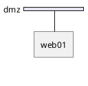

# NwDiag 社区问题和解决方案

> **文档目的**: 汇总社区讨论的 NwDiag 问题和解决方案
> **最后更新**: 2025-01-13

---

## 🌐 PlantUML 论坛问题

### 1. 连字符导致语法错误

**问题来源**: [PlantUML Forum #14346](https://forum.plantuml.net/14346/hyphen-in-node-id-causes-syntax-error)

**问题描述**:
在网络图或节点 ID 中使用连字符会导致语法错误。

**报告者**: 社区用户
**日期**: 2021

**复现代码**:

```nwdiag
nwdiag {
  network my-network {
    web-server-01;
    db-server-01;
  }
}
```

**错误信息**:
```
Syntax error at line X
```

**根本原因**:
- NwDiag 解析器将连字符 `-` 识别为减号运算符
- 导致节点名被错误解析

**解决方案**:

```nwdiag
nwdiag {
  network my_network {        // 使用下划线
    web_server_01;
    db_server_01;
  }
}
```

**社区建议**:
- 使用下划线 `_` 替代连字符
- 使用驼峰命名法 `webServer01`
- 在 PlantUML 中可以使用引号包裹 (但 NwDiag 原生不支持)

---

### 2. 组定义导致元素错误连接

**问题来源**: [GitHub Issue #1301](https://github.com/plantuml/plantuml/issues/1301)

**问题描述**:
组定义位置影响元素到网络的连接,导致布局错误。

**报告者**: plantuml/plantuml GitHub
**日期**: 2021

**问题场景**:

```nwdiag
nwdiag {
  // 问题: 组定义在网络之前
  group {
    color = "#FF0000";
    description = "Web Group";
    web01;
    db01;
  }

  network dmz {
    web01;  // 连接可能错误
  }

  network internal {
    web01;
    db01;
  }
}
```

**现象**:
- 组在网络之前: 连接正确,但样式、颜色、描述被忽略
- 组在网络之后: 样式正确,但连接可能错误

**解决方案 1**: 在网络内定义组

```nwdiag
nwdiag {
  network dmz {
    group web {
      web01;
    }
  }

  network internal {
    group db {
      db01;
    }
  }
}
```

**解决方案 2**: 组定义在所有网络之后

```nwdiag
nwdiag {
  network dmz {
    web01;
  }

  network internal {
    web01;
    db01;
  }

  // 所有网络定义后再定义组
  group {
    color = "#FF0000";
    description = "Web Group";
    web01;
    db01;
  }
}
```

**社区讨论**:
- 这是已知的布局引擎限制
- 建议遵循 "网络优先,组其后" 原则

---

### 3. 其他内部网络布局问题

**问题来源**: [PlantUML Forum #14458](https://forum.plantuml.net/14458/nwdiag-issue-other-internal-networks-with-the-layout-engine)

**问题描述**:
使用新布局引擎时,非 TCP/IP 网络(如 USB、SERIAL)的布局出现问题。

**报告者**: 社区用户
**日期**: 2022

**问题场景**:

```nwdiag
nwdiag {
  network LAN1 {
    a [address = "a1"];
  }

  network LAN2 {
    a [address = "a2"];
    switch;
  }

  // 其他内部网络 (USB, SERIAL 等)
  switch -- equip;
  equip -- printer;
}
```

**现象**:
- 布局可能错位
- 连接线显示不正确
- 新布局引擎处理非标准网络时有bug

**解决方案**: 添加明确的地址或类型

```nwdiag
nwdiag {
  network LAN1 {
    a [address = "a1"];
  }

  network LAN2 {
    a [address = "a2"];
    switch [address = "s2"];
  }

  // 添加地址信息
  switch -- equip;
  equip [address = "e3"];
  equip -- printer;
  printer [address = "USB"];
}
```

**社区反馈**:
- 新布局引擎仍在优化中
- 建议为所有节点添加地址属性
- 考虑使用旧布局引擎: `skinparam useBetaStyle false`

---

### 4. hide footbox 导致 nwdiag 错误

**问题来源**: [GitHub Issue #800](https://github.com/plantuml/plantuml/issues/800)

**问题描述**:
在 PlantUML 中使用 `hide footbox` 会导致 nwdiag 块解析失败。

**报告者**: plantuml/plantuml GitHub
**日期**: 2020

**问题代码**:



**错误信息**:
```
Syntax error in nwdiag block
```

**根本原因**:
- `hide footbox` 是序列图的指令
- 与 nwdiag 解析器冲突

**解决方案 1**: 移除 `hide footbox`


**解决方案 2**: 分离图表



**官方回复**:
- 已在后续版本中修复
- 建议升级到最新版 PlantUML

---

## 💡 Stack Overflow 问题

### 5. 如何表示跨泳道的操作

**问题来源**: Stack Overflow (相关活动图问题)

**问题描述**:
虽然这是活动图问题,但思路可应用于 nwdiag:如何表示跨网络的节点?

**nwdiag 应用**:

```nwdiag
nwdiag {
  // 方案: 同一节点出现在多个网络
  network dmz {
    web01 [address = "210.x.x.1"];
  }

  network internal {
    web01 [address = "172.x.x.1"];  // 跨网络节点
    db01;
  }

  // 使用组标识共享节点
  group shared {
    color = "#FFAAAA";
    web01;
  }
}
```

**最佳实践**:
- 使用跳线自动连接跨网络节点
- 使用组高亮共享节点
- 设置 `width = full` 对齐所有网络

---

## 🐛 GitHub Issues

### 6. 语法检查性能问题

**问题来源**: [PlantUML Changes Log](https://plantuml.com/changes)

**问题描述**:
语法错误导致语法检查和图像生成速度降低 10 倍。

**根本原因**:
- 语法错误触发回溯解析
- 大量错误累积导致性能下降

**解决方案**:
- 确保语法正确
- 使用 lint 工具预检查
- 逐步构建复杂图表

**性能优化建议**:

```nwdiag
// ❌ 复杂且可能有错误
nwdiag {
  network n1 { s1; s2; s3; s4; s5; s6; s7; s8; s9; s10; }
  network n2 { s1; s2; s3; s4; s5; s6; s7; s8; s9; s10; s11; s12; }
  // ... 更多网络
}

// ✅ 简化和分解
nwdiag {
  network frontend {
    web01; web02;
  }

  network backend {
    app01; app02;
  }
}
```

---

## 🔍 常见误解

### 7. 地址必须是有效 IP

**误解**: 地址必须是完整的有效 IP 地址

**实际情况**:

```nwdiag
nwdiag {
  network demo {
    // ✅ 完整 IP
    node01 [address = "192.168.1.10"];

    // ✅ 相对地址
    node02 [address = ".20"];

    // ✅ 占位符
    node03 [address = "x.x.x.30"];

    // ✅ 任意文本 (用于非 IP 网络)
    node04 [address = "USB"];
    node05 [address = "COM1"];
  }
}
```

**关键点**:
- 地址仅用于显示,不做验证
- 可以使用任意文本作为地址
- 相对地址自动补全网络前缀

---

### 8. 组只能有一个

**误解**: 一个图表只能定义一个组

**实际情况**:

```nwdiag
nwdiag {
  group web_tier {
    color = "#FFAAAA";
    web01; web02;
  }

  group app_tier {
    color = "#AAFFAA";
    app01; app02;
  }

  group db_tier {
    color = "#AAAAFF";
    db01; db02;
  }

  network dmz {
    web01; web02;
  }

  network internal {
    web01; web02;
    app01; app02;
    db01; db02;
  }
}
```

**关键点**:
- 可以定义多个组
- 每个组可以有不同颜色和描述
- 一个节点只能属于一个组

---

## 🛠️ 工具集成问题

### 9. Sphinx 集成配置

**问题来源**: 官方文档

**配置要点**:

```python
# conf.py
extensions = [
    'sphinxcontrib.nwdiag',
]

nwdiag_fontpath = '/usr/share/fonts/truetype/dejavu/DejaVuSans.ttf'
nwdiag_antialias = True
```

**reStructuredText 用法**:

```rst
.. nwdiag::

   nwdiag {
     network dmz {
       web01;
     }
   }
```

---

### 10. Kroki 集成编码问题

**问题描述**:
Kroki URL 编码不正确导致渲染失败。

**正确编码流程**:

```javascript
// 1. Deflate 压缩
const compressed = pako.deflate(code, { level: 9 });

// 2. Base64 编码
const base64 = btoa(String.fromCharCode(...compressed));

// 3. URL 安全转换
const urlSafe = base64
  .replace(/\+/g, '-')
  .replace(/\//g, '_')
  .replace(/=+$/, '');

// 4. 构建 URL
const url = `https://kroki.io/nwdiag/svg/${urlSafe}`;
```

**DiagramAI 实现**:

```typescript
// src/lib/utils/kroki.ts
export function generateKrokiURL(
  code: string,
  diagramType: 'nwdiag',
  outputFormat: 'svg' | 'png' = 'svg'
): string {
  const compressed = pako.deflate(code, { level: 9 });
  const encoded = base64UrlEncode(compressed);
  return `${KROKI_URL}/${diagramType}/${outputFormat}/${encoded}`;
}
```

---

## 📊 版本兼容性

### 11. PlantUML 版本差异

**问题**: 不同 PlantUML 版本对 nwdiag 支持程度不同

**版本对比**:

| 版本 | nwdiag 支持 | 已知问题 |
|------|------------|---------|
| < 1.2020.7 | 基本支持 | 缺少标题支持 |
| 1.2020.7+ | 完整支持 | 修复标题问题 |
| 1.2021.0+ | 增强支持 | 新布局引擎 |
| 1.2022.0+ | 优化支持 | 性能改进 |

**建议**: 使用最新稳定版

---

### 12. Kroki 版本差异

**Kroki 支持**:

| Kroki 版本 | nwdiag 版本 | 备注 |
|-----------|------------|------|
| 0.16.0+ | 1.5.0 | 稳定支持 |
| 0.20.0+ | 1.5.0 | 性能优化 |
| 最新版 | 1.5.0 | 推荐使用 |

---

## 🔧 调试技巧

### 13. 使用在线工具

**推荐工具**:

1. **PlantUML Online Server**
   - URL: https://www.plantuml.com/plantuml/uml/
   - 实时预览
   - 错误提示

2. **Kroki**
   - URL: https://kroki.io/
   - 支持多种格式
   - API 测试

3. **DiagramAI**
   - 本地部署
   - AI 辅助生成
   - 错误检测

---

### 14. 错误信息解读

**常见错误模式**:

| 错误信息 | 可能原因 | 解决方案 |
|---------|---------|---------|
| `Syntax error at line X` | 语法错误 | 检查该行语法 |
| `unexpected token` | 符号错误 | 检查分号、引号 |
| `Font not found` | 字体缺失 | 配置字体路径 |
| `Timeout` | 图表过大 | 简化图表 |

---

## 📚 学习资源

### 官方资源
- **NwDiag 主页**: http://blockdiag.com/en/nwdiag/
- **示例集**: http://blockdiag.com/en/nwdiag/nwdiag-examples.html
- **PlantUML 文档**: https://plantuml.com/nwdiag

### 社区资源
- **PlantUML 论坛**: https://forum.plantuml.net/
- **GitHub Issues**: https://github.com/plantuml/plantuml/issues
- **Stack Overflow**: 搜索 `[nwdiag]` 标签

### 相关工具
- **Kroki**: https://kroki.io/
- **rackdiag**: http://blockdiag.com/en/nwdiag/rackdiag-examples.html
- **packetdiag**: http://blockdiag.com/en/nwdiag/packetdiag-examples.html

---

## 🤝 贡献指南

### 报告新问题

1. **搜索已知问题**
   - PlantUML Forum
   - GitHub Issues
   - Stack Overflow

2. **准备最小复现案例**
   ```nwdiag
   nwdiag {
     // 最简代码复现问题
   }
   ```

3. **提供完整信息**
   - 错误信息
   - 版本信息
   - 预期结果
   - 实际结果

4. **提交到合适平台**
   - PlantUML 相关: PlantUML Forum/GitHub
   - NwDiag 原生: blockdiag GitHub
   - 使用问题: Stack Overflow

---

## 📝 社区最佳实践

### 问题报告模板

```markdown
### 环境
- NwDiag 版本: X.X.X
- PlantUML 版本: X.X.X (如适用)
- Kroki 版本: X.X.X (如适用)

### 问题描述
[简要描述]

### 复现代码
```nwdiag
[最小化代码]
```

### 预期结果
[描述预期行为]

### 实际结果
[描述实际行为 + 截图]

### 错误信息
```
[完整错误日志]
```

### 已尝试的解决方案
- [ ] 检查语法
- [ ] 简化图表
- [ ] 更新版本
- [ ] ...
```

---

## 🔗 相关文档

- **官方文档**: `/docs/kroki/nwdiag/official-docs.md`
- **语法规则**: `/docs/kroki/nwdiag/syntax-rules.md`
- **常见错误**: `/docs/kroki/nwdiag/common-errors.md`

---

*文档整理: DiagramAI 项目 | 基于社区讨论和 GitHub Issues*
