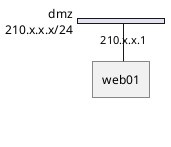
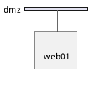
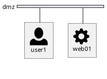
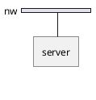
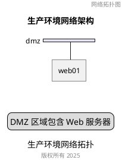

# NwDiag 官方文档

> **来源**: http://blockdiag.com/en/nwdiag/
> **开发者**: Takeshi Komiya
> **License**: Apache License 2.0
> **最后更新**: 2025-01-13

---

## 📋 概述

NwDiag 是一个网络拓扑图生成工具,可以从类似 Graphviz DOT 的文本描述生成网络拓扑图。

**核心特性**:
- 从类似 DOT 的文本生成网络拓扑图
- 支持多语言节点标签 (UTF-8)
- 支持 Sphinx 文档嵌入
- 支持 SVG/PNG 多种输出格式

**相关工具**:
- **rackdiag**: 机柜结构图生成器
- **packetdiag**: 数据包头部图生成器

---

## 🔧 安装和使用

### 安装

```bash
# 使用 pip 安装
pip install nwdiag

# 使用 easy_install 安装
easy_install nwdiag
```

### 基本用法

```bash
# 生成 PNG 图像
nwdiag simple.diag

# 生成 SVG 图像
nwdiag -Tsvg simple.diag

# 指定字体
nwdiag -f /usr/share/fonts/truetype/ttf-dejavu/DejaVuSerif.ttf simple.diag
```

### 字体配置

创建 `$HOME/.blockdiagrc` 配置文件:

```ini
[nwdiag]
fontpath = /usr/share/fonts/truetype/ttf-dejavu/DejaVuSerif.ttf
```

---

## 📝 基本语法

### 1. 简单网络图

```nwdiag
nwdiag {
  network dmz {
    address = "210.x.x.x/24"

    web01 [address = "210.x.x.1"];
    web02 [address = "210.x.x.2"];
  }

  network internal {
    address = "172.x.x.x/24";

    web01 [address = "172.x.x.1"];
    web02 [address = "172.x.x.2"];
    db01;
    db02;
  }
}
```

**解释**:
- `network <name>`: 定义网络段
- `address`: 设置网络地址范围
- `[address = "..."]`: 设置节点地址

### 2. 多地址节点

```nwdiag
nwdiag {
  network dmz {
    // 使用逗号分隔设置多个地址
    web01 [address = "210.x.x.1, 210.x.x.20"];
    web02 [address = "210.x.x.2"];
  }
}
```

### 3. 节点分组

**在网络内定义组**:

```nwdiag
nwdiag {
  network Sample_front {
    address = "192.168.10.0/24";

    // 定义组
    group web {
      web01 [address = ".1"];
      web02 [address = ".2"];
    }
  }

  network Sample_back {
    address = "192.168.20.0/24";

    web01 [address = ".1"];
    web02 [address = ".2"];
    db01 [address = ".101"];
    db02 [address = ".102"];

    // 使用已定义的节点创建组
    group db {
      db01;
      db02;
    }
  }
}
```

**在网络外定义组**:

```nwdiag
nwdiag {
  // 在网络定义外定义组
  group {
    color = "#FF7777";
    web01;
    web02;
    db01;
  }

  network dmz {
    web01;
    web02;
  }

  network internal {
    web01;
    web02;
    db01;
  }
}
```

### 4. 点对点网络

```nwdiag
nwdiag {
  inet [shape = cloud];
  inet -- router;

  network {
    router;
    web01;
    web02;
  }
}
```

**特点**:
- 使用 `--` 连接两个节点
- 不使用水平总线网络
- 适合简单的点对点连接

---

## 🎨 扩展语法

### 网络属性

```nwdiag
nwdiag {
  network dmz {
    address = "210.x.x.x/24"
    color = "pink"
    width = full

    web01 [address = "210.x.x.1"];
  }
}
```

**可用属性**:
- `address`: 网络地址
- `color`: 背景色
- `width`: 宽度 (默认 | full)

### 节点属性

```nwdiag
nwdiag {
  network dmz {
    web01 [
      address = "210.x.x.1, 210.x.x.2",
      shape = "cloud",
      color = "pink",
      description = "Web Server 01"
    ];
  }
}
```

**可用属性**:
- `address`: IP 地址 (支持多个,逗号分隔)
- `shape`: 形状 (cloud, database, actor, etc.)
- `color`: 节点颜色
- `description`: 描述文本

### 组属性

```nwdiag
nwdiag {
  group {
    color = "#CCFFCC";
    description = "Web Servers";
    web01;
    web02;
  }
}
```

**可用属性**:
- `color`: 组背景色
- `description`: 组描述

---

## 🎯 高级特性

### 1. 网络宽度控制

```nwdiag
nwdiag {
  network NETWORK_BASE {
    width = full
    dev_A [address = "dev_A"];
    dev_B [address = "dev_B"];
  }

  network IntNET1 {
    width = full
    dev_B [address = "dev_B1"];
    dev_M [address = "dev_M1"];
  }
}
```

**说明**:
- `width = full`: 网络占据整行宽度
- 不设置: 自动调整宽度

### 2. 跨网络节点

```nwdiag
nwdiag {
  network dmz {
    web01;
  }

  network internal {
    web01;  // 同一节点出现在多个网络
    db01;
  }

  network internal2 {
    web01;  // 使用跳线连接
    db01;
  }
}
```

**特点**:
- 同一节点可以出现在多个网络
- NwDiag 自动使用跳线连接

### 3. 其他内部网络

```nwdiag
nwdiag {
  network LAN1 {
    a [address = "a1"];
  }

  network LAN2 {
    a [address = "a2"];
    switch [address = "s2"];
  }

  // 非网络连接 (USB, SERIAL 等)
  switch -- equip;
  equip [address = "e3"];
  equip -- printer;
  printer [address = "USB"];
}
```

---

## 🖼️ 集成功能

### PlantUML 集成

NwDiag 已集成到 PlantUML 中:



### 使用 Sprites



### 使用 OpenIconic



---

## 📊 支持的形状

NwDiag 支持以下节点形状:

| 形状 | 说明 |
|------|------|
| `actor` | 角色/用户 |
| `agent` | 代理 |
| `artifact` | 制品 |
| `boundary` | 边界 |
| `card` | 卡片 |
| `cloud` | 云 |
| `collections` | 集合 |
| `component` | 组件 |
| `control` | 控制器 |
| `database` | 数据库 |
| `entity` | 实体 |
| `file` | 文件 |
| `folder` | 文件夹 |
| `frame` | 框架 |
| `hexagon` | 六边形 |
| `interface` | 接口 |
| `label` | 标签 |
| `node` | 节点(默认) |
| `package` | 包 |
| `person` | 人员 |
| `queue` | 队列 |
| `rectangle` | 矩形 |
| `stack` | 堆栈 |
| `storage` | 存储 |
| `usecase` | 用例 |

---

## 🎨 样式定制

### 使用全局样式

```plantuml
@startuml
<style>
nwdiagDiagram {
  network {
    BackgroundColor palegreen
    LineColor green
    LineThickness 1.0
  }
  server {
    BackgroundColor pink
  }
  group {
    BackgroundColor #FFAAAA
    LineColor #AA0000
  }
}
</style>

nwdiag {
  network dmz {
    web01;
  }
}
@enduml
```



### 阴影控制



---

## 📚 附加功能

### 标题和图例



### 多个组

```nwdiag
nwdiag {
  group {
    color = "#FFaaaa";
    web01;
    db01;
  }

  group {
    color = "#aaaaFF";
    web02;
    db02;
  }

  network dmz {
    web01;
    web02;
  }

  network internal {
    web01;
    web02;
    db01;
    db02;
  }
}
```

---

## 🔗 相关资源

### 官方文档
- **主页**: http://blockdiag.com/en/nwdiag/
- **示例**: http://blockdiag.com/en/nwdiag/nwdiag-examples.html
- **PlantUML 集成**: https://plantuml.com/nwdiag

### GitHub
- **源码**: https://github.com/blockdiag/nwdiag

### 依赖
- Python 2.6, 2.7, 3.2, 3.3+
- Pillow 2.2.1+
- funcparserlib 0.3.6+
- setuptools / distribute

---

## 📝 完整示例

```nwdiag
nwdiag {
  // 定义全局组
  group {
    color = "#7777FF";
    description = "核心服务";
    web01;
    web02;
    db01;
  }

  // DMZ 网络
  network dmz {
    color = "pink"
    width = full
    address = "210.x.x.x/24"

    web01 [address = "210.x.x.1", shape = cloud];
    web02 [address = "210.x.x.2", shape = cloud];
  }

  // 内部网络
  network internal {
    color = "LightBlue"
    width = full
    address = "172.x.x.x/24"

    web01 [address = "172.x.x.1"];
    web02 [address = "172.x.x.2"];
    db01 [address = "172.x.x.100", shape = database];
  }

  // 备份网络
  network backup {
    width = full
    address = "192.168.x.x/24"

    db01 [address = "192.168.x.100"];
    backup_server [address = "192.168.x.200", shape = storage];
  }
}
```

---

*文档整理: DiagramAI 项目 | 基于官方文档和 PlantUML 集成资料*
