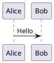
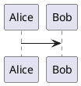
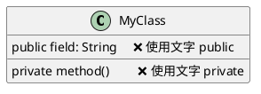
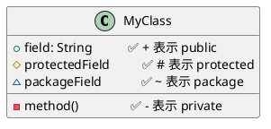
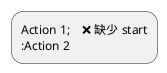
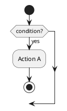

# PlantUML 常见错误手册

> 收集时间: 2025-10-13
> 数据来源: Stack Overflow, 社区论坛, 最佳实践总结

---

## 🐛 语法错误类别

### 1. 图表声明错误

#### 错误 1.1: 缺少 @startuml/@enduml 标记

**错误代码**:
```plantuml
Alice -> Bob : Hello
```

**错误信息**: `Syntax Error: Missing @startuml declaration`

**正确代码**:


**解释**: 所有 PlantUML 图表必须包含开始和结束标记。

---

#### 错误 1.2: 标记大小写错误

**错误代码**:


**错误信息**: `Unknown directive @startUML`

**正确代码**:


**解释**: PlantUML 关键字区分大小写，必须使用小写。

---

### 2. 箭头语法错误

#### 错误 2.1: 箭头符号不完整

**错误代码**:
```plantuml
@startuml
Alice > Bob    ❌ 缺少 -
Alice < Bob    ❌ 缺少 -
@enduml
```

**错误信息**: `Syntax Error: Invalid arrow syntax`

**正确代码**:
```plantuml
@startuml
Alice -> Bob   ✅ 完整箭头
Alice <- Bob   ✅ 完整箭头
@enduml
```

---

#### 错误 2.2: 箭头修饰符位置错误

**错误代码**:
```plantuml
@startuml
Alice x-> Bob    ❌ x 应在末尾
Alice o-> Bob    ❌ o 应在末尾
@enduml
```

**正确代码**:
```plantuml
@startuml
Alice ->x Bob    ✅ 丢失消息
Alice ->o Bob    ✅ 末尾圆圈
Alice o<- Bob    ✅ 开始圆圈
@enduml
```

**解释**: 修饰符 `x` 和 `o` 必须在箭头的正确位置。

---

### 3. 参与者和命名错误

#### 错误 3.1: 参与者名称包含特殊字符

**错误代码**:
```plantuml
@startuml
participant User@Domain    ❌ @ 不允许
participant User#123       ❌ # 不允许
participant User Name      ❌ 空格需引号
@enduml
```

**错误信息**: `Syntax Error: Invalid character in identifier`

**正确代码**:
```plantuml
@startuml
participant "User@Domain" as User1   ✅ 使用引号
participant "User#123" as User2      ✅ 使用引号
participant "User Name" as User3     ✅ 使用引号
@enduml
```

**解决方案**:
- 包含特殊字符的名称用双引号包裹
- 使用 `as` 关键字创建简短别名

---

#### 错误 3.2: 别名语法错误

**错误代码**:
```plantuml
@startuml
participant "Very Long Name" = VLN    ❌ 使用 = 错误
@enduml
```

**正确代码**:
```plantuml
@startuml
participant "Very Long Name" as VLN   ✅ 使用 as
VLN -> Bob : Hello
@enduml
```

---

### 4. 类图关系错误

#### 错误 4.1: 关系符号方向错误

**错误代码**:
```plantuml
@startuml
ClassA --|> ClassB    ❌ 继承符号反了
ClassC ..|> ClassD    ❌ 实现符号反了
@enduml
```

**正确代码**:
```plantuml
@startuml
ClassA <|-- ClassB    ✅ B 继承 A
ClassC <|.. ClassD    ✅ D 实现 C
@enduml
```

**记忆技巧**:
- 三角形 `<|` 指向父类/接口
- 实线 `--` 表示继承
- 虚线 `..` 表示实现

---

#### 错误 4.2: 可见性修饰符错误

**错误代码**:


**正确代码**:


---

### 5. 活动图错误（新语法）

#### 错误 5.1: 缺少 start/stop

**错误代码**:


**错误信息**: `Syntax Error: Missing start keyword`

**正确代码**:
```plantuml
@startuml
start         ✅ 必须以 start 开始
:Action 1;
:Action 2;
stop          ✅ 必须以 stop 或 end 结束
@enduml
```

---

#### 错误 5.2: if/endif 不匹配

**错误代码**:


**错误信息**: `Syntax Error: Unmatched if statement`

**正确代码**:
```plantuml
@startuml
start
if (condition?) then (yes)
  :Action A;
else (no)
  :Action B;
endif         ✅ 必须有 endif
stop
@enduml
```

---

#### 错误 5.3: fork/end fork 不匹配

**错误代码**:
```plantuml
@startuml
start
fork
  :action 1;
fork again
  :action 2;
' 缺少 end fork
stop
@enduml
```

**正确代码**:
```plantuml
@startuml
start
fork
  :action 1;
fork again
  :action 2;
end fork      ✅ 必须有 end fork
stop
@enduml
```

---

### 6. 状态图错误

#### 错误 6.1: 混用 package（不支持）

**错误代码**:
```plantuml
@startuml
package "System" {
  state Monitoring
  state Deployed
}
@enduml
```

**错误信息**: `Syntax Error: package not allowed in state diagrams`

**解决方案 1 - 使用 allowmixing**:
```plantuml
@startuml
allowmixing
package "System" {
  state Monitoring
  state Deployed
}
@enduml
```

**解决方案 2 - 使用复合状态**:
```plantuml
@startuml
state "System" as System {
  state Monitoring
  state Deployed
}
@enduml
```

**解释**: 状态图不支持 `package`，除非启用 `allowmixing` 或使用复合状态。

---

#### 错误 6.2: [*] 初始/终止状态语法错误

**错误代码**:
```plantuml
@startuml
state [*]              ❌ 声明错误
[*] -> StateA
StateB -> [*]
@enduml
```

**错误信息**: `Syntax Error: Invalid state declaration`

**正确代码**:
```plantuml
@startuml
[*] -> StateA          ✅ 直接使用，不声明
StateB -> [*]          ✅ 直接使用
@enduml
```

**解释**: `[*]` 是特殊符号，表示初始/终止状态，不需要声明。

---

### 7. 预处理错误

#### 错误 7.1: !define 语法错误

**错误代码**:
```plantuml
@startuml
!define MYCONST = "value"    ❌ 不需要 =
@enduml
```

**正确代码**:
```plantuml
@startuml
!define MYCONST "value"      ✅ 直接赋值
!define TABLE (T,#FFAAAA)    ✅ 带参数
@enduml
```

---

#### 错误 7.2: !include 路径错误

**错误代码**:
```plantuml
@startuml
!include common.puml         ❌ 相对路径可能失败
@enduml
```

**错误信息**: `File not found: common.puml`

**正确代码**:
```plantuml
@startuml
!include ./common.puml       ✅ 明确相对路径
!include /abs/path/common.puml  ✅ 绝对路径
!include https://example.com/common.puml  ✅ URL
@enduml
```

---

### 8. 样式错误

#### 错误 8.1: skinparam 拼写错误

**错误代码**:
```plantuml
@startuml
skinParam backgroundColor yellow    ❌ P 大写
SkinParam shadowing false           ❌ S 大写
@enduml
```

**正确代码**:
```plantuml
@startuml
skinparam backgroundColor yellow    ✅ 全小写
skinparam shadowing false           ✅ 全小写
@enduml
```

---

#### 错误 8.2: 颜色格式错误

**错误代码**:
```plantuml
@startuml
participant Alice #GGGGGG    ❌ G 不是有效的十六进制
participant Bob #12345       ❌ 缺少一位
@enduml
```

**正确代码**:
```plantuml
@startuml
participant Alice #CCCCCC    ✅ 有效的 HEX
participant Bob #123456      ✅ 6 位 HEX
participant Charlie red      ✅ 颜色名称
@enduml
```

**颜色格式**:
- 颜色名称: `red`, `blue`, `green` 等
- HEX: `#RRGGBB` (6 位) 或 `#RGB` (3 位)

---

### 9. 注释和文本错误

#### 错误 9.1: 多行注释未闭合

**错误代码**:
```plantuml
@startuml
/'
This is a comment
Alice -> Bob
@enduml
```

**错误信息**: `Syntax Error: Unclosed comment`

**正确代码**:
```plantuml
@startuml
/'
This is a comment
'/                  ✅ 必须闭合
Alice -> Bob
@enduml
```

---

#### 错误 9.2: 文本换行错误

**错误代码**:
```plantuml
@startuml
Alice -> Bob : This is a very long message
that spans multiple lines    ❌ 直接换行不工作
@enduml
```

**正确代码**:
```plantuml
@startuml
Alice -> Bob : This is a very long message\nthat spans multiple lines
' 或
Alice -> Bob : This is a very long message
that spans multiple lines    ✅ 在某些上下文中允许
@enduml
```

---

### 10. 图表特定错误

#### 错误 10.1: 时序图 - autonumber 位置错误

**错误代码**:
```plantuml
@startuml
Alice -> Bob : msg1
autonumber              ❌ 应在消息之前
Alice -> Charlie : msg2
@enduml
```

**正确代码**:
```plantuml
@startuml
autonumber              ✅ 在第一条消息之前
Alice -> Bob : msg1
Alice -> Charlie : msg2
@enduml
```

---

#### 错误 10.2: 甘特图 - 日期格式错误

**错误代码**:
```plantuml
@startgantt
[Task 1] starts 01/15/2025    ❌ 错误的日期格式
@endgantt
```

**正确代码**:
```plantuml
@startgantt
[Task 1] starts 2025-01-15    ✅ ISO 格式 YYYY-MM-DD
[Task 1] starts 2025/01/15    ✅ 也支持 YYYY/MM/DD
@endgantt
```

---

## 🔧 常见渲染错误

### 11. Kroki/服务器错误

#### 错误 11.1: 图表过大

**错误信息**: `Error: Diagram too complex or too large`

**解决方案**:
1. 拆分成多个小图表
2. 减少元素数量
3. 简化关系连接
4. 使用分页或分层

---

#### 错误 11.2: 超时错误

**错误信息**: `Timeout: Rendering took too long`

**解决方案**:
1. 检查是否有循环引用
2. 减少预处理复杂度
3. 避免过深的嵌套
4. 优化 !include 文件数量

---

### 12. 布局问题（非错误但常见）

#### 问题 12.1: 参与者顺序混乱

**问题代码**:
```plantuml
@startuml
Alice -> Bob
Charlie -> Alice
Bob -> Charlie
' 参与者顺序: Alice, Bob, Charlie（自动）
@enduml
```

**改进方案**:
```plantuml
@startuml
' 显式声明参与者顺序
participant Alice
participant Charlie
participant Bob

Alice -> Bob
Charlie -> Alice
Bob -> Charlie
@enduml
```

---

#### 问题 12.2: 箭头交叉混乱

**解决方案**:
1. 使用分组（`group`）
2. 调整参与者顺序
3. 使用分隔符（`==`）
4. 考虑拆分图表

---

## 🎯 调试技巧

### 1. 使用在线编辑器
- 访问 http://www.plantuml.com/plantuml/uml
- 实时查看错误提示
- 逐步添加元素验证

### 2. 注释调试法
```plantuml
@startuml
Alice -> Bob
' 逐步注释以定位错误
/'
Charlie -> Alice
Bob -> Charlie
'/
@enduml
```

### 3. 分段验证
- 从最简单的图表开始
- 逐步添加复杂元素
- 每次添加后验证

### 4. 使用 IDE 插件
- VS Code PlantUML 扩展
- IntelliJ IDEA PlantUML 插件
- 提供语法高亮和错误检查

---

## 📚 错误速查表

| 错误类型 | 常见原因 | 快速解决 |
|---------|---------|---------|
| `Missing @startuml` | 缺少声明标记 | 添加 `@startuml` 和 `@enduml` |
| `Invalid arrow syntax` | 箭头格式错误 | 使用 `->` 或 `<-` |
| `Invalid character` | 特殊字符未转义 | 使用双引号包裹名称 |
| `Unmatched if` | 条件语句未闭合 | 添加 `endif` |
| `Unmatched fork` | 并行语句未闭合 | 添加 `end fork` |
| `Unknown directive` | 关键字拼写错误 | 检查大小写（全小写） |
| `File not found` | !include 路径错误 | 使用正确的相对/绝对路径 |
| `Syntax Error` | 通用语法错误 | 逐行检查语法 |

---

## 🔗 参考资源

- **官方 FAQ**: https://plantuml.com/faq
- **Stack Overflow**: https://stackoverflow.com/questions/tagged/plantuml
- **官方论坛**: https://forum.plantuml.net
- **GitHub Issues**: https://github.com/plantuml/plantuml/issues

---

*最后更新: 2025-10-13*
*维护者: DiagramAI Team*
