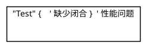
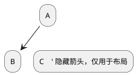
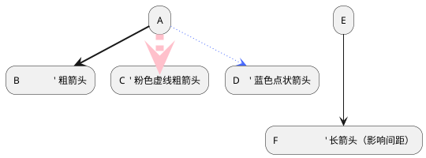
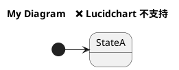
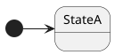
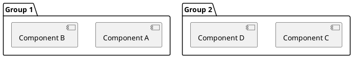
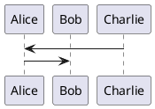

# PlantUML 社区问题与解决方案

> 收集时间: 2025-10-13
> 数据来源: GitHub Issues, PlantUML Forum, Stack Overflow

---

## 📊 热门议题概览

### 1. 布局和排版问题 (Most Common)

PlantUML 社区中最常讨论的话题是布局问题，特别是：
- 元素位置自动调整不符合预期
- 箭头交叉混乱
- 文本重叠
- 图表方向控制

**社区资源**:
- **官方 FAQ**: https://plantuml.com/faq - "common layout issues"
- **布局指南**: https://crashedmind.github.io/PlantUMLHitchhikersGuide/layout/layout.html

---

## 🐛 GitHub 开放问题（2024-2025）

### 2. 核心功能增强请求

#### 问题 2.1: EBNF 语法多行支持
- **Issue**: https://github.com/plantuml/plantuml/labels/enhancement
- **描述**: EBNF 应该允许在下一行继续（当前不支持）
- **状态**: Open
- **影响**: EBNF 图表的可读性

---

#### 问题 2.2: JSON 渲染不一致
- **Issue**: GitHub plantuml/plantuml (enhancement label)
- **描述**: JSON 数据可视化渲染结果不一致
- **状态**: Open
- **临时解决方案**: 手动调整 JSON 结构

---

#### 问题 2.3: Teoz 时序图锚点分层
- **Issue**: "layering the anchors in teoz feature"
- **描述**: Teoz 引擎的锚点分层功能需要改进
- **状态**: Open
- **相关**: 时序图高级功能

---

### 3. nwdiag 网络图限制

#### 问题 3.1: 节点不能存在于多个网络
- **Issue**: "nwdiag nodes cannot exist in more than one network"
- **描述**: nwdiag 图表中，一个节点无法同时出现在多个网络段
- **状态**: Open
- **影响**: 复杂网络拓扑绘制

**临时解决方案**:
```plantuml
@startuml
' 使用多个节点表示同一设备
nwdiag {
  network dmz {
      address = "210.x.x.x/24"
      web01 [address = "210.x.x.1"];
  }
  network internal {
      address = "172.x.x.x/24";
      web01_internal [address = "172.x.x.1"];
  }
}
note "web01 和 web01_internal 是同一设备" as N1
@enduml
```

---

### 4. PlantUML Server 问题

#### 问题 4.1: Web 编辑器导出文件名过长
- **Issue**: https://github.com/plantuml/plantuml-server/issues/383
- **描述**: 导出的文件名超过 Windows 路径长度限制，导致文件无法使用
- **状态**: Open
- **影响**: Windows 用户导出功能

**临时解决方案**: 手动重命名文件或使用短标题

---

### 5. VS Code 扩展问题

#### 问题 5.1: Markdown 预览渲染问题
- **Issue**: https://github.com/qjebbs/vscode-plantuml/issues/621
- **描述**: PlantUML 在 Markdown 预览中渲染失败
- **状态**: Open (2024-12-11)
- **相关扩展**: qjebbs/vscode-plantuml

---

#### 问题 5.2: 宏定义问题
- **Issue**: https://github.com/qjebbs/vscode-plantuml/issues/607
- **描述**: 宏定义在某些情况下无法正确解析
- **状态**: Open
- **影响**: 使用预处理功能的用户

---

## 🔥 性能问题

### 6. 渲染性能

#### 问题 6.1: 宏括号不匹配导致性能下降
- **论坛帖子**: https://forum.plantuml.net/questions/unsorted
- **描述**: 如果宏定义中有不匹配的括号，PlantUML 处理时间显著增加
- **发现时间**: 2021-05-28 (仍然相关)
- **影响**: 大型项目使用宏时的性能

**示例**:


**解决方案**: 确保所有括号正确闭合

---

#### 问题 6.2: JRE 21 性能问题
- **Issue**: GitHub plantuml/plantuml - "Performance issue with JRE21"
- **描述**: 使用 Java 21 运行时性能下降
- **状态**: Fixed in recent versions
- **建议**: 升级到最新版本或使用 JRE 17

---

#### 问题 6.3: 复杂图表渲染缓慢
- **论坛**: https://forum.plantuml.net/6351/performance-problem
- **症状**:
  - 17 秒渲染时间
  - CPU 100% 使用率（双核）
- **原因**:
  - 元素过多
  - 关系复杂
  - 过深的嵌套

**优化建议**:
1. 拆分大图表为多个小图表
2. 减少不必要的关系连接
3. 使用 `!include` 分离公共部分
4. 避免循环引用

---

## 🎨 布局问题详解

### 7. 布局方向控制

#### 问题 7.1: 自动布局不符合预期

**常见症状**:
- 元素位置混乱
- 箭头交叉
- 文本重叠

**解决方案 1: 设置布局方向**:
```plantuml
@startuml
left to right direction    ' 从左到右
' 或
top to bottom direction    ' 从上到下（默认）
@enduml
```

**解决方案 2: 调整间距**:
```plantuml
@startuml
skinparam nodesep 10      ' 节点间距
skinparam ranksep 150     ' 等级间距
@enduml
```

**解决方案 3: 使用隐藏箭头**:


---

#### 问题 7.2: 箭头样式影响布局

**现象**: 不同的箭头样式会影响布局结果

**示例**:


---

### 8. 甘特图布局问题

#### 问题 8.1: printscale weekly 导致布局错误
- **Issue**: "Gantt Layout issue when Print between is used with Printscale weekly"
- **描述**: 使用 `printscale weekly` 和 `Print between` 时布局混乱
- **状态**: Fixed in recent versions
- **建议**: 升级到 v1.2025.0+

**正确用法**:

```plantuml
@startgantt
printscale weekly
[Task 1] lasts 2 weeks
[Task 2] lasts 3 weeks
@endgantt
```


---

## 📚 标准库和扩展问题

### 9. Azure PlantUML 库

#### 问题 9.1: 缺少最新 Azure 服务
- **Repo**: https://github.com/plantuml-stdlib/Azure-PlantUML/issues
- **Feature Request**: "Update with newly Microsoft Azure services"
- **描述**: Azure 库未包含最新的 Azure 服务图标
- **状态**: Open
- **影响**: Azure 架构图绘制

---

#### 问题 9.2: 虚拟网络边界创建
- **Issue**: "How is this virtual network boundary created?"
- **描述**: 不清楚如何在 Azure 图表中创建虚拟网络边界
- **社区解决方案**: 使用 `rectangle` 或 `package` 模拟边界

---

### 10. Office 图标库

#### 问题 10.1: README 示例无法运行
- **Repo**: https://github.com/Roemer/plantuml-office/issues
- **描述**: README 中的示例代码无法正常运行
- **状态**: Open
- **临时解决方案**: 参考官方文档而非 README

---

#### 问题 10.2: 缺少 all.puml 汇总文件
- **Issue**: "Create all.puml for Office"
- **描述**: 希望有一个文件包含所有 Office 图标定义
- **状态**: Open (2024-02-11)
- **Feature Request**: 方便一次性导入所有图标

---

## 🔧 工具集成问题

### 11. Lucidchart 导入问题

#### 问题 11.1: title 关键字不支持
- **来源**: https://community.lucid.co/product-questions
- **错误**: "Issue with the title on line 3 column 1"
- **原因**: Lucidchart 不支持 PlantUML 的 `title` 关键字
- **解决方案**: 移除 `title` 或使用注释

**错误代码**:


**正确代码**:


---

#### 问题 11.2: [*] 初始状态不支持
- **原因**: Lucidchart 的 PlantUML 实现不完整
- **解决方案**: 用具名状态替换 `[*]`

**替代方案**:
```plantuml
@startuml
state Initial      ✅ 使用具名状态
Initial -> StateA
StateB -> Final
@enduml
```

---

## 🌟 最佳实践（社区推荐）

### 12. 布局优化技巧

#### 技巧 1: 使用分组


---

#### 技巧 2: 控制参与者顺序（时序图）


---

#### 技巧 3: 使用 skinparam 统一样式
```plantuml
@startuml
!include common-styles.puml  ' 公共样式文件

skinparam defaultFontName "Arial"
skinparam shadowing false
@enduml
```

---

### 13. 性能优化技巧

#### 技巧 1: 延迟加载 !include
```plantuml
@startuml
!if %variable_defined("INCLUDE_DETAILS")
  !include detailed-components.puml
!endif
@enduml
```

---

#### 技巧 2: 使用预定义常量

```plantuml
@startuml
!define PRIMARY_COLOR #4A90E2
!define SECONDARY_COLOR #F5A623

participant Alice PRIMARY_COLOR
participant Bob SECONDARY_COLOR
@enduml
```


---

#### 技巧 3: 分页大型图表
```plantuml
@startuml
' Page 1
!include page1-header.puml
Alice -> Bob : Step 1
newpage

' Page 2
Alice -> Charlie : Step 2
@enduml
```

---

## 📈 版本更新亮点

### 14. 最近版本改进 (v1.2025.x)

#### v1.2025.3 (2025-06-01)
- **GitHub Issues 修复**: 查看 https://github.com/plantuml/plantuml
- **Javadoc 改进**: API 文档更完善
- **性能优化**: JRE 21 兼容性提升

#### v1.2025.0 (2025-01-01)
- **teoz 引擎改进**: 并行组激活级别修复
- **甘特图修复**: printscale weekly 布局问题
- **时序图增强**: 响应消息显示优化

**升级建议**: 使用最新稳定版获得最佳性能和最少 bug

---

## 🔗 社区资源

### 15. 官方渠道
- **GitHub 主仓库**: https://github.com/plantuml/plantuml
- **服务器仓库**: https://github.com/plantuml/plantuml-server
- **标准库**: https://github.com/plantuml/plantuml-stdlib

### 16. 第三方工具
- **VS Code 扩展**: https://github.com/qjebbs/vscode-plantuml
- **Azure 库**: https://github.com/plantuml-stdlib/Azure-PlantUML
- **Office 库**: https://github.com/Roemer/plantuml-office

### 17. 学习资源
- **官方 FAQ**: https://plantuml.com/faq
- **社区论坛**: https://forum.plantuml.net
- **The Hitchhiker's Guide to PlantUML**: https://crashedmind.github.io/PlantUMLHitchhikersGuide/

---

## 💡 贡献社区

### 如何报告问题
1. 检查是否已有相同 Issue
2. 提供最小可复现示例
3. 说明 PlantUML 版本和环境
4. 附上错误截图或日志

### 如何提交功能请求
1. 访问 https://github.com/plantuml/plantuml/issues
2. 使用 "enhancement" 标签
3. 描述使用场景和预期行为
4. 提供示例代码（如果适用）

---

## 🎯 常见问题速查

| 问题类型 | 解决方向 | 参考资源 |
|---------|---------|---------|
| 布局混乱 | 调整间距、方向、使用隐藏箭头 | [布局指南](https://crashedmind.github.io/PlantUMLHitchhikersGuide/layout/layout.html) |
| 性能缓慢 | 拆分图表、减少元素、优化宏 | [论坛性能讨论](https://forum.plantuml.net/6351) |
| 导入错误 | 检查工具兼容性、移除不支持特性 | [Lucidchart 问题](https://community.lucid.co) |
| 标准库缺失 | 使用第三方库或自定义 sprite | [Azure 库](https://github.com/plantuml-stdlib/Azure-PlantUML) |
| 版本兼容 | 升级到最新版本 | [更新日志](https://plantuml.com/changes) |

---

*最后更新: 2025-10-13*
*维护者: DiagramAI Team*
*数据来源: GitHub, PlantUML Forum, Stack Overflow*
