# PlantUML 强制语法规则

> 收集时间: 2025-10-13
> 数据来源: PlantUML Language Reference Guide (1.2025.0), 官方文档

---

## 🚨 关键强制规则

### 1. 图表声明标记 (Mandatory)

**规则**: 所有 PlantUML 图表必须以 `@startuml` 开始，以 `@enduml` 结束

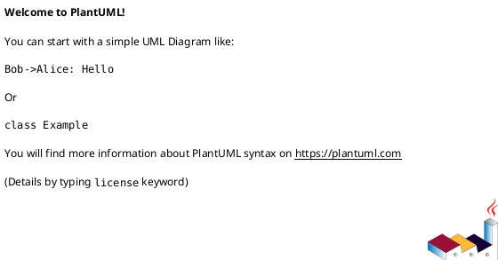

**特殊图表类型标记**:
```plantuml
@startuml         ' UML 图表（默认）
@startditaa       ' Ditaa ASCII 艺术图
@startjcckit      ' JCCKit 图表
@startsalt        ' 线框图/UI 原型
@startgantt       ' 甘特图
@startmindmap     ' 思维导图
@startwbs         ' 工作分解结构
@startjson        ' JSON 数据可视化
@startyaml        ' YAML 数据可视化
```

**错误示例**:
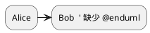

**正确示例**:
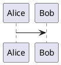

---

### 2. 箭头语法规则

**基本箭头格式**: `参与者1 箭头类型 参与者2 : 消息`

#### 箭头方向
- `->` 或 `->`  : 从左到右
- `<-` 或 `<-`  : 从右到左
- `<->` 或 `<->` : 双向箭头

#### 箭头样式修饰符
- `-` : 实线
- `--` : 虚线
- `>>` : 细箭头
- `\\` 或 `//` : 半箭头（上半部分或下半部分）
- `->x` : 丢失消息（末尾 x）
- `->o` : 末尾带圆圈

**示例**:
```plantuml
@startuml
Bob ->x Alice   ' 丢失消息
Bob -> Alice    ' 普通箭头
Bob ->> Alice   ' 细箭头
Bob -\ Alice    ' 仅下半部分箭头
Bob \\- Alice   ' 仅上半部分箭头
Bob //-- Alice  ' 虚线半箭头
Bob ->o Alice   ' 末尾圆圈
Bob o\\-- Alice ' 开始圆圈
Bob <-> Alice   ' 双向箭头
Bob <->o Alice  ' 双向带圆圈
@enduml
```

#### 箭头颜色
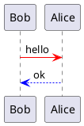

---

### 3. 注释语法

**单行注释**: 使用 `'` (单引号)


**多行注释**: 使用 `/'` 和 `'/`


---

### 4. 文本和标签规则

#### 多行文本
使用 `\n` 或实际换行符：
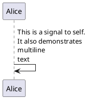

#### 特殊字符转义
- 引号: 使用 `\"` 或直接使用（在某些上下文中）
- 反斜杠: `\\`
- 冒号: 在消息中使用空格分隔 `: `

---

### 5. 参与者声明（时序图）

**显式声明参与者**:
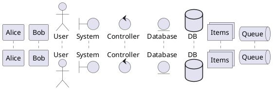

**参与者类型**:
- `participant` : 默认参与者（矩形框）
- `actor` : 人形图标
- `boundary` : 边界（圆形）
- `control` : 控制器（圆形箭头）
- `entity` : 实体（圆形）
- `database` : 数据库图标
- `collections` : 集合图标
- `queue` : 队列图标

---

### 6. 类图语法规则

#### 类声明
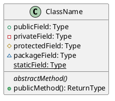

#### 可见性修饰符
- `+` : public（公共）
- `-` : private（私有）
- `#` : protected（保护）
- `~` : package/internal（包级）

#### 关系类型
```plantuml
@startuml
ClassA <|-- ClassB    ' 继承（泛化）
ClassC <|.. ClassD    ' 实现（接口）
ClassE <-- ClassF     ' 依赖
ClassG *-- ClassH     ' 组合（强关联）
ClassI o-- ClassJ     ' 聚合（弱关联）
ClassK --> ClassL     ' 关联
ClassM ..> ClassN     ' 虚线依赖
@enduml
```

**关系符号规则**:
- `<|--` : 继承/泛化（实心三角形）
- `<|..` : 实现接口（空心三角形 + 虚线）
- `*--` : 组合（实心菱形）
- `o--` : 聚合（空心菱形）
- `-->` : 关联（箭头）
- `..>` : 依赖（虚线箭头）

---

### 7. 活动图语法规则（新语法）

**基本结构**:
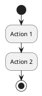

#### 条件分支
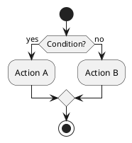

#### 并行处理
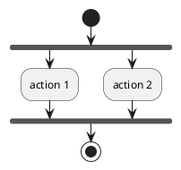

**合并方式**:
- `end fork` : 默认合并（同步）
- `end merge` : 第一个完成即继续
- `end fork {and}` : 显式 AND 合并
- `end fork {or}` : 显式 OR 合并

#### 循环
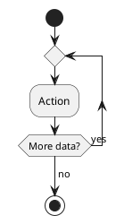

---

### 8. 预处理指令

#### 变量定义
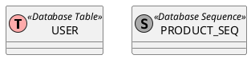

#### 条件包含
```plantuml
@startuml
!if %getenv("ENVIRONMENT") == "production"
  skinparam backgroundColor LightYellow
!else
  skinparam backgroundColor LightBlue
!endif
@enduml
```

#### 文件包含
```plantuml
@startuml
!include https://example.com/common-styles.puml
!include ./local-definitions.puml
@enduml
```

#### 宏定义
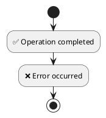

---

### 9. 样式和主题（Skinparam）

**全局样式**:
```plantuml
@startuml
skinparam backgroundColor transparent
skinparam shadowing false
skinparam defaultFontName Arial
skinparam defaultFontSize 12
skinparam defaultFontColor #333333
@enduml
```

**图表特定样式**:
```plantuml
@startuml
skinparam sequence {
  ArrowColor DeepSkyBlue
  ActorBorderColor DeepSkyBlue
  LifeLineBorderColor blue
  LifeLineBackgroundColor #A9DCDF
  ParticipantBorderColor DeepSkyBlue
  ParticipantBackgroundColor DodgerBlue
  ParticipantFontName Impact
  ParticipantFontSize 17
  ParticipantFontColor #A9DCDF
}
@enduml
```

---

### 10. 颜色和格式规则

#### 颜色格式
- **颜色名称**: `red`, `blue`, `green`, `yellow` 等
- **HEX 格式**: `#FF0000`, `#00FF00`, `#0000FF`
- **RGB 格式**: `rgb(255,0,0)` (某些上下文)

#### 应用颜色
```plantuml
@startuml
' 背景色
participant Alice #lightblue
participant Bob #red/white  ' 背景色/文字色

' 箭头颜色
Alice -[#red]-> Bob : hello

' 注释颜色
note right of Alice #yellow
  This is a note
end note
@enduml
```

---

### 11. 特殊图表类型规则

#### 甘特图
```plantuml
@startgantt
[Task 1] lasts 3 days
[Task 2] lasts 4 days
[Task 2] starts at [Task 1]'s end
@endgantt
```

**关键字**:
- `lasts` : 持续时间
- `starts` : 开始时间
- `ends` : 结束时间
- `at` : 在某个时间点
- `is colored in` : 颜色

#### 思维导图
```plantuml
@startmindmap
* Root
** Branch 1
*** Leaf 1.1
*** Leaf 1.2
** Branch 2
@endmindmap
```

**规则**:
- `*` : 根节点（1 个）
- `**` : 二级节点
- `***` : 三级节点
- 左右自动平衡

#### JSON 数据
```plantuml
@startjson
{
  "name": "John",
  "age": 30,
  "city": "New York"
}
@endjson
```

---

### 12. 命名规则和约束

#### 标识符规则
- **允许字符**: 字母、数字、下划线 `_`
- **不允许**: 空格（使用引号包裹）
- **大小写敏感**: `Alice` 和 `alice` 是不同的参与者

**示例**:
```plantuml
@startuml
participant Alice
participant "Bob Smith" as Bob  ' 含空格需引号
participant User_123            ' 下划线允许
@enduml
```

#### 别名（Alias）
```plantuml
@startuml
participant "Very Long Participant Name" as VLPN
VLPN -> Alice : Hello
@enduml
```

---

### 13. 布局和排版规则

#### 顺序控制
```plantuml
@startuml
' 参与者声明顺序决定左右位置
participant Alice
participant Bob
participant Charlie

Alice -> Bob
Alice -> Charlie
@enduml
```

#### 分组和分隔符
```plantuml
@startuml
Alice -> Bob : msg1
== Initialization ==
Alice -> Bob : msg2
== Processing ==
Alice -> Bob : msg3
@enduml
```

#### 激活/停用（Activation）
```plantuml
@startuml
Alice -> Bob : Request
activate Bob
Bob -> Charlie : Query
activate Charlie
Charlie -> Bob : Response
deactivate Charlie
Bob -> Alice : Result
deactivate Bob
@enduml
```

---

### 14. 错误处理规则

#### 常见语法错误
1. **缺少声明标记**
   ```plantuml
   ❌ Alice -> Bob  ' 错误：缺少 @startuml
   ```

2. **箭头格式错误**
   ```plantuml
   ❌ Alice > Bob    ' 错误：缺少 - 或 --
   ✅ Alice -> Bob   ' 正确
   ```

3. **括号不匹配**
   ```plantuml
   ❌ class A {
        +method()   ' 错误：缺少 }
   ```

4. **关键字拼写错误**
   ```plantuml
   ❌ @startUML      ' 错误：大小写不正确
   ✅ @startuml      ' 正确：全小写
   ```

5. **非法字符**
   ```plantuml
   ❌ participant User@Domain  ' 错误：@ 不允许直接使用
   ✅ participant "User@Domain" as User  ' 正确：使用引号
   ```

---

### 15. 版本兼容性规则

#### 新旧语法对比

**活动图 - 旧语法**:
```plantuml
@startuml
(*) --> "Action"
"Action" --> (*)
@enduml
```

**活动图 - 新语法（推荐）**:
```plantuml
@startuml
start
:Action;
stop
@enduml
```

**建议**: 新项目使用新语法，旧语法仅用于向后兼容。

---

## 🎯 最佳实践建议

### 1. 代码组织
- ✅ 使用注释分隔不同部分
- ✅ 保持缩进一致性
- ✅ 一个文件一个图表类型

### 2. 命名规范
- ✅ 使用有意义的名称
- ✅ 复杂名称使用别名
- ✅ 避免特殊字符

### 3. 样式管理
- ✅ 提取公共样式到单独文件
- ✅ 使用预处理变量
- ✅ 保持风格一致

### 4. 错误预防
- ✅ 使用在线编辑器实时验证
- ✅ 逐步构建复杂图表
- ✅ 保存可工作的版本

---

## 📚 参考资料

- **官方语言参考**: https://plantuml.com/guide (606 页 PDF)
- **在线编辑器**: http://www.plantuml.com/plantuml/uml
- **VS Code 扩展**: https://marketplace.visualstudio.com/items?itemName=jebbs.plantuml

---

*最后更新: 2025-10-13*
*基于 PlantUML 1.2025.0 版本*
