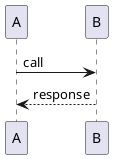

# SeqDiag Community Issues & Discussions

> **Purpose**: Collection of real-world problems and solutions from the SeqDiag community
> **Sources**: GitHub Issues, Stack Overflow, Forums
> **Last Updated**: 2025-10-13

---

## Project Status & Maintenance

### Current State (2025)

**Project**: Mature but limited active development

- **Last Major Release**: v3.0.0 (December 2021)
- **Status**: Maintained for compatibility
- **Repository**: https://github.com/blockdiag/seqdiag
- **Open Issues**: ~20 (as of 2025)
- **Active PRs**: ~3

**Key Maintainer**: [@tk0miya](https://github.com/tk0miya)

---

## Major Known Issues

### 1. Pillow 10+ Compatibility Issues

**Issue**: BlockDiag family not working with Pillow 10
**Discussion**: [OpenStack Mailing List (2023-07)](https://lists.openstack.org/pipermail/openstack-discuss/2023-July/034568.html)

**Problem**:

```python
# Error with Pillow 10+
ImportError: cannot import name 'ANTIALIAS' from 'PIL.Image'
```

**Background**: Pillow 10 removed deprecated constants

**Workaround**:

```bash
# Option 1: Pin Pillow version
pip install "Pillow<10"

# Option 2: Use updated blockdiag
pip install blockdiag>=3.0.0
```

**Status**: Fixed in blockdiag 3.0.0, seqdiag 3.0.0

---

### 2. Font Configuration in Docker

**Issue**: `.blockdiagrc` ignored in Docker containers
**Source**: [Google Groups Discussion](https://groups.google.com/g/blockdiag-discuss/c/i1QCfuZL-Qo)

**Problem**:

```dockerfile
# .blockdiagrc not read when running in container
FROM python:3.9
RUN pip install seqdiag
COPY .blockdiagrc /root/.blockdiagrc
# Font still not found
```

**Root Cause**: Container home directory mismatch

**Solutions**:

**Option 1: Explicit font path**

```bash
seqdiag -f /usr/share/fonts/truetype/dejavu/DejaVuSerif.ttf diagram.diag
```

**Option 2: Environment variable**

```dockerfile
ENV BLOCKDIAG_FONTPATH=/usr/share/fonts/truetype/dejavu/DejaVuSerif.ttf
```

**Option 3: Install fonts in container**

```dockerfile
RUN apt-get update && apt-get install -y fonts-dejavu-core
```

---

### 3. Language Comparison: SeqDiag vs PlantUML

**Discussion**: [GitHub Issue #807](https://github.com/plantuml/plantuml/issues/807)

**Community Feedback**:

**SeqDiag Advantages**:

- Simpler, cleaner syntax
- Automatic return arrows with `=>`
- No need for explicit `return` statements
- Better for quick diagrams

**PlantUML Advantages**:

- More features (alt/opt/loop blocks)
- Better documentation
- More active development
- Richer formatting options

**Example Comparison**:

```seqdiag
// SeqDiag - Concise
seqdiag {
  A => B [label = "call", return = "response"];
}
```



**Community Consensus**: Use SeqDiag for simple diagrams, PlantUML for complex ones

---

## Common Community Questions

### 4. Syntax Highlighting in Editors

**Question**: "Which syntax highlighting to use for SeqDiag in vim?"
**Source**: [Stack Overflow](https://stackoverflow.com/questions/68753802/)

**Problem**: No official Structurizr DSL syntax for vim

**Community Solutions**:

**Vim**:

```vim
" ~/.vim/after/syntax/seqdiag.vim
syn keyword seqdiagKeyword seqdiag
syn keyword seqdiagEdge -> <- --> <-- ->> <<- -->> <<--
syn match seqdiagComment "//.*$"
```

**VS Code**: Use "blockdiag" extension (supports all \*diag tools)

**Sublime Text**: "Diagram" package

**Atom**: "language-blockdiag" package

---

### 5. Programmatic Generation

**Question**: "How to generate SeqDiag from Python/Perl?"
**Source**: [Stack Overflow](https://stackoverflow.com/questions/13136247/)

**Python Example**:

```python
from seqdiag import parser, builder, drawer

# Parse diagram text
tree = parser.parse_string("""
seqdiag {
  A -> B;
  B -> C;
}
""")

# Build diagram
diagram = builder.ScreenNodeBuilder.build(tree)

# Draw to file
draw = drawer.DiagramDraw('png', diagram, filename='output.png')
draw.draw()
draw.save()
```

**Alternative: Template-based**:

```python
def generate_seqdiag(actors, interactions):
    template = "seqdiag {\n"
    for actor in actors:
        template += f"  {actor};\n"
    for src, dst, label in interactions:
        template += f"  {src} -> {dst} [label = \"{label}\"];\n"
    template += "}\n"
    return template

# Usage
actors = ['browser', 'server', 'database']
interactions = [
    ('browser', 'server', 'GET /'),
    ('server', 'database', 'SELECT'),
]
diagram = generate_seqdiag(actors, interactions)
```

---

### 6. Embedding in Documentation

**Question**: "Best way to embed SeqDiag in Sphinx/MkDocs/etc.?"

**Solutions by Tool**:

**Sphinx**:

```rst
.. seqdiag::

   seqdiag {
     A -> B;
   }
```

Requires: `pip install sphinxcontrib-seqdiag`

**MkDocs (via Kroki)**:

`````markdown
````kroki-seqdiag
seqdiag {
  A -> B;
}
``` ` ` `
````
`````

````

Requires: `kroki` or `kroki-server` plugin

**Asciidoctor**:

```asciidoc
[seqdiag]
----
seqdiag {
  A -> B;
}
----
```

Requires: `asciidoctor-diagram` gem

---

## Performance & Scalability Issues

### 7. Large Diagram Performance

**Issue**: Slow rendering for diagrams with 50+ actors

**Community Reports**:

- Rendering time increases exponentially
- Memory usage high for complex diagrams
- SVG output faster than PNG

**Optimizations**:

```seqdiag
seqdiag {
  // Optimization 1: Reduce edge_length
  edge_length = 150;  // Default: 192

  // Optimization 2: Disable activation lines
  activation = none;

  // Optimization 3: Use simpler fonts
  default_fontsize = 10;

  // Your 50+ edges here
}
```

**Alternative**: Split into multiple diagrams

---

### 8. Memory Issues with PDF Output

**Issue**: High memory usage when generating PDF

**Workaround**:

```bash
# Generate SVG first, then convert
seqdiag -Tsvg diagram.diag
inkscape diagram.svg --export-pdf=diagram.pdf
```

---

## Integration Challenges

### 9. Kroki Integration Problems

**Common Issues**:

**Issue 1: CORS Errors**

```javascript
// ❌ Problem: Direct browser call
fetch("https://kroki.io/seqdiag/svg/...").then((r) => r.text()); // CORS blocked

// ✅ Solution: Server-side proxy
fetch("/api/kroki-proxy?type=seqdiag&diagram=...");
```

**Issue 2: Encoding Problems**

```python
# ❌ Problem: Wrong encoding
import base64
encoded = base64.b64encode(diagram.encode())

# ✅ Solution: Deflate + Base64 URL-safe
import zlib, base64
compressed = zlib.compress(diagram.encode(), 9)
encoded = base64.urlsafe_b64encode(compressed).decode()
```

---

### 10. CI/CD Pipeline Integration

**Question**: "How to validate SeqDiag in CI?"

**GitHub Actions Example**:

```yaml
name: Validate Diagrams
on: [push, pull_request]

jobs:
  validate:
    runs-on: ubuntu-latest
    steps:
      - uses: actions/checkout@v2

      - name: Install SeqDiag
        run: |
          pip install seqdiag

      - name: Validate Diagrams
        run: |
          find docs -name "*.diag" -exec seqdiag {} \;

      - name: Upload Artifacts
        uses: actions/upload-artifact@v2
        with:
          name: diagrams
          path: docs/**/*.png
```

---

## Feature Requests & Workarounds

### 11. Conditional/Alternative Flows

**Request**: Support for alt/opt/loop (like PlantUML)

**Status**: Not supported natively

**Workaround with Separators**:

```seqdiag
seqdiag {
  A -> B [label = "request"];

  === ALT: Success Path ===
  B -> C [label = "process"];
  B <- C;
  A <- B [label = "200 OK", color = green];

  === ALT: Error Path ===
  B -> B [label = "error", failed];
  A <- B [label = "500 Error", color = red, failed];
}
```

---

### 12. Participant Aliases

**Request**: Longer descriptive names with shorter references

**Workaround with Comments**:

```seqdiag
seqdiag {
  // Define short names, document in comments
  FE;  // Frontend Application
  API; // API Gateway
  DB;  // PostgreSQL Database

  FE -> API [label = "GET /users"];
  API -> DB [label = "SELECT"];
}
```

---

### 13. Group/Box Support

**Request**: Grouping actors (like PlantUML boxes)

**Status**: Not supported

**Workaround**: Use separators to indicate logical groups

```seqdiag
seqdiag {
  === Client Layer ===
  browser; mobile_app;

  === Backend Layer ===
  api_gateway; auth_service; data_service;

  === Data Layer ===
  database; cache;

  browser -> api_gateway;
  // etc.
}
```

---

## Migration & Compatibility

### 14. Migrating from PlantUML

**Common Translations**:

| PlantUML          | SeqDiag                                      |
| ----------------- | -------------------------------------------- |
| `A -> B: message` | `A -> B [label = "message"];`                |
| `A --> B`         | `A --> B [label = "return"];`                |
| `activate A`      | Not directly supported (use activation attr) |
| `deactivate A`    | Not directly supported                       |
| `note left of A`  | `[leftnote = "text"]`                        |
| `note right of A` | `[rightnote = "text"]`                       |

**Conversion Script**:

```python
def plantuml_to_seqdiag(plantuml_code):
    """Basic PlantUML to SeqDiag converter"""
    seqdiag_code = "seqdiag {\n"

    for line in plantuml_code.split('\n'):
        if '->' in line or '-->' in line:
            # Convert arrow syntax
            parts = line.split(':')
            arrow = parts[0].strip()
            label = parts[1].strip() if len(parts) > 1 else ""

            arrow = arrow.replace(' ', '')  # Remove spaces
            if label:
                seqdiag_code += f"  {arrow} [label = \"{label}\"];\n"
            else:
                seqdiag_code += f"  {arrow};\n"

    seqdiag_code += "}\n"
    return seqdiag_code
```

---

### 15. Version Migration (v2 → v3)

**Breaking Changes in v3.0.0**:

- Requires blockdiag >= 3.0
- Pillow 10+ compatibility
- Python 3.7+ required (dropped 2.7, 3.6)

**Migration Steps**:

```bash
# 1. Upgrade Python if needed
python --version  # Should be 3.7+

# 2. Upgrade dependencies
pip install --upgrade seqdiag blockdiag

# 3. Test existing diagrams
seqdiag --version  # Verify v3.0.0+
seqdiag test.diag  # Check rendering
```

---

## Debugging Tips from Community

### 16. Verbose Output for Debugging

```bash
# Enable verbose logging
seqdiag -v diagram.diag

# Debug with Python
python -m seqdiag -v diagram.diag

# Check what fonts are detected
seqdiag --list-fonts
```

### 17. Minimal Reproducible Example

Community recommends this template for bug reports:

```seqdiag
seqdiag {
  // Minimal diagram that shows the issue
  A -> B;

  // Add only the failing feature
  // [describe what you expect vs what happens]
}
```

---

## Alternative Tools Discussed

### Community Alternatives

1. **Mermaid**: More active, similar syntax
2. **PlantUML**: More features, steeper learning curve
3. **WebSequenceDiagrams**: Commercial, simpler
4. **js-sequence-diagrams**: Browser-based
5. **sdedit**: Java-based, GUI

**When to Consider Alternatives**:

- Need active development/support
- Require advanced features (loops, alt blocks)
- Want better IDE integration
- Need commercial support

---

## Best Practices from Community

### 1. Diagram Organization

```seqdiag
seqdiag {
  // Section 1: Configuration
  edge_length = 250;
  default_fontsize = 12;

  // Section 2: Actor Declaration
  client; server; database;

  // Section 3: Main Flow
  === Happy Path ===
  client -> server;
  // ...

  // Section 4: Error Cases
  === Error Cases ===
  // ...
}
```

### 2. Naming Conventions

- Use `snake_case` for multi-word actors
- Prefix actors by layer: `ui_browser`, `api_gateway`, `db_postgres`
- Use meaningful edge labels
- Keep labels concise (< 30 chars)

### 3. Version Control

```bash
# Store diagrams as source
git add diagrams/*.diag

# Generate images in CI
# .gitignore
diagrams/*.png
diagrams/*.svg
```

---

## Resources & Communities

### Official Resources

- **Documentation**: http://blockdiag.com/en/seqdiag/
- **GitHub**: https://github.com/blockdiag/seqdiag
- **PyPI**: https://pypi.org/project/seqdiag/

### Community Support

- **Stack Overflow**: [seqdiag tag](https://stackoverflow.com/questions/tagged/seqdiag)
- **Google Groups**: [blockdiag-discuss](https://groups.google.com/g/blockdiag-discuss)
- **GitHub Issues**: For bug reports
- **Reddit**: r/programming, r/devops (occasional mentions)

### Related Projects

- **blockdiag**: Block diagrams
- **actdiag**: Activity diagrams
- **nwdiag**: Network diagrams
- **Kroki**: Universal diagram API

---

## Future Outlook

**Community Sentiment (2025)**:

- **Pros**: Stable, simple, works well for basic needs
- **Cons**: Limited active development, fewer features than alternatives
- **Recommendation**: Good for existing projects, consider alternatives for new projects

**Active Development Alternatives**:

1. Mermaid (most popular)
2. PlantUML (most features)
3. D2 (modern, growing)

**SeqDiag Best Use Cases**:

- Legacy documentation migration
- Simple sequence diagrams
- When minimalism is preferred
- Integration with BlockDiag ecosystem
````
