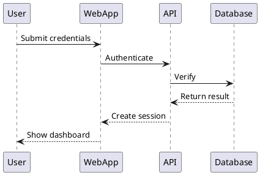

# Structurizr DSL Community Issues & Best Practices

> **Last Updated**: 2025-10-13
> **Sources**: GitHub Issues, Discussions, Stack Overflow, Community Blogs

---

## 高频社区问题

### 1. 前向引用/提升问题

**GitHub Discussion**: [#375 - Is forward referencing of identifiers supported?](https://github.com/structurizr/dsl/discussions/375)

**问题**: 为什么不能在定义元素之前引用它？

**背景**:
```structurizr
// 用户期望这样工作
model {
  a = softwareSystem "A"
  a -> b "Uses"          // ❌ b 尚未定义
  b = softwareSystem "B"
}
```

**官方解释** (Simon Brown):
> Structurizr DSL 是 Structurizr for Java 库的包装器，而 Java 主要是命令式语言。模型是按代码编写顺序逐步构建的，因此不支持前向引用/提升。

**解决方案**:
1. **按顺序定义**: 先定义再引用
2. **使用隐式关系**: 在元素块内部可以有限前向引用
3. **延迟关系定义**: 所有元素定义后再定义关系

**最佳实践**:
```structurizr
workspace {
  !identifiers hierarchical

  model {
    // 1. 先定义所有元素
    user = person "User"
    system = softwareSystem "System" {
      webapp = container "Web App"
      api = container "API"
      db = container "Database"
    }

    // 2. 再定义所有关系
    user -> system.webapp "Uses"
    system.webapp -> system.api "Calls"
    system.api -> system.db "Reads/Writes"
  }
}
```

---

### 2. 布局信息丢失问题

**常见投诉**: "每次修改 DSL 后手动调整的布局都丢失了！"

**根本原因**:
- DSL 文件不存储布局信息
- 布局存储在 `workspace.json` 中
- 元素重命名或顺序变化导致内部 ID 变化
- Structurizr 无法匹配新旧元素

**影响因素**:
1. **元素重命名**
2. **改变元素定义顺序**
3. **删除后重新添加元素**
4. **视图键未显式指定**

**解决方案**:

#### 方案 1: 使用稳定视图键

```structurizr
// ❌ 风险 - 自动生成键
views {
  systemContext system {
    include *
  }
}

// ✅ 安全 - 显式稳定键
views {
  systemContext system "SystemContext_2025" {
    include *
  }
}
```

#### 方案 2: 保持元素定义顺序

```bash
# 使用版本控制跟踪变化
git diff workspace.dsl

# 尽量只添加，不重新排序
```

#### 方案 3: 备份 workspace.json

```bash
# 修改 DSL 前备份
cp workspace.json workspace.json.backup

# 如果布局丢失，恢复
cp workspace.json.backup workspace.json
```

#### 方案 4: 使用自动布局

```structurizr
// 接受自动布局，不手动调整
views {
  systemContext system {
    include *
    autoLayout lr 300 300
  }
}
```

**社区共识**: 对于经常变化的模型，优先使用自动布局而非手动布局。

---

### 3. 分层标识符 vs 扁平标识符

**问题**: 何时使用分层标识符？

**扁平标识符 (默认)**:
```structurizr
model {
  system1_api = container "API"
  system2_api = container "API"  // 必须不同标识符
}
```

**优点**:
- 简单直接
- 适合小型模型

**缺点**:
- 标识符污染全局命名空间
- 必须手动确保唯一性

**分层标识符**:
```structurizr
workspace {
  !identifiers hierarchical

  model {
    system1 = softwareSystem "S1" {
      api = container "API"  // system1.api
    }
    system2 = softwareSystem "S2" {
      api = container "API"  // system2.api
    }
  }
}
```

**优点**:
- 命名空间隔离
- 更清晰的结构
- 适合大型模型

**缺点**:
- 引用时需要完整路径
- 轻微增加复杂性

**社区建议**:
- **小型模型 (< 5 系统)**: 扁平标识符
- **大型模型 (5+ 系统)**: 分层标识符
- **模块化项目**: 分层标识符 + !include

---

### 4. Workspace 作用域最佳实践

**GitHub Issue**: [#59 - Directory based includes](https://github.com/structurizr/dsl/issues/59)

**问题**: 如何组织大型企业架构？

**三种作用域模式**:

#### Landscape Workspace (全景)

```structurizr
// landscape.dsl
workspace {
  configuration {
    scope landscape
  }

  model {
    !include systems/ecommerce.dsl
    !include systems/inventory.dsl
    !include systems/payment.dsl
  }

  views {
    systemLandscape "EnterpriseLandscape" {
      include *
      autoLayout tb
    }
  }
}
```

**用途**: 高层次企业架构概览

---

#### Software System Workspace (单系统)

```structurizr
// ecommerce-system.dsl
workspace extends landscape.dsl {
  configuration {
    scope softwareSystem
  }

  model {
    !element ecommerce {
      webapp = container "Web App"
      api = container "API"
      db = container "Database"
    }
  }

  views {
    container ecommerce "EcommerceContainers" {
      include *
      autoLayout lr
    }
  }
}
```

**用途**: 团队维护自己的系统详细设计

---

#### None Scope (混合)

```structurizr
workspace {
  configuration {
    scope none  // 无限制
  }
}
```

**用途**: 灵活性优先的场景

---

### 5. 模块化和代码复用

**社区需求**: 如何避免重复定义？

**模式 1: 共享模型**

```
project/
├── workspace.dsl
├── shared/
│   ├── common-users.dsl
│   └── external-systems.dsl
└── systems/
    ├── system-a.dsl
    └── system-b.dsl
```

```structurizr
// workspace.dsl
workspace {
  model {
    !include shared/common-users.dsl
    !include shared/external-systems.dsl
    !include systems/system-a.dsl
    !include systems/system-b.dsl
  }
}

// shared/common-users.dsl
admin = person "Administrator"
customer = person "Customer"

// systems/system-a.dsl
systemA = softwareSystem "System A" {
  webapp = container "Web App"
}
customer -> systemA.webapp "Uses"
```

---

**模式 2: Workspace 扩展**

```structurizr
// base.dsl
workspace {
  model {
    sharedService = softwareSystem "Shared Service"
  }
}

// team-a.dsl
workspace extends base.dsl {
  model {
    teamASystem = softwareSystem "Team A System"
    teamASystem -> sharedService "Uses"
  }
}
```

---

**模式 3: 常量复用**

```structurizr
// constants.dsl
!const ORG_NAME "Acme Corp"
!const AWS_REGION "us-east-1"

// workspace.dsl
workspace {
  !include constants.dsl

  model {
    group "${ORG_NAME}" {
      system = softwareSystem "System"
    }

    deploymentEnvironment "Production" {
      deploymentNode "AWS ${AWS_REGION}" {
        containerInstance webapp
      }
    }
  }
}
```

---

### 6. 主题和样式管理

**问题**: 如何在多个 workspace 中保持一致的样式？

**方案 1: 共享样式文件**

```
project/
├── workspace-a.dsl
├── workspace-b.dsl
└── shared/
    └── styles.dsl
```

```structurizr
// shared/styles.dsl
styles {
  element "Person" {
    shape Person
    background #08427b
    color #ffffff
  }

  element "Software System" {
    background #1168bd
    color #ffffff
  }

  element "Container" {
    background #438dd5
    color #ffffff
  }

  element "Database" {
    shape Cylinder
  }
}

// workspace-a.dsl
workspace {
  model { ... }

  views {
    !include ../shared/styles.dsl

    systemContext system {
      include *
    }
  }
}
```

---

**方案 2: 自定义主题**

```json
// custom-theme.json
{
  "name": "Acme Corp Theme",
  "elements": [
    {
      "tag": "Person",
      "shape": "Person",
      "background": "#08427b",
      "color": "#ffffff"
    }
  ],
  "relationships": [
    {
      "tag": "Relationship",
      "thickness": 2,
      "color": "#707070"
    }
  ]
}
```

```structurizr
// 使用自定义主题
views {
  themes https://your-domain.com/themes/custom-theme.json
}
```

---

### 7. 动态视图 vs 时序图

**问题**: 何时使用 Structurizr 动态视图 vs PlantUML 时序图？

**Structurizr 动态视图**:
```structurizr
views {
  dynamic system "UserLogin" "User login flow" {
    user -> webapp "1. Submit credentials"
    webapp -> api "2. Authenticate"
    api -> database "3. Verify"
    database -> api "4. Return result"
    api -> webapp "5. Create session"
    webapp -> user "6. Show dashboard"

    autoLayout lr
  }
}
```

**优点**:
- 与模型集成
- 自动布局
- 一致的样式

**缺点**:
- 简单的顺序流
- 缺少分支/循环
- 不支持生命线

---

**PlantUML 时序图** (导出后):


**优点**:
- 丰富的时序图特性
- 支持 alt/opt/loop
- 生命线管理

**缺点**:
- 与 Structurizr 模型分离
- 手动维护同步

**社区建议**:
- **简单流程**: Structurizr 动态视图
- **复杂时序**: PlantUML/Mermaid 时序图
- **两者结合**: 在文档中混合使用

---

### 8. C4 模型深度问题

**问题**: 何时停止深入组件层？

**社区共识**:

**Level 1: System Context** - 总是需要
```structurizr
views {
  systemContext system "L1_Context" {
    include *
  }
}
```

**Level 2: Container** - 大多数情况需要
```structurizr
views {
  container system "L2_Container" {
    include *
  }
}
```

**Level 3: Component** - 选择性使用
```structurizr
views {
  component system.api "L3_Component_API" {
    include *
  }
}
```

**何时不用 Component 视图**:
- 容器内部逻辑简单
- 使用微服务架构 (容器即组件)
- 团队更喜欢直接看代码

**Level 4: Code** - 几乎不用
- IDE 已提供类图
- 维护成本高
- Structurizr 不直接支持

**建议**:
1. **所有系统**: Context + Container
2. **复杂容器**: 添加 Component 视图
3. **代码级**: 使用 IDE 工具

---

### 9. Structurizr vs C4-PlantUML 选择

**Stack Overflow 高频问题**: "我该用哪个？"

**对比**:

| 特性 | Structurizr DSL | C4-PlantUML |
|------|----------------|-------------|
| **学习曲线** | 中等 | 低 (如果熟悉 PlantUML) |
| **模型复用** | ✅ 单一模型，多视图 | ❌ 每个图表独立 |
| **工具生态** | Lite/Cloud/CLI | PlantUML 生态 |
| **自动布局** | Graphviz | PlantUML 布局 |
| **样式控制** | 主题 + 样式 | PlantUML skinparam |
| **交互性** | ✅ (Lite/Cloud) | ❌ 静态图片 |
| **文档集成** | ✅ 原生 | ❌ 需手动同步 |
| **版本控制** | ✅ DSL 文本 | ✅ PlantUML 文本 |
| **协作** | Workspace 共享 | 文件共享 |
| **导出** | 多格式 | PNG/SVG |

**社区建议 (Simon Brown)**:
> 大多数人应该使用 Structurizr DSL，并在需要时导出为 C4-PlantUML，而不是手工编写 PlantUML 定义。

**使用场景**:
- **Structurizr DSL**: 长期维护的架构文档、团队协作、多视图需求
- **C4-PlantUML**: 已有 PlantUML 工作流、简单单一图表、快速原型

---

### 10. Kroki 集成实践

**问题**: 如何在文档中嵌入 Structurizr 图表？

**方案 1: Kroki 图像链接**

```markdown
<!-- Markdown 文档 -->

```

**限制**:
- URI 长度限制
- 样式支持有限
- 无交互性

---

**方案 2: AsciiDoc + Structurizr 扩展**

```asciidoc
[structurizr,systemContext,svg]
----
workspace {
  model {
    user = person "User"
    system = softwareSystem "System"
    user -> system "Uses"
  }
  views {
    systemContext system {
      include *
      autoLayout
    }
  }
}
----
```

**优点**:
- 文档即代码
- 自动生成
- 版本控制

---

**方案 3: Structurizr Lite + 截图**

```bash
# 1. 启动 Lite
docker run -p 8080:8080 -v $(pwd):/usr/local/structurizr structurizr/lite

# 2. 浏览器访问并截图
# 3. 嵌入文档
```

**适用**: 演示文稿、报告

---

### 11. 部署视图最佳实践

**问题**: 如何建模复杂的云部署？

**模式 1: 多环境**

```structurizr
model {
  system = softwareSystem "System" {
    webapp = container "Web App"
    api = container "API"
    db = container "Database"
  }

  deploymentEnvironment "Development" {
    deploymentNode "Local Machine" {
      containerInstance webapp
      containerInstance api
      containerInstance db
    }
  }

  deploymentEnvironment "Production" {
    deploymentNode "AWS" {
      deploymentNode "CloudFront" {
        containerInstance webapp
      }

      deploymentNode "ECS" {
        containerInstance api instance 3
      }

      deploymentNode "RDS" {
        containerInstance db
      }
    }
  }
}
```

---

**模式 2: 基础设施节点**

```structurizr
deploymentEnvironment "Production" {
  deploymentNode "AWS" {
    infrastructureNode "Route 53" "DNS"
    infrastructureNode "ALB" "Load Balancer"

    deploymentNode "VPC" {
      deploymentNode "Public Subnet" {
        containerInstance webapp
      }

      deploymentNode "Private Subnet" {
        containerInstance api
        containerInstance db
      }
    }
  }
}
```

---

**模式 3: 容器实例数量**

```structurizr
deploymentNode "Kubernetes Cluster" {
  deploymentNode "api-deployment" {
    containerInstance api instances 5  // 5 个副本
  }
}
```

---

### 12. 文档和 ADR 集成

**问题**: 如何在 Structurizr 中管理架构决策？

**目录结构**:
```
project/
├── workspace.dsl
├── docs/
│   └── system/
│       ├── 01-overview.md
│       ├── 02-architecture.md
│       └── 03-deployment.md
└── adrs/
    └── system/
        ├── 0001-use-microservices.md
        ├── 0002-choose-database.md
        └── 0003-adopt-event-sourcing.md
```

**DSL 配置**:
```structurizr
workspace {
  model {
    system = softwareSystem "System" {
      !docs docs/system
      !adrs adrs/system
    }
  }
}
```

**ADR 格式** (MADR):
```markdown
# 2. Choose PostgreSQL as Primary Database

Date: 2025-01-15

## Status

Accepted

## Context

We need a relational database for transactional data...

## Decision

We will use PostgreSQL 15...

## Consequences

Positive:
- ACID compliance
- JSON support
- Strong community

Negative:
- Operational overhead
- Scaling challenges
```

**好处**:
- 决策历史可追溯
- 与架构模型关联
- 在 Structurizr 中浏览

---

### 13. 版本控制策略

**问题**: 如何管理 workspace.dsl 和 workspace.json？

**方案 1: 仅版本控制 DSL**

```gitignore
# .gitignore
workspace.json
.structurizr/
```

**优点**:
- DSL 是源文件
- 避免合并冲突

**缺点**:
- 手动布局丢失

---

**方案 2: 两者都版本控制**

```gitignore
# .gitignore
# (不忽略 workspace.json)
```

**优点**:
- 保留布局信息

**缺点**:
- JSON 合并冲突
- 仓库体积增大

---

**社区建议**:
1. **DSL 必须版本控制**
2. **workspace.json 可选版本控制**
3. **使用自动布局避免依赖 JSON**
4. **定期备份 workspace.json**

---

### 14. 团队协作工作流

**问题**: 多人如何协作维护架构？

**模式 1: 单一 Workspace (小团队)**

```
- 单个 workspace.dsl
- 团队成员直接编辑
- Pull Request 审查
```

**挑战**: 合并冲突

---

**模式 2: 模块化 Workspace (中型团队)**

```
workspace/
├── main.dsl
├── model/
│   ├── users.dsl
│   ├── system-a.dsl
│   └── system-b.dsl
└── views/
    ├── landscape.dsl
    ├── system-a-views.dsl
    └── system-b-views.dsl
```

```structurizr
// main.dsl
workspace {
  !include model/users.dsl
  !include model/system-a.dsl
  !include model/system-b.dsl

  views {
    !include views/landscape.dsl
    !include views/system-a-views.dsl
    !include views/system-b-views.dsl
  }
}
```

**优点**:
- 减少冲突
- 清晰的所有权

---

**模式 3: Workspace 扩展 (大型组织)**

```
enterprise/
├── landscape.dsl         # 企业全景
├── team-a/
│   └── workspace.dsl     # extends ../landscape.dsl
├── team-b/
│   └── workspace.dsl     # extends ../landscape.dsl
└── team-c/
    └── workspace.dsl     # extends ../landscape.dsl
```

**优点**:
- 团队自治
- 独立演进

**缺点**:
- 同步复杂性

---

### 15. 性能和规模限制

**问题**: Structurizr 能处理多大的模型？

**社区经验**:

| 规模 | 元素数量 | 性能 | 建议 |
|------|---------|------|------|
| 小型 | < 50 | ✅ 优秀 | 单一 workspace |
| 中型 | 50-200 | ✅ 良好 | 分层标识符 + 模块化 |
| 大型 | 200-500 | ⚠️ 可用 | Workspace 扩展 + 按系统拆分 |
| 超大型 | 500+ | ❌ 慢 | 多个独立 workspace |

**优化技巧**:
1. **拆分视图**: 不要在一个视图中包含所有元素
2. **使用过滤**: `include` 特定元素而非 `*`
3. **延迟加载**: 按需加载详细视图
4. **简化关系**: 移除冗余关系

---

### 16. Structurizr Cloud vs Lite vs On-Premises

**选择指南**:

**Structurizr Cloud** (付费):
- ✅ 托管服务
- ✅ 团队协作
- ✅ 完整功能
- ❌ 需订阅

**Structurizr Lite** (免费):
- ✅ 开源
- ✅ 本地运行
- ✅ 适合开发
- ❌ 单用户
- ❌ 无持久化 (需手动保存)

**Structurizr On-Premises** (免费):
- ✅ 自托管
- ✅ 多用户
- ✅ 完整功能
- ❌ 需自行维护

**社区建议**:
- **个人/小团队**: Lite
- **企业**: Cloud 或 On-Premises
- **开发**: Lite + CLI
- **生产**: Cloud (便利) 或 On-Premises (安全)

---

## 常见反模式

### ❌ 反模式 1: 过度详细的组件视图

```structurizr
// 不要为每个类创建组件
component "UserController"
component "UserService"
component "UserRepository"
component "UserEntity"
component "UserDTO"
component "UserValidator"
// ... 100+ 组件
```

**建议**: 组件应该是有意义的架构单元，而非代码级类

---

### ❌ 反模式 2: 忽略隐含关系

```structurizr
// 手动重复定义所有关系
user -> system
user -> system.webapp
user -> system.webapp.controller
```

**建议**: 使用 `!impliedRelationships true` 自动推导

---

### ❌ 反模式 3: 硬编码值

```structurizr
// 多处重复相同值
"https://api.example.com"
"https://api.example.com"
"https://api.example.com"
```

**建议**: 使用常量
```structurizr
!const API_URL "https://api.example.com"
url "${API_URL}"
```

---

## 社区工具推荐

### IDE 插件

1. **VS Code**: [Structurizr DSL Extension](https://marketplace.visualstudio.com/items?itemName=systemticks.c4-dsl-extension)
   - 语法高亮
   - 代码片段
   - 预览

2. **IntelliJ IDEA**: [Structurizr Plugin](https://plugins.jetbrains.com/plugin/17270-structurizr-dsl)
   - 自动完成
   - 错误检查

---

### 辅助工具

1. **Structurizr CLI**: 验证、导出、推送
2. **Structurizr Site Generatr**: 生成静态网站
3. **Asciidoctor Structurizr**: 文档嵌入
4. **Kroki**: 图表渲染服务

---

## 学习资源

### 官方资源

- **文档**: https://docs.structurizr.com/
- **教程**: https://docs.structurizr.com/dsl/tutorial
- **Cookbook**: https://docs.structurizr.com/dsl/cookbook
- **视频**: [C4 models as code](https://www.youtube.com/watch?v=Za1-v4Zkq5E)

### 社区资源

- **GitHub**: https://github.com/structurizr/dsl
- **Discussions**: https://github.com/structurizr/dsl/discussions
- **Stack Overflow**: Tag `structurizr`
- **Blog**: https://simonbrown.je/

### 示例项目

- **官方示例**: https://github.com/structurizr/examples
- **Big Bank**: https://structurizr.com/share/36141
- **实际案例**: 社区成员分享的 workspace

---

## 快速问题检查清单

在发布 GitHub Issue 前,检查以下内容:

- [ ] 是否按顺序定义元素？
- [ ] 是否使用了唯一的元素名称？
- [ ] 是否指定了稳定的视图键？
- [ ] 是否使用 Structurizr CLI 验证了 DSL？
- [ ] 是否查看了 FAQ 和 Troubleshooting 文档？
- [ ] 是否搜索了已有的 Issues 和 Discussions？
- [ ] 是否提供了最小复现示例？

---

## 获取帮助

### GitHub Discussions (推荐)

- 提问: https://github.com/structurizr/dsl/discussions
- 功能建议: Feature Requests 分类
- 展示作品: Show and Tell 分类

### GitHub Issues

- 仅用于 Bug 报告
- 提供最小复现示例
- 包含 DSL 版本信息

### Stack Overflow

- Tag: `structurizr`
- Tag: `c4-model`

### 商业支持

- Structurizr Cloud 订阅
- Simon Brown 咨询服务

---

## 社区贡献

### 如何贡献

1. **报告 Bug**: GitHub Issues
2. **功能建议**: GitHub Discussions
3. **文档改进**: Pull Request
4. **分享示例**: Discussions - Show and Tell
5. **回答问题**: Discussions - Q&A

### 代码贡献

- DSL Parser: https://github.com/structurizr/dsl
- Java Library: https://github.com/structurizr/java
- CLI: https://github.com/structurizr/cli
- Lite: https://github.com/structurizr/lite

---

**Structurizr 社区** - 活跃、友好、专业的架构师社区
