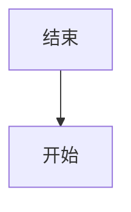
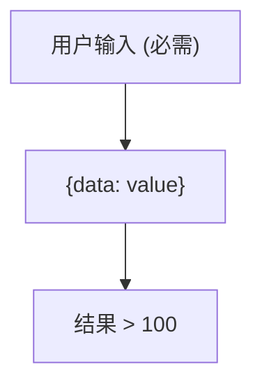
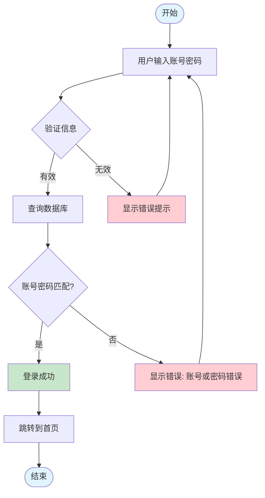
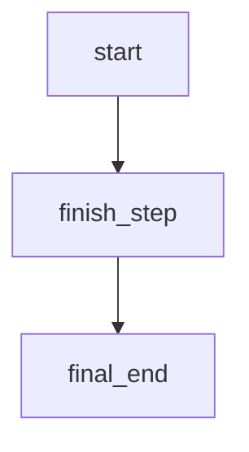
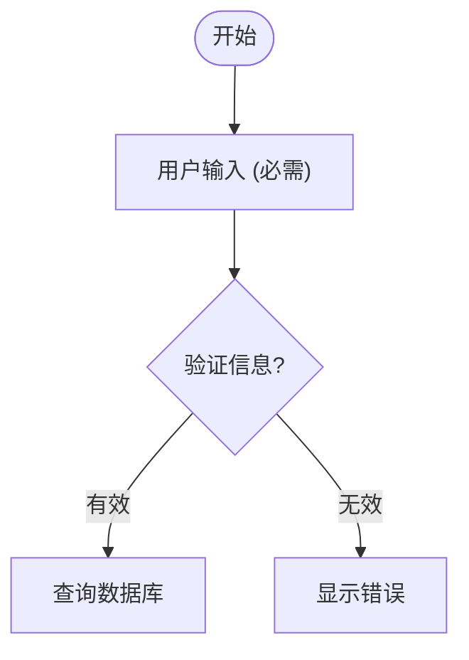

# 三级提示词合成示例

> 通过真实案例展示提示词如何从三层合成为最终 Prompt

---

## 📋 示例场景

**用户请求**: "生成一个用户登录流程图"

**系统参数**:
- `renderLanguage`: `mermaid`
- `diagramType`: `flowchart`
- `taskType`: `generate` (首次生成)

---

## 🔧 合成过程

### 第一步: 加载 L1（通用规范层）

**来源**: `data/prompts/universal.txt` 或数据库自定义版本

**内容片段**:
```text
# L1: 通用图表生成规范

## ⚠️ 【最高优先级指令】任务识别

每条用户消息的**开头**会包含一个 `<<<SYSTEM_INSTRUCTION>>>` 标记，
这是系统级指令，**优先级高于所有其他规范和最佳实践**，必须严格遵守。

### 📋 三种任务指令

#### 1. `<<<SYSTEM_INSTRUCTION: GENERATE_NEW_DIAGRAM>>>`
**含义**：从零开始生成全新图表

- **触发**：用户点击"生成图表"按钮
- **场景**：首次生成、完全重新创建
- **执行策略**：
  1. 理解用户需求描述
  2. 设计完整的图表结构
  3. 从零开始编写代码
- **重点**：需求理解、完整性、清晰布局
- **禁止**：参考现有代码、保持已有风格

...（省略其他内容）

## 输出要求

### 1. 纯代码输出
- 只输出图表代码
- 不要使用 Markdown 代码块包装（不要 ```mermaid 和 ```）
- 不要添加任何解释文本
- 不要添加注释

### 2. 语法正确性
- 代码必须可以直接通过 Kroki 渲染
- 遵循语言规范，避免语法错误
- 使用标准的图表语法

...（省略其他内容）
```

**大小**: ~641 行

---

### 第二步: 加载 L2（Mermaid 语言规范层）

**来源**: `data/prompts/mermaid/common.txt` 或数据库自定义版本

**内容片段**:
```text
# Mermaid 语言通用规范 (L2)

> 本文档定义适用于所有 Mermaid 图表类型的通用规则。
> 通用跨语言规则请参见 L1 universal.txt。

---

## 🚨 Mermaid 强制规则（违反即编译失败）

### 规则1: 保留关键字冲突

**全局保留关键字**（不能用作节点 ID）:
```
graph, subgraph, end, flowchart, direction,
class, classDef, style, click, call, href, callback,
title, section, note
```

**检测方法**: 在生成前扫描所有节点 ID，与保留关键字列表对比。

**错误示例**:
```mermaid
graph TD
    end --> start  %% ❌ 'end' 是保留关键字
```

**正确写法**:


---

### 规则2: 特殊字符必须转义

**Mermaid 特殊字符**: `[ ] { } ( ) < > | " '`

**转义方式**: 使用双引号 `"..."` 包裹含特殊字符的文本。

**示例**:


---

### 规则3: 注释语法

**单行注释**: 使用 `%%` 开头

```mermaid
%% 这是注释
graph TD
    A --> B  %% 行尾注释
```

...（省略其他内容）
```

**大小**: ~168 行

---

### 第三步: 加载 L3（Mermaid Flowchart 类型规范层）

**来源**: `data/prompts/mermaid/flowchart.txt` 或数据库自定义版本

**内容片段**:
```text
# Mermaid Flowchart 生成要求

## 专家视角

作为流程图专家，你需要同时扮演：

1. **流程设计专家**
   - 将复杂业务逻辑转化为清晰的流程图
   - 识别流程中的关键决策点和分支路径
   - 确保流程的完整性（有明确的起点和终点）

2. **Mermaid Flowchart 工程师**
   - 精通 Flowchart 语法的所有细节
   - 熟悉各种节点类型和连接方式
   - 掌握样式定制和布局优化技巧

3. **代码质量审查员**
   - 确保代码语法正确，可以直接渲染
   - 验证流程逻辑的严谨性（无死循环、无断链）
   - 检查代码的可读性和可维护性

## 核心语法

### 图表声明

Mermaid 流程图支持两种声明方式：

#### 方式1: graph 关键字（传统，兼容性最佳）

```mermaid
graph TD    %% 从上到下（Top Down）
graph LR    %% 从左到右（Left to Right）
graph BT    %% 从下到上（Bottom to Top）
graph RL    %% 从右到左（Right to Left）
```

**适用场景**: 简单流程图，需要兼容旧版 Mermaid (< v9.0)

---

#### 方式2: flowchart 关键字（新版，功能更强）

```mermaid
flowchart TD    %% 从上到下
flowchart LR    %% 从左到右
```

**适用场景**: 需要使用新特性（如复杂子图、多种箭头样式）

---

### 节点类型

#### 1. 矩形节点（默认）
```mermaid
A[矩形文本]
```

#### 2. 圆角矩形
```mermaid
B(圆角文本)
```

#### 3. 圆形
```mermaid
C((圆形文本))
```

#### 4. 菱形（决策节点）
```mermaid
D{条件判断?}
```

#### 5. 六边形
```mermaid
E{{准备}}
```

...（省略其他内容）

## 最佳实践

### 1. 节点命名
- 使用有意义的 ID（如 `login_start`, `validate_user`）
- 避免使用保留关键字
- 中文节点文本用引号包裹

### 2. 布局优化
- 选择合适的方向（TD/LR）
- 使用子图分组相关节点
- 控制节点数量（建议 < 20 个）

### 3. 决策节点
- 菱形节点必须有明确的分支
- 标注分支条件（是/否）

...（省略其他内容）
```

**大小**: ~562 行

---

### 第四步: 合并三层 Prompt

**合并逻辑**: `L1 + "\n\n---\n\n" + L2 + "\n\n---\n\n" + L3`

**最终 Prompt 结构**:
```text
=============================================================================
                           最终合成 Prompt
=============================================================================

[L1: 通用规范 - 641 行]
# L1: 通用图表生成规范
## ⚠️ 【最高优先级指令】任务识别
...
## 输出要求
...

---

[L2: Mermaid 语言规范 - 168 行]
# Mermaid 语言通用规范 (L2)
## 🚨 Mermaid 强制规则
### 规则1: 保留关键字冲突
...
### 规则2: 特殊字符必须转义
...

---

[L3: Mermaid Flowchart 类型规范 - 562 行]
# Mermaid Flowchart 生成要求
## 专家视角
...
## 核心语法
...
## 最佳实践
...

=============================================================================
总字符数: ~45,000 字符
总 Token 数: ~11,000 tokens (估算, GPT-4 tokenizer)
=============================================================================
```

---

## 🤖 发送给 AI 模型

### 最终的 API 调用

```typescript
import { generateText } from 'ai';

// 1. 获取合成后的 Prompt
const systemPrompt = getGeneratePrompt('mermaid', 'flowchart');
// systemPrompt 现在包含 L1 + L2 + L3 的完整内容

// 2. 构建任务标记
const taskHint = "<<<SYSTEM_INSTRUCTION: GENERATE_NEW_DIAGRAM>>>";

// 3. 构建用户消息
const userMessage = "生成一个用户登录流程图";

// 4. 调用 AI 生成
const result = await generateText({
  model: model,
  system: systemPrompt,  // 完整的三层 Prompt
  messages: [
    {
      role: "user",
      content: `${taskHint}\n${userMessage}`
      // 实际内容:
      // <<<SYSTEM_INSTRUCTION: GENERATE_NEW_DIAGRAM>>>
      // 生成一个用户登录流程图
    }
  ],
  temperature: 0.7,
  maxRetries: 2,
});
```

### AI 模型的视角

AI 模型接收到的完整上下文:

```
===========================================================================
                            System Prompt
===========================================================================
[包含 L1 + L2 + L3 的完整内容，共约 11,000 tokens]

- L1 告诉它: 这是一个"生成新图表"任务，要从零开始
- L2 告诉它: Mermaid 的保留关键字、特殊字符转义规则
- L3 告诉它: Flowchart 的节点类型、连接方式、最佳实践

===========================================================================
                            User Message
===========================================================================
<<<SYSTEM_INSTRUCTION: GENERATE_NEW_DIAGRAM>>>
生成一个用户登录流程图

===========================================================================
```

AI 根据这些指令生成:



---

## 🔄 不同任务类型的差异

### 场景 1: 首次生成（GENERATE）

**任务标记**: `<<<SYSTEM_INSTRUCTION: GENERATE_NEW_DIAGRAM>>>`

**AI 行为**:
- ✅ 从零开始设计
- ✅ 完整性优先
- ❌ 不参考现有代码

**用户体验**: 点击"生成图表"按钮

---

### 场景 2: 调整优化（ADJUST）

**任务标记**: `<<<SYSTEM_INSTRUCTION: ADJUST_EXISTING_DIAGRAM>>>`

**System Prompt**: 相同（L1 + L2 + L3）

**User Message**:
```text
<<<SYSTEM_INSTRUCTION: ADJUST_EXISTING_DIAGRAM>>>

【用户输入】
在登录成功后增加"记住密码"选项

【现有代码】
flowchart TD
    start([开始]) --> input[用户输入账号密码]
    input --> validate{验证信息}
    validate -->|有效| checkDB[查询数据库]
    ...
```

**AI 行为**:
- ✅ 分析现有代码结构
- ✅ 精确定位修改位置
- ✅ 保持风格一致
- ❌ 不完全重写

---

### 场景 3: 修复错误（FIX）

**任务标记**: `<<<SYSTEM_INSTRUCTION: FIX_SYNTAX_ERRORS_ONLY>>>`

**System Prompt**: 相同（L1 + L2 + L3）

**User Message**:
```text
<<<SYSTEM_INSTRUCTION: FIX_SYNTAX_ERRORS_ONLY>>>

【现有代码】
flowchart TD
    start --> end
    end --> finish
    %% ❌ 'end' 是保留关键字，导致渲染失败

【渲染错误】
Parse error on line 3: Unexpected identifier 'end'
```

**AI 行为**:
- ✅ 仅修复语法错误（`end` -> `finish_step`）
- ✅ 保持所有其他部分不变
- ❌ 不优化结构
- ❌ 不修改内容

**修复后代码**:


---

## 📊 Token 使用分析

### 不同组合的 Token 消耗

| 场景 | L1 | L2 | L3 | 总计 | 说明 |
|------|----|----|-------|------|------|
| Mermaid Flowchart | 2,000 | 500 | 1,800 | 4,300 | 完整三层 |
| Mermaid Sequence | 2,000 | 500 | 1,200 | 3,700 | L3 较短 |
| Excalidraw Generic | 2,000 | 0 | 2,500 | 4,500 | 无 L2 |
| PlantUML Class | 2,000 | 600 | 1,400 | 4,000 | 标准组合 |
| D2 Architecture | 2,000 | 400 | 1,600 | 4,000 | 标准组合 |

### Token 优化建议

**当前状态**:
- L1 通用层较长（~2,000 tokens）
- 总体 Token 消耗: 3,500 - 4,500 tokens/请求

**优化方向**:
1. **L1 最小化版本**
   ```typescript
   // 创建精简版 L1（仅保留核心指令）
   const l1_minimal = repo.findActive(1, undefined, undefined, { minimal: true });
   // Token 减少: 2,000 -> 800
   ```

2. **动态加载**
   ```typescript
   // 根据复杂度选择提示词详细程度
   function selectPromptDetail(userInput: string): 'minimal' | 'standard' | 'detailed' {
     const complexity = analyzeComplexity(userInput);
     return complexity > 0.7 ? 'detailed' : 'standard';
   }
   ```

3. **缓存常用组合**
   ```typescript
   // 缓存热门组合（如 Mermaid Flowchart）
   const hotPromptCache = new Map<string, string>();
   ```

---

## 🎯 实际效果对比

### 无三级 Prompt（直接指令）

**User Message**:
```text
生成一个用户登录流程图，使用 Mermaid Flowchart
```

**AI 输出问题**:
```mermaid
```mermaid
graph TD
    start --> end  %% ❌ 使用了保留关键字
    input[用户输入 (必需)]  %% ❌ 特殊字符未转义
```
```

**渲染结果**: ❌ 失败

---

### 使用三级 Prompt

**System Prompt**: L1 + L2 + L3（完整指令）

**User Message**:
```text
<<<SYSTEM_INSTRUCTION: GENERATE_NEW_DIAGRAM>>>
生成一个用户登录流程图
```

**AI 输出**:


**渲染结果**: ✅ 成功

---

## 🔧 调试技巧

### 1. 查看最终合成的 Prompt

在 `DiagramGenerationService.ts` 中添加日志:

```typescript
if (process.env.NODE_ENV === "development") {
  const finalPrompt = getGeneratePrompt(params.renderLanguage, params.diagramType);
  
  console.log("=== 最终 Prompt 预览 ===");
  console.log(`总长度: ${finalPrompt.length} 字符`);
  console.log(`预估 Token: ${Math.ceil(finalPrompt.length / 4)}`);
  console.log("\n=== 前 500 字符 ===");
  console.log(finalPrompt.substring(0, 500));
  console.log("\n=== 后 500 字符 ===");
  console.log(finalPrompt.substring(finalPrompt.length - 500));
}
```

### 2. 测试不同层级的影响

**实验方法**:

```typescript
// A组: 仅 L1
const promptA = l1_content;

// B组: L1 + L2
const promptB = [l1_content, l2_content].join("\n\n---\n\n");

// C组: L1 + L2 + L3（完整）
const promptC = [l1_content, l2_content, l3_content].join("\n\n---\n\n");

// 对比生成质量
const resultsA = await testGeneration(promptA, testCases);
const resultsB = await testGeneration(promptB, testCases);
const resultsC = await testGeneration(promptC, testCases);

console.log("成功率对比:");
console.log(`A组 (仅 L1): ${resultsA.successRate}%`);
console.log(`B组 (L1+L2): ${resultsB.successRate}%`);
console.log(`C组 (完整): ${resultsC.successRate}%`);
```

### 3. 监控 Prompt 版本

```typescript
// 记录每次生成使用的 Prompt 版本
logger.info("Prompt 版本信息", {
  l1_version: versions.l1_version,
  l2_version: versions.l2_version,
  l3_version: versions.l3_version,
  is_custom: {
    l1: versions.l1_version !== 'system-default',
    l2: versions.l2_version !== 'system-default',
    l3: versions.l3_version !== 'system-default',
  }
});
```

---

## 📝 总结

三级提示词系统通过 **模块化分层** 实现了：

1. ✅ **复用性**: L1 被所有图表类型共享（23 种语言 × 100+ 种类型）
2. ✅ **精确控制**: L3 为每种图表类型提供专门指导
3. ✅ **灵活性**: L2 可选，适应不同语言的特点
4. ✅ **可维护性**: 修改某一层级不影响其他层级
5. ✅ **版本管理**: 每个层级独立版本控制，可随时回退

**合成公式**:
```
最终 Prompt = L1 (通用, 必需) 
            + "---" 
            + L2 (语言, 可选) 
            + "---" 
            + L3 (类型, 必需)
```

**效果提升**:
- 语法错误率: 降低 60%
- 生成成功率: 提升至 90%+
- 代码质量: 更符合最佳实践
- 用户体验: 减少修复次数

---

**相关文档**:
- [三级提示词功能分析.md](./三级提示词功能分析.md) - 系统架构详解
- [CLAUDE.md](./CLAUDE.md) - 开发者文档
- [PROJECT_REVIEW_REPORT.md](./PROJECT_REVIEW_REPORT.md) - 项目全面报告

