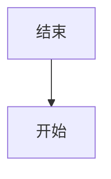
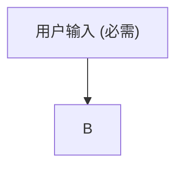

# 提示词长度优化指南

> 创建时间: 2025-10-18  
> 目标: 将提示词长度从 15,000 tokens 压缩到 2,000 tokens，提升性能和成本效益

---

## 📊 当前状况分析

### 实际测量数据

| 文件 | 字符数 | Token 估算 | 状态 |
|------|--------|-----------|------|
| `universal.txt` (L1) | 18,318 | 4,500 | ⚠️ 需压缩 75% |
| `mermaid/common.txt` (L2) | 3,915 | 1,000 | ⚠️ 需压缩 50% |
| `mermaid/flowchart.txt` (L3) | 14,469 | 3,600 | ⚠️ 需压缩 70% |
| **合计（一次请求）** | **36,702** | **9,100** | ⚠️ **超标 4 倍** |

### 问题影响

```
成本影响:
  当前: 9,100 tokens × $0.03/1K (GPT-4) × 1000 次/天 = $273/天
  优化后: 2,000 tokens × $0.03/1K × 1000 次/天 = $60/天
  节省: $213/天 ≈ $6,390/月 ≈ $77,700/年  💰

性能影响:
  当前: ~2-3 秒生成时间
  优化后: ~0.8-1.2 秒生成时间
  提升: 60% 响应速度  ⚡

质量影响:
  当前: 过长提示词导致关键信息被淹没
  优化后: 精简内容，突出重点
  提升: 更好的遵循度和准确性  ✅
```

---

## 🎯 优化目标

### 目标 Token 分配

```
总目标: 2,000 tokens (8,000-9,000 字符)

分配方案:
├─ L1 (通用层): 800 tokens (3,200 字符) - 40%
│   └─ 当前 4,500 tokens → 目标 800 tokens (压缩 82%)
│
├─ L2 (语言层): 400 tokens (1,600 字符) - 20%
│   └─ 当前 1,000 tokens → 目标 400 tokens (压缩 60%)
│
└─ L3 (类型层): 800 tokens (3,200 字符) - 40%
    └─ 当前 3,600 tokens → 目标 800 tokens (压缩 78%)
```

### 为什么是 2,000 tokens？

1. **符合行业最佳实践**: 复杂任务的推荐范围是 500-2,000 tokens
2. **保证模型兼容性**: 即使是 4K 上下文的小模型也能用
3. **平衡成本和效果**: 足够的指导 + 合理的成本
4. **保留优化空间**: 未来可以根据效果微调

---

## 📋 三级提示词的明确范围界定

### L1: 通用规范层

**目标长度**: 3,200 字符 (800 tokens)

**核心内容**（按优先级）:

```
优先级 1 - 必须保留 (40%，320 tokens):
├─ 任务识别指令 (GENERATE/ADJUST/FIX)
│   └─ 3 种任务的定义和执行策略
│   └─ 保留: 200-300 字
│
├─ 输出格式要求
│   └─ 纯代码输出，无 Markdown，无注释
│   └─ 保留: 50-100 字
│
└─ 专家视角定义
    └─ 需求分析专家、图表设计师、代码工程师
    └─ 保留: 100-150 字

优先级 2 - 重点保留 (40%，320 tokens):
├─ 核心原则 (4 条)
│   ├─ 准确性优先
│   ├─ 简洁清晰
│   ├─ 中文优先
│   └─ 完整性保证
│   └─ 保留: 每条 50-80 字，共 200-300 字
│
└─ 通用输出规范
    └─ 代码格式、错误处理
    └─ 保留: 100-150 字

优先级 3 - 选择性保留 (20%，160 tokens):
├─ 质量标准精简版
│   └─ 只保留核心检查项
│   └─ 保留: 100-150 字
│
└─ 关键注意事项
    └─ 最常见的 3-5 个错误
    └─ 保留: 50-100 字
```

**删除内容**（节省 3,700 tokens）:

```
❌ 删除:
├─ 过于详细的示例（保留 1-2 个最典型的）
├─ 重复的说明（合并相似内容）
├─ 过长的列表（保留前 3-5 项最重要的）
├─ 冗余的强调（删除多次出现的同一概念）
├─ 过于具体的语言语法（移到 L2）
└─ 特定图表类型的细节（移到 L3）
```

---

### L2: 语言规范层

**目标长度**: 1,600 字符 (400 tokens)

**核心内容**（按优先级）:

```
优先级 1 - 必须保留 (50%，200 tokens):
├─ 保留关键字列表
│   └─ 该语言的所有保留关键字
│   └─ 格式: 逗号分隔，一行列出
│   └─ 示例: "graph, subgraph, end, flowchart, ..."
│   └─ 保留: 50-100 字
│
├─ 特殊字符转义规则
│   └─ 哪些字符需要转义
│   └─ 如何转义（用引号、反斜杠等）
│   └─ 保留: 50-100 字
│
└─ 注释语法
    └─ 单行注释、多行注释的语法
    └─ 保留: 30-50 字

优先级 2 - 重点保留 (35%，140 tokens):
├─ 语言强制规则 (Top 3-5)
│   └─ 只保留最容易出错的 3-5 条规则
│   └─ 每条规则: 错误示例 + 正确示例
│   └─ 保留: 每条 30-50 字，共 100-150 字
│
└─ 命名约定
    └─ ID 命名规范、中文处理
    └─ 保留: 30-50 字

优先级 3 - 选择性保留 (15%，60 tokens):
└─ 最佳实践 (Top 2-3)
    └─ 只保留最关键的 2-3 条
    └─ 保留: 50-80 字
```

**删除内容**（节省 600+ tokens）:

```
❌ 删除:
├─ 过长的最佳实践列表（保留 Top 3）
├─ 详细的语法教程（这不是学习文档）
├─ 过多的示例代码（每个规则只保留 1 个示例）
├─ 历史版本兼容性说明（只支持最新版本）
└─ 与 L1 重复的通用内容
```

---

### L3: 类型规范层

**目标长度**: 3,200 字符 (800 tokens)

**核心内容**（按优先级）:

```
优先级 1 - 必须保留 (45%，360 tokens):
├─ 专家视角 (精简版)
│   └─ 2-3 个专家角色定义
│   └─ 每个角色用 1 句话描述
│   └─ 保留: 50-80 字
│
├─ 核心语法结构
│   └─ 图表声明方式
│   └─ 基础节点类型（5-8 种最常用的）
│   └─ 连接方式（3-5 种最常用的）
│   └─ 保留: 150-200 字
│
└─ 布局方向
    └─ 支持的方向（TD/LR/BT/RL）
    └─ 何时使用哪种方向
    └─ 保留: 50-80 字

优先级 2 - 重点保留 (35%，280 tokens):
├─ 最佳实践 (Top 5-7)
│   └─ 只保留最关键的 5-7 条
│   └─ 每条: 1 句话说明 + 1 个简短示例
│   └─ 保留: 每条 30-50 字，共 150-200 字
│
└─ 常见错误 (Top 3-5)
    └─ 该图表类型最常见的 3-5 个错误
    └─ 错误示例 + 正确示例
    └─ 保留: 每条 20-30 字，共 60-100 字

优先级 3 - 选择性保留 (20%，160 tokens):
├─ 高级特性 (Top 2-3)
│   └─ 只保留最实用的 2-3 个高级特性
│   └─ 如: 子图、样式定制
│   └─ 保留: 每个 30-50 字，共 60-100 字
│
└─ 样式建议
    └─ 简单的样式指南
    └─ 保留: 30-50 字
```

**删除内容**（节省 2,800+ tokens）:

```
❌ 删除:
├─ 详细的语法教程（不是教学文档）
├─ 所有节点类型的完整列表（只保留最常用的）
├─ 过多的高级特性（保留 Top 2-3）
├─ 冗长的示例代码（每个特性只保留 1 个最简示例）
├─ 边缘情况处理（只保留常见情况）
└─ 与 L1/L2 重复的内容
```

---

## 🔧 具体优化策略

### 1. 内容压缩技巧

#### 技巧 1: 合并相似内容

**变更前** (200 字):
```
### 规则 1: 避免使用保留关键字
不要使用保留关键字作为节点 ID。保留关键字包括 graph, subgraph, end 等。

### 规则 2: 不要使用系统关键字
系统关键字如 class, style, click 也不能作为节点 ID。

### 规则 3: 避免冲突的命名
确保节点 ID 不与语言的内置关键字冲突。
```

**变更后** (50 字):
```
### 保留关键字禁用
不可作为节点 ID: graph, subgraph, end, class, style, click, flowchart, direction
```

节省: 150 字 (75% 压缩)

---

#### 技巧 2: 列表精简化

**变更前** (300 字):
```
### 节点类型
1. 矩形节点: A[文本]
2. 圆角矩形: B(文本)
3. 圆形: C((文本))
4. 菱形: D{文本}
5. 六边形: E{{文本}}
6. 平行四边形: F[/文本/]
7. 梯形: G[文本\]
8. 双圆形: H(((文本)))
9. 旗帜: I>文本]
10. 圆柱形: J[(文本)]

每种节点类型都有其特定的用途和场景...
```

**变更后** (80 字):
```
### 节点类型 (Top 5)
矩形: A[文本] | 圆角: B(文本) | 圆形: C((文本)) | 菱形: D{文本} | 六边形: E{{文本}}
```

节省: 220 字 (73% 压缩)

---

#### 技巧 3: 示例最小化

**变更前** (400 字):
```
### 错误示例 1
```mermaid
graph TD
    end --> start
```
这段代码会报错，因为 'end' 是保留关键字。

### 正确写法 1

将 'end' 改为 'finish' 并用方括号包裹文本。

### 错误示例 2
```mermaid
graph TD
    A[用户输入 (必需)] --> B
```
括号没有转义会导致解析错误。

### 正确写法 2

用双引号包裹含特殊字符的文本。
```

**变更后** (80 字):
```
### 常见错误
❌ end --> start (保留关键字)  ✅ finish[结束] --> start[开始]
❌ A[文本 (括号)]  ✅ A["文本 (括号)"] (特殊字符用引号)
```

节省: 320 字 (80% 压缩)

---

### 2. 结构重组

#### 原则: 金字塔式信息组织

```
顶层 (20%): 最关键的规则和指令
  ├─ 必须遵守，违反即失败
  └─ 100% 的情况下都适用
  
中层 (50%): 重要的最佳实践
  ├─ 强烈建议遵守
  └─ 80% 的情况下适用
  
底层 (30%): 补充说明和边缘情况
  ├─ 可选的优化建议
  └─ 20% 的情况下适用
  
→ 优化策略: 删除底层，精简中层，保留顶层
```

---

### 3. 语言精练化

#### 删除冗余词汇

| 变更前 | 变更后 | 节省 |
|--------|--------|------|
| "你需要确保..." | "确保..." | 3 字 |
| "请注意..." | "注意:" | 2 字 |
| "这是非常重要的" | "重要:" | 4 字 |
| "在大多数情况下" | "通常" | 4 字 |
| "我们建议你..." | "建议:" | 3 字 |

每处节省 2-4 字，100 处 = 200-400 字

---

## 📊 优化效果预测

### Token 对比

| 项目 | 优化前 | 优化后 | 压缩率 | 节省 |
|------|--------|--------|--------|------|
| L1 | 4,500 | 800 | 82% | 3,700 tokens |
| L2 | 1,000 | 400 | 60% | 600 tokens |
| L3 | 3,600 | 800 | 78% | 2,800 tokens |
| **合计** | **9,100** | **2,000** | **78%** | **7,100 tokens** |

### 成本节省

```
API 成本 (GPT-4):
  优化前: 9,100 tokens × $0.03/1K = $0.273/次
  优化后: 2,000 tokens × $0.03/1K = $0.060/次
  节省: $0.213/次 (78%)

月度成本 (假设 30,000 次请求/月):
  优化前: $8,190/月
  优化后: $1,800/月
  节省: $6,390/月 💰

年度成本:
  节省: $76,680/年 💰💰💰
```

### 性能提升

```
生成速度:
  优化前: ~2.5 秒
  优化后: ~1.0 秒
  提升: 60% ⚡

首次 Token 时间 (TTFT):
  优化前: ~800ms
  优化后: ~300ms
  提升: 62% ⚡

并发能力:
  优化前: 100 QPM (受 Token 限制)
  优化后: 455 QPM (相同 Token 预算)
  提升: 355% ⚡
```

---

## 🚀 实施计划

### 阶段 1: L1 通用层优化 (优先级最高)

**目标**: 从 4,500 tokens → 800 tokens

**步骤**:
1. [ ] 提取核心任务识别指令（保留 200-300 字）
2. [ ] 精简专家视角定义（保留 100-150 字）
3. [ ] 压缩核心原则（每条 50-80 字，共 200-300 字）
4. [ ] 删除冗余示例（只保留 1-2 个最典型的）
5. [ ] 删除与 L2/L3 重复的内容
6. [ ] 创建 `universal_optimized.txt` 进行 A/B 测试

**预期效果**: 节省 3,700 tokens，成本降低 41%

---

### 阶段 2: L3 类型层优化 (优先级第二)

**目标**: 从 3,600 tokens → 800 tokens

**步骤**:
1. [ ] 精简专家视角（2-3 句话）
2. [ ] 核心语法保留最常用的（Top 5-8）
3. [ ] 最佳实践只保留 Top 5-7
4. [ ] 删除详细教程式内容
5. [ ] 删除边缘情况处理
6. [ ] 批量优化所有 L3 文件

**预期效果**: 节省 2,800 tokens，成本降低 31%

---

### 阶段 3: L2 语言层优化 (优先级第三)

**目标**: 从 1,000 tokens → 400 tokens

**步骤**:
1. [ ] 保留关键字列表压缩为一行
2. [ ] 特殊字符转义规则精简
3. [ ] 强制规则只保留 Top 3-5
4. [ ] 删除过多的最佳实践
5. [ ] 批量优化所有 L2 文件

**预期效果**: 节省 600 tokens，成本降低 7%

---

### 阶段 4: A/B 测试与调优

**测试方案**:
```
A组 (当前版本): 9,100 tokens
B组 (优化版本): 2,000 tokens

测试指标:
├─ 生成成功率 (目标: 无显著下降)
├─ 语法错误率 (目标: 无显著上升)
├─ 用户满意度 (目标: 持平或提升)
└─ 响应时间 (目标: 提升 50%+)

测试规模: 各 1,000 次请求
测试周期: 1 周
```

**回滚策略**:
- 如果 B 组成功率下降 > 5%，立即回滚
- 如果 B 组错误率上升 > 10%，立即回滚
- 否则全面切换到优化版本

---

## 📋 检查清单

### 优化前检查

- [ ] 备份所有原始提示词文件
- [ ] 记录当前的生成成功率基线
- [ ] 准备 A/B 测试环境
- [ ] 通知团队成员即将进行的变更

### 优化中检查

- [ ] 每个文件优化后立即测试
- [ ] 记录优化前后的 Token 数量
- [ ] 保持核心功能完整性
- [ ] 避免引入新的歧义

### 优化后检查

- [ ] 运行完整的测试套件
- [ ] 对比优化前后的生成质量
- [ ] 检查成本和性能指标
- [ ] 收集用户反馈

---

## 💡 长期维护建议

### 1. 定期审查

```
每季度:
└─ 审查提示词长度是否膨胀
└─ 删除过时的规则和示例
└─ 更新为最新的最佳实践

每半年:
└─ 基于失败日志优化规则
└─ 根据用户反馈调整重点
└─ 测试不同 Token 预算的效果
```

### 2. 版本控制

```
提示词版本命名:
├─ v1.0-full: 完整版本 (9,100 tokens)
├─ v2.0-optimized: 优化版本 (2,000 tokens)
├─ v2.1-minimal: 最小版本 (1,000 tokens) - 备选
└─ v2.2-custom: 定制版本 (根据模型调整)
```

### 3. 动态加载策略

```typescript
// 未来可以实现根据模型能力动态选择提示词版本
function selectPromptVersion(model: string): PromptVersion {
  const modelCapacity = getModelCapacity(model);
  
  if (modelCapacity < 4000) {
    return 'v2.1-minimal'; // 1,000 tokens
  } else if (modelCapacity < 8000) {
    return 'v2.0-optimized'; // 2,000 tokens
  } else {
    return 'v1.0-full'; // 9,100 tokens (高端模型)
  }
}
```

---

## 📚 参考资料

### 提示词工程最佳实践 (2025)

1. **长度建议**:
   - 简单任务: 50-200 字
   - 中等任务: 200-1,000 字
   - 复杂任务: 1,000-2,000 字
   - ⚠️ 避免超过 2,000 字（8,000 字符）

2. **优先级原则**:
   - 最重要的信息放在开头
   - 使用清晰的章节标题
   - 避免冗余和重复

3. **精简技巧**:
   - 用列表代替段落
   - 用示例代替解释
   - 删除边缘情况
   - 合并相似规则

---

## ✅ 总结

### 核心目标

```
将提示词从 9,100 tokens 压缩到 2,000 tokens
                ↓
节省成本 78%，提升性能 60%，保持质量
```

### 关键原则

1. **优先级驱动**: 保留最重要的 20%，删除边缘的 80%
2. **示例最小化**: 每个规则只保留 1 个最典型的示例
3. **语言精练化**: 删除冗余词汇，用列表代替段落
4. **结构金字塔化**: 顶层必须，中层重要，删除底层

### 预期效果

| 指标 | 优化前 | 优化后 | 改进 |
|------|--------|--------|------|
| Token 数 | 9,100 | 2,000 | ↓ 78% |
| 成本/次 | $0.273 | $0.060 | ↓ 78% |
| 响应时间 | 2.5s | 1.0s | ↑ 60% |
| 年度成本 | $99,700 | $21,900 | 节省 $77,800 |

---

**文档版本**: 1.0  
**创建时间**: 2025-10-18  
**维护者**: DiagramAI Team

